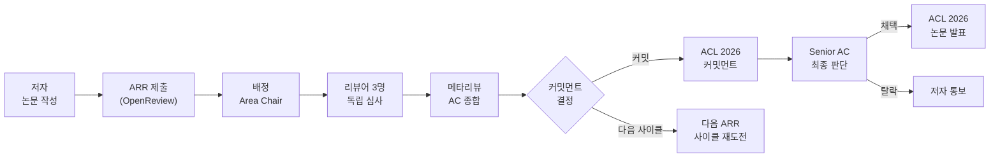
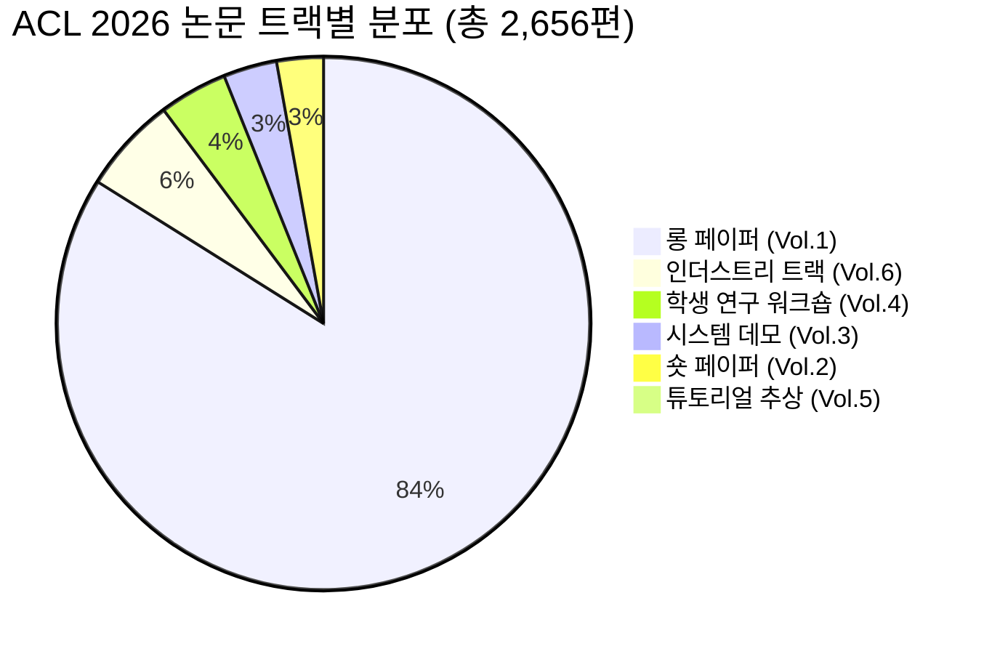
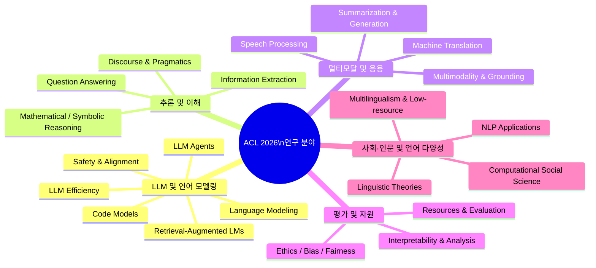
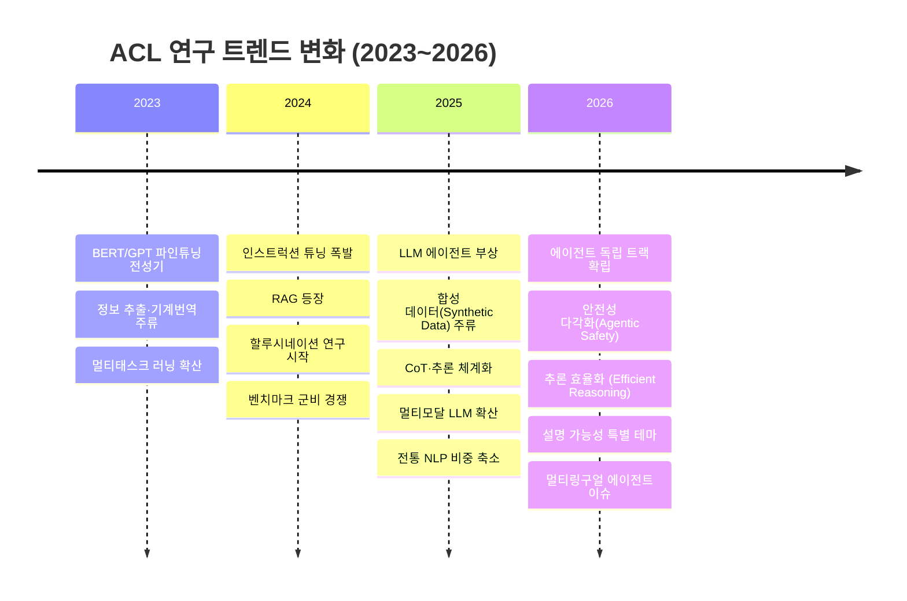

# ACL 2026 완전 정리: 제64회 연례 ACL, 채택 논문·연구 트렌드·핵심 논문 해설

> 📊 **발표자료**: [acl-2026-presentation.pptx](./acl-2026-presentation.pptx)

제64회 ACL(Association for Computational Linguistics) 연례 학회가 2026년 7월 2~7일 미국 캘리포니아 샌디에이고에서 열립니다. ACL은 NLP·CL 분야에서 가장 권위 있는 학술대회 중 하나로, 이번 회차에는 **메인 트랙 2,223편(롱 페이퍼)을 포함해 총 2,656편**이 채택됐습니다. 이 글에서는 공개된 채택 논문 현황, 연구 분야 분류, 주목할 만한 논문들, 그리고 ACL 2025 대비 달라진 트렌드를 정리합니다.

> **정보 공개 현황 (2026-06-23 기준)**: 공식 홈페이지의 accepted papers 목록 페이지는 아직 "Coming soon" 상태입니다. 다만 ACL Anthology에 이미 논문 메타데이터가 등록돼 있고, 각 기관의 발표 포스트와 arXiv 프리프린트에서 상당수 논문 정보를 확인할 수 있습니다.

---

## 목차

1. [ACL 2026 한눈에 보기](#1-acl-2026-한눈에-보기)
2. [ARR 기반 리뷰 프로세스](#2-arr-기반-리뷰-프로세스)
3. [채택 논문 현황 및 규모](#3-채택-논문-현황-및-규모)
4. [연구 분야 분류 및 트렌드 분석](#4-연구-분야-분류-및-트렌드-분석)
5. [ACL 2025 대비 변화한 연구 지형](#5-acl-2025-대비-변화한-연구-지형)
6. [대표 채택 논문 리뷰](#6-대표-채택-논문-리뷰)
7. [워크숍·튜토리얼로 보는 핫 토픽](#7-워크숍튜토리얼로-보는-핫-토픽)
8. [특별 테마: NLP 모델의 설명 가능성](#8-특별-테마-nlp-모델의-설명-가능성)
9. [키노트 스피커와 프로그램 하이라이트](#9-키노트-스피커와-프로그램-하이라이트)
10. [참고 문헌](#10-참고-문헌)

---

## 1. ACL 2026 한눈에 보기

| 항목 | 내용 |
|------|------|
| 정식 명칭 | 제64회 ACL 연례 학회 (64th Annual Meeting of the ACL) |
| 일시 | 2026년 7월 2~7일 |
| 장소 | 미국 캘리포니아 샌디에이고 |
| 특별 테마 | Explainability of NLP Models (NLP 모델 설명 가능성) |
| 메인 트랙 총 논문 수 | 2,656편 (ACL Anthology 기준) |
| 롱 페이퍼 (Volume 1) | 2,223편 |
| 숏 페이퍼 (Volume 2) | 75편 |
| 시스템 데모 (Volume 3) | 86편 |
| 학생 연구 워크숍 (Volume 4) | 110편 |
| 인더스트리 트랙 (Volume 6) | 155편 |
| 리뷰 시스템 | ACL Rolling Review (ARR) |
| 프로그램 의장 | Maria Liakata, Viviane P. Moreira, Jiajun Zhang, David Jurgens |

**주요 일정 (제출 → 채택 흐름)**

| 단계 | 날짜 |
|------|------|
| ARR 제출 마감 | 2026년 1월 5일 |
| ARR 리뷰 완료 | 2026년 3월 10일 |
| 커밋먼트 마감 | 2026년 3월 14일 |
| 채택 통보 | 2026년 4월 4일 |
| 카메라레디 마감 | 2026년 4월 19일 |
| 튜토리얼 | 2026년 7월 2일 |
| 워크숍 | 2026년 7월 3~4일 |
| 메인 컨퍼런스 | 2026년 7월 5~7일 |

---

## 2. ARR 기반 리뷰 프로세스

ACL 2026는 ACL Rolling Review(ARR) 시스템을 통해 논문을 심사합니다. ARR은 NeurIPS·ICLR의 OpenReview처럼 상시 제출·리뷰 체계를 NLP 커뮤니티에 도입한 플랫폼으로, 2021년부터 ACL 계열 학회(ACL·EMNLP·NAACL·EACL 등)가 함께 사용하고 있습니다.

ARR의 핵심 특징은 다음과 같습니다.

- **상시 제출**: 정해진 제출 마감이 월별로 존재해 연중 언제든 제출 가능
- **재사용 가능한 리뷰**: 한 사이클에서 받은 리뷰를 그대로 다른 학회에 커밋 가능
- **OpenReview 플랫폼**: 제출·심사·커밋 모두 OpenReview에서 진행
- **2단계 채택 결정**: ARR의 메타리뷰 이후 각 학회의 시니어 AC·프로그램 의장이 최종 결정

[ARR 공식 사이트](https://aclrollingreview.org/)에 따르면, 저자는 리뷰가 완료된 논문을 원하는 학회에 커밋하는 방식으로, 기존 한 학회 제출-리젝트-재제출의 반복 사이클을 줄일 수 있습니다.

---

## 3. 채택 논문 현황 및 규모

### 3-1. 전체 규모

[ACL Anthology](https://aclanthology.org/venues/acl/)에 등록된 ACL 2026 메인 컨퍼런스 논문 수는 총 **2,656편**이며, 이 중 롱 페이퍼만 2,223편입니다. 이는 역대 ACL 중 최대 규모입니다.

비교를 위해 ACL 2025 통계를 보면, [Paper Copilot 통계](https://papercopilot.com/statistics/acl-statistics/acl-2025-statistics/)에 따라 ACL 2025는 **8,360편 제출에 3,091편 채택(수락률 약 37%)**였습니다. ACL 2024는 4,407편 제출로 약 절반 수준이었던 것과 비교하면 2025~2026 기간에 NLP 커뮤니티의 논문 제출량이 폭발적으로 증가했음을 알 수 있습니다.

> **미공개 정보**: 2026-06-23 현재 ACL 2026의 공식 제출 총 수와 수락률(acceptance rate)은 공개되지 않았습니다. 상기 2,656편은 ACL Anthology에 이미 등록된 수치이며, 커밋되지 않고 탈락한 논문 수는 알 수 없습니다.

### 3-2. 트랙별 분포 (확인된 수치)

---

## 4. 연구 분야 분류 및 트렌드 분석

ACL 2026은 [ARR 공식 영역 분류](http://aclrollingreview.org/areas)와 [메인 컨퍼런스 CfP](https://2026.aclweb.org/calls/main_conference_papers/)를 기준으로 총 **34개 트랙**에 걸쳐 논문을 수신했습니다.

### 4-1. 주요 연구 분야 분류 트리

### 4-2. 분야별 추정 중요도 및 성장세

아래 표는 튜토리얼·워크숍 구성, 기관별 채택 논문 공개 내용, 그리고 ACL Anthology Findings 샘플에서 도출한 **추정** 트렌드입니다. 공식 분야별 논문 수는 미공개 상태입니다.

| 연구 분야 | ACL 2026 중요도 | ACL 2025 대비 | 주요 키워드 |
|-----------|----------------|--------------|-------------|
| LLM Agents | ★★★★★ | 상승 ↑↑ | Multi-agent, Tool Use, Planning |
| LLM Safety & Alignment | ★★★★★ | 상승 ↑↑ | Jailbreak, Red-team, RLHF |
| Reasoning (수학·논리) | ★★★★★ | 상승 ↑↑ | CoT, MCTS, Verifiable Reward |
| Evaluation & Benchmarks | ★★★★☆ | 상승 ↑ | LLM-as-Judge, Contamination |
| Multimodal LLMs | ★★★★☆ | 상승 ↑ | VLM, Vision-Language |
| LLM Efficiency | ★★★★☆ | 상승 ↑ | Sparse Attention, Distillation |
| Interpretability | ★★★★☆ | 상승 ↑ | Mechanistic, SAE, Steering |
| RAG | ★★★☆☆ | 유지 → | Conflict, Multi-hop |
| Multilingual / Low-resource | ★★★☆☆ | 유지 → | Cross-lingual, Indigenous |
| Machine Translation | ★★★☆☆ | 하락 ↓ | 전통 MT 비중 감소 |
| Information Extraction | ★★★☆☆ | 하락 ↓ | LLM으로 대체 추세 |
| Syntax & Parsing | ★★☆☆☆ | 하락 ↓ | 전통 NLP 축소 |

---

## 5. ACL 2025 대비 변화한 연구 지형

### 5-1. 급부상한 분야

**LLM Agents가 독립 트랙으로 확립**

ACL 2025에서는 "Agentic Systems"가 언급 수준이었다면, ACL 2026에서는 독립 연구 트랙(AI/LLM Agents)으로 분류됩니다. [ARR 영역 분류](http://aclrollingreview.org/areas)에서도 "LLM Agents" 트랙이 2025년 업데이트로 추가됐고, 튜토리얼 1편 전체가 멀티-에이전트 시스템에 할애됩니다.

[A*STAR CFAR의 채택 논문](https://www.a-star.edu.sg/cfar/news/news/features/4-papers-accepted-at-acl-2026) 4편 중 3편이 Agent 안전성·자율 주행·반성(reflection) 주제이고, LinkedIn에서 공유된 6편도 에이전트 행동 시뮬레이션·도구 호출·강화학습 에이전트로 구성됩니다.

**Safety & Alignment의 다각화**

단순 jailbreak 방지에서 나아가 다음과 같은 세부 주제들이 두드러집니다.

- **Affective Hallucination**: LLM이 감정적으로 친절하게 굴다 사실과 다른 내용을 말하는 현상 (EACL 2026 Findings)
- **Agentic Safety**: 에이전트가 자율 실행 중 안전 규칙을 지키게 하는 런타임 제어 (A*STAR CFAR 논문)
- **Multilingual Safety**: 영어 외 언어에서 에이전트 안전성이 현저히 떨어지는 문제 (MAPS 벤치마크)

**추론 효율화 (Efficient Reasoning)**

DeepSeek-R1 이후 "생각을 너무 길게 하는 모델"을 압축하는 연구가 폭발했습니다. CoT-Valve, Light-R1 등 체인-오브-소트 길이를 조절하는 논문들이 대거 채택됐고, ACL 2026 튜토리얼 중 하나가 "Current Advances in LLM Reasoning"으로 이 흐름을 반영합니다.

### 5-2. 하락하거나 흡수된 분야

- **전통 기계번역(MT)**: 독립 논문 수가 줄고, MT 개선 연구가 LLM 파인튜닝 프레임으로 흡수
- **정보 추출(IE) 단독 연구**: NER·RE 등 태스크 특화 모델 연구가 "LLM을 IE에 쓰기"로 방향 전환
- **구문 분석(Syntax/Parsing)**: 독립 논문 수 축소. 필요한 부분은 모델 내재화로 해결

---

## 6. 대표 채택 논문 리뷰

아래는 여러 기관 발표 및 arXiv 프리프린트에서 확인된 ACL 2026 채택 논문들입니다. **공식 Best Paper는 미발표** 상태이며, 화제성과 연구 기여도를 기준으로 선별했습니다.

### 6-1. LLM Agents 분야

**CORBA: Contagious Recursive Blocking Attacks on Multi-Agent Systems**
([A*STAR CFAR, ACL 2026 Main](https://www.a-star.edu.sg/cfar/news/news/features/4-papers-accepted-at-acl-2026))

멀티-에이전트 LLM 시스템에서 하나의 에이전트가 재귀적 커뮤니케이션 루프를 만들어 전체 시스템을 마비시키는 새로운 공격 유형 "Denial-of-Collaboration"을 최초로 제안합니다. 협업 AI 시스템의 보안 취약점을 실증적으로 드러낸 논문으로, 에이전트 안전성 연구에 새로운 방향을 제시합니다.

**Safety Sidecar: Reflection-Driven Runtime Control for Safer Agents**
([A*STAR CFAR, ACL 2026 Main](https://www.a-star.edu.sg/cfar/news/news/features/4-papers-accepted-at-acl-2026))

에이전트가 자율 실행 중에 안전 규칙을 위반하지 않도록 모델에 무관한(model-agnostic) 런타임 제어 모듈을 추가합니다. 반성적 개입(reflective intervention) 메커니즘을 활용해 에이전트가 스스로 행동을 점검하게 하는 접근입니다.

**Trajectory2Task: Training Robust Tool-Calling Agents with Synthesized Yet Verifiable Data**
(ACL 2026 Main, [LinkedIn 공개 목록](https://www.linkedin.com/posts/dakuowang_acl2026-acl2026-nlp-activity-7450837153850519552-rWHR))

복잡한 사용자 의도를 처리하는 도구 호출 에이전트를 훈련할 때, 합성 데이터를 사용하면서도 검증 가능성을 유지하는 방법을 제안합니다. 데이터 중심 AI 패러다임과 에이전트 연구의 교차점을 보여주는 논문입니다.

### 6-2. Safety & Alignment 분야

**Being Kind Isn't Always Being Safe: Diagnosing Affective Hallucination in LLMs**
([ACL Anthology, Findings of ACL: EACL 2026](https://aclanthology.org/events/findings-2026/))

LLM이 감정적으로 친절하려는 성향 때문에 사실에 반하는 내용을 생성하는 "정서적 환각(affective hallucination)" 현상을 정의하고 진단합니다. DPO 파인튜닝이 이 현상을 감소시킨다는 것을 실험으로 보여주며, 새로운 안전성 우려를 제기합니다.

**MAPS: A Multilingual Benchmark for Agent Performance and Security**
([Findings of ACL 2026](https://aclanthology.org/events/findings-2026/))

GAIA, SWE-Bench, MATH, Agent Security Benchmark 등 기존 4개 벤치마크를 다국어로 확장해, 영어 외 언어에서 에이전트 성능과 안전성이 얼마나 저하되는지를 정량화합니다.

**Unleashing the Unseen: Harnessing Benign Datasets for Jailbreaking LLMs**
([Findings of ACL 2026](https://aclanthology.org/events/findings-2026/))

악의적 콘텐츠 없이 일반적인 양성(benign) 데이터셋만으로 LLM을 탈옥시킬 수 있다는 것을 보여줍니다. 기존 탈옥 방어 방법이 악성 데이터 필터링에만 집중한 것의 한계를 지적합니다.

### 6-3. Reasoning 분야

**PHOTON: Hierarchical Autoregressive Modeling for Lightspeed and Memory-Efficient Language Generation**
([RIKEN AIP, ACL 2026 Main](https://aip.riken.jp/news/acl2026/))

기존 자동회귀 언어 모델의 메모리 비효율성을 해결하는 계층적 오토레그레시브 아키텍처를 제안합니다. "빛의 속도"라는 이름처럼 생성 속도와 메모리 효율을 동시에 개선하는 것이 목표입니다.

**AgentCoMa: A Compositional Benchmark Mixing Commonsense and Mathematical Reasoning**
([RIKEN AIP, ACL 2026 Main](https://aip.riken.jp/news/acl2026/))

상식 추론과 수학 추론을 혼합한 실세계 시나리오 벤치마크를 제안합니다. 단일 추론 유형만 테스트하던 기존 벤치마크의 한계를 넘어, 에이전트가 실제 문제를 풀 때 필요한 복합 추론 능력을 평가합니다.

**AdapTime: Enabling Adaptive Temporal Reasoning in LLMs**
([ACL 2026 Main](https://www.analyticsvidhya.com/blog/2026/05/top-llm-research-papers-2026/))

외부 도구 없이 LLM이 동적으로 시간 추론을 수행할 수 있게 하는 파이프라인을 제안합니다. "오늘부터 3주 뒤 화요일은 언제인가" 같은 질문에 모델이 자체적으로 적응형 추론을 하도록 설계됐습니다.

### 6-4. Evaluation & Benchmarks 분야

**When Benchmarks Leak: Inference-Time Decontamination for LLMs**
([RIKEN AIP, ACL 2026 Main](https://aip.riken.jp/news/acl2026/))

테스트 데이터가 LLM 훈련 데이터에 오염됐을 때 추론 시점에서 이를 감지하고 완화하는 방법을 제안합니다. 벤치마크 오염 문제가 가시화된 2025~2026년 흐름에서 실용적인 해법을 제시한 논문입니다.

**DebateQA: Evaluating Question Answering on Debatable Knowledge**
([Findings of ACL 2026](https://aclanthology.org/events/findings-2026/))

명확한 정답이 없는 논쟁적 지식에 대한 QA 모델의 응답 능력을 평가하는 새 벤치마크를 제안합니다. 사실 지식 QA에 편중됐던 기존 평가를 넘어, 모호한 실세계 질문에 대한 모델 능력을 측정합니다.

### 6-5. Multilingual 분야

**CommonLID: Re-evaluating State-of-the-Art Language Identification on Web Data**
([HCDS University of Hamburg, ACL 2026 Main](https://www.hcds.uni-hamburg.de/en/news/2026/20260420-acl-accept.html))

최신 언어 식별(LID) 시스템이 웹 규모의 실제 데이터에서 얼마나 잘 작동하는지를 재평가합니다. 벤치마크 성능과 실제 성능 사이의 괴리를 보여주는 비판적 평가 논문입니다.

**JEEM: Vision-Language Understanding in Four Arabic Dialects**
([Findings of ACL 2026](https://aclanthology.org/events/findings-2026/))

표준 아랍어가 아닌 4개 아랍어 방언에서의 비전-언어 이해 능력을 평가하는 벤치마크를 소개합니다. 저자원(low-resource) 언어와 멀티모달 연구의 교차점을 개척합니다.

### 6-6. 멀티모달·비-LLM 주목 논문

ACL 2026 채택 논문은 LLM 에이전트·안전성·추론에 크게 쏠려 있지만, 그 사이로 "결이 다른" 멀티모달·인접 분야 연구들이 눈에 띕니다. LLM 텍스트 추론과 달리, 이미지·신체 동작·취향 같은 **텍스트 밖 신호**를 다룬다는 점에서 흥미롭습니다.

**What Do Vision-Language Models Encode for Personalized Image Aesthetics Assessment?**
([arXiv:2604.11374](https://arxiv.org/abs/2604.11374), [Findings of ACL 2026](https://aclanthology.org/events/findings-2026/))

비전-언어 모델(VLM) 내부가 사람마다 다른 미적 취향을 인코딩하는지를 선형 프로빙으로 분석합니다. 파인튜닝 없이 사용자당 소수 이미지만으로 개인화 미학 평가가 가능함을 보입니다.

**Rad-Flamingo: A Multimodal Prompt-driven Radiology Report Generation Framework with Patient-Centric Explanations**
([Findings of ACL 2026](https://aclanthology.org/events/findings-2026/))

흉부 X-ray 같은 의료 영상을 보고 방사선 판독문을 생성하되, 의사가 아니라 **환자가 이해할 수 있는 설명**을 함께 붙이는 멀티모달 프레임워크입니다. 멀티모달 연구가 실제 의료 커뮤니케이션 현장으로 내려온 사례입니다.

---

## 7. 워크숍·튜토리얼로 보는 핫 토픽

워크숍과 튜토리얼 구성은 해당 시점 커뮤니티의 관심사를 직접적으로 반영합니다.

### 7-1. 튜토리얼 (2026년 7월 2일)

[ACL 2026 튜토리얼 공식 페이지](https://2026.aclweb.org/program/tutorials/)에 따르면 6개 튜토리얼이 확정됐습니다.

| 튜토리얼 제목 | 핵심 주제 |
|--------------|----------|
| Towards Effective and Efficient Multi-Agent LM Systems | 멀티-에이전트 설계·효율화 |
| Future of Work in the Age of LLMs | LLM과 노동·직업 변화 |
| The Data Frontier for Large Language Models | 데이터 선택·합성·도구 |
| The Interplay between Metaphors and NLP | 은유 처리·다국어 |
| Knowledge Control for Responsible Generative AI | 언러닝·지식 편집·추론 시점 제어 |
| Current Advances in LLM Reasoning | 추론 평가·추론 후훈련 |

### 7-2. 워크숍 하이라이트

[ACL 2026 워크숍 페이지](https://2026.aclweb.org/program/workshops/)에서 확인된 30여 개 워크숍 중 특히 주목할 것들입니다.

| 워크숍 | 의미 |
|--------|------|
| TrustNLP 2026 | 설명 가능성·공정성·견고성 — 특별 테마와 직결 |
| SURGeLLM | LLM 시대의 구조화 이해·검색·생성 |
| SELVA | 효율성과 지속 가능성 — 경량화 트렌드 반영 |
| ALVR 2026 | 언어+비전 멀티모달 — 7명 키노트 초청 |
| RAG4Reports | 다국어 RAG 실용화 |
| C3NLP | 문화 간 NLP — 글로벌화 이슈 |
| EvalEval | 평가 방법론 자체에 대한 메타 평가 |
| MeLLMs | 다국어 LLM 전문 워크숍 |
| CLPsych | 정신 건강 NLP — AI 응용 확대 |

---

## 8. 특별 테마: NLP 모델의 설명 가능성

ACL 2026의 특별 테마는 **"Explainability of NLP Models"(NLP 모델의 설명 가능성)**입니다. 이 테마는 단순히 "왜 이런 출력이 나왔는가"에 대한 기술적 해석을 넘어, 대형 언어 모델의 시대에 설명 가능성이 갖는 의미를 학계와 산업계 양쪽에서 재검토하는 방향성을 담고 있습니다.

[메인 컨퍼런스 CfP](https://2026.aclweb.org/calls/main_conference_papers/)에 따르면, 이 테마 트랙은 경험적·이론적 연구, 서베이, 포지션 페이퍼를 모두 수용하며 "현재 NLP 분야의 발전 상태에 대한 반성과 토론"을 목표로 합니다.

7월 6일 월요일에는 **"Explainability of LLMs: Academic vs Industry Perspective"** 패널 토론이 열립니다. 패널리스트는 다음과 같습니다.

- Tal Linzen (NYU/Google DeepMind)
- Sameer Singh (UC Irvine)
- Kamalika Das (산업계 대표)

이 토론은 메카니스틱 해석 가능성(mechanistic interpretability), 프롬프팅 기반 설명, 피처 어트리뷰션 등의 방법론에 대해 학계와 산업계의 시각 차이를 공개적으로 다루는 자리입니다.

---

## 9. 키노트 스피커와 프로그램 하이라이트

[ACL 2026 공식 프로그램 페이지](https://2026.aclweb.org/program/)에 따르면 4명의 키노트 스피커가 확정됐습니다.

| 스피커 | 소속 | 일정 |
|--------|------|------|
| Philip Resnik | University of Maryland | 7월 5일 (일) 09:30 |
| Yue Zhang | Westlake University | 7월 6일 (월) 13:00 |
| Tania Lombrozo | Princeton University | 7월 6일 (월) 16:45 |
| Barbara Plank | LMU Munich (ACL 회장) | 7월 6일 (월) 15:30 (Presidential Address) |

특히 **Tania Lombrozo**는 인지과학·심리학 전문가로, NLP와 인지과학의 연결을 다루는 키노트가 예상됩니다. **Yue Zhang**은 Westlake University의 NLP 연구자로 중국계 AI 연구 커뮤니티의 ACL 내 위상을 보여줍니다.

7월 5일(일)에는 **Linguistics Symposium "Linguistics and NLP in the LLM Era"**도 열립니다. Allyson Ettinger, Richard Futrell, Zoey Liu, Tom McCoy가 패널로 참여해, LLM 시대에 언어학이 NLP에 어떤 의미를 갖는지를 논의합니다.

---

## 10. 참고 문헌

1. [The 64th Annual Meeting of the Association for Computational Linguistics - ACL 2026 공식 사이트](https://2026.aclweb.org/)
2. [ACL Anthology - Annual Meeting of the Association for Computational Linguistics](https://aclanthology.org/venues/acl/)
3. [Findings of the Association for Computational Linguistics (2026) - ACL Anthology](https://aclanthology.org/events/findings-2026/)
4. [ACL Rolling Review 공식 사이트](https://aclrollingreview.org/)
5. [21 papers were accepted at ACL 2026 - RIKEN AIP](https://aip.riken.jp/news/acl2026/)
6. [4 Papers Accepted at ACL 2026 - A*STAR CFAR](https://www.a-star.edu.sg/cfar/news/news/features/4-papers-accepted-at-acl-2026)
7. [HCDS with Multiple Papers Accepted at ACL 2026 - University of Hamburg](https://www.hcds.uni-hamburg.de/en/news/2026/20260420-acl-accept.html)
8. [ACL 2026 Tutorials 공식 페이지](https://2026.aclweb.org/program/tutorials/)
9. [ACL 2026 Workshops 공식 페이지](https://2026.aclweb.org/program/workshops/)
10. [ACL 2026 Program Overview](https://2026.aclweb.org/program/)
11. [ACL 2025 Statistics - Paper Copilot](https://papercopilot.com/statistics/acl-statistics/acl-2025-statistics/)
12. [ACL 2025 Highlights: Direction of NLP & AI - Megagon Labs](https://megagonlabs.medium.com/acl-2025-highlights-direction-of-nlp-ai-e9478c0b4ccf)
13. [Trends in NLP Research: An ACL 2025 Overview - ComplyAdvantage](https://technology.complyadvantage.com/trends-in-nlp-research-an-acl-2025-overview/)
14. [Top 10 LLM Research Papers of 2026 - Analytics Vidhya](https://www.analyticsvidhya.com/blog/2026/05/top-llm-research-papers-2026/)
15. [Most Influential ACL Papers (2026-03 Version) - Paper Digest](https://www.paperdigest.org/2026/03/most-influential-acl-papers-2026-03-version/)
16. [Top Conference Best Papers GitHub Repository](https://github.com/FeijiangHan/Top-Conference-Best-Papers)
17. [ARR Area Keywords - ACL Rolling Review](http://aclrollingreview.org/areas)
18. [ACL 2026 Main Conference Call for Papers](https://2026.aclweb.org/calls/main_conference_papers/)
19. [6 Papers Accepted to ACL 2026 - Dakuo Wang (LinkedIn)](https://www.linkedin.com/posts/dakuowang_acl2026-acl2026-nlp-activity-7450837153850519552-rWHR)

---

## 📝 학습 퀴즈

지금까지 읽은 내용, 얼마나 기억나는지 가볍게 점검해 보세요. 답을 먼저 생각해 본 다음 "정답 보기"를 눌러 확인하면 됩니다.

**Q1. ACL 2026은 제 몇 회 연례 학회이고, 어디서 열리나요?**

✅ 정답 보기

**정답**: 제64회(64th Annual Meeting), 미국 캘리포니아 샌디에이고, 2026년 7월 2~7일

**해설**: ACL(Association for Computational Linguistics)은 1963년 창설된 NLP·CL 분야의 가장 오래된 학회 중 하나로, 매년 연례 학회를 개최합니다. 2026년이 제64회입니다.

**Q2. ACL Rolling Review(ARR)에서 "커밋먼트(commitment)"란 무엇을 의미하나요?**

✅ 정답 보기

**정답**: ARR에서 리뷰와 메타리뷰가 완료된 논문을, 저자가 원하는 특정 학회(예: ACL 2026)에 채택 심사를 받겠다고 제출하는 과정

**해설**: ARR은 리뷰와 채택 결정을 분리합니다. 저자는 먼저 ARR에 논문을 제출해 리뷰를 받고, 이후 원하는 학회에 그 리뷰 결과와 함께 "커밋"합니다. 이렇게 하면 한 번 받은 리뷰를 여러 학회에 재활용할 수 있어, 기존의 제출-거절-재제출 사이클을 줄일 수 있습니다.

**Q3. ACL 2026의 ACL Anthology 기준 총 채택 논문 수와, 그 중 롱 페이퍼는 몇 편인가요?**

✅ 정답 보기

**정답**: 총 2,656편, 롱 페이퍼(Volume 1) 2,223편

**해설**: 숏 페이퍼 75편, 시스템 데모 86편, 학생 연구 워크숍 110편, 튜토리얼 추상 7편, 인더스트리 트랙 155편이 추가됩니다. ACL Anthology에 이미 등록된 수치이며, 공식 수락률(acceptance rate)은 2026-06-23 현재 미공개입니다.

**Q4. ACL 2026의 특별 테마(Special Theme)는 무엇이고, 이를 위해 마련된 특별 행사는 무엇인가요?**

✅ 정답 보기

**정답**: 특별 테마는 "Explainability of NLP Models(NLP 모델의 설명 가능성)". 특별 행사로는 7월 6일(월) 패널 토론 "Explainability of LLMs: Academic vs Industry Perspective"가 열리며, Tal Linzen, Sameer Singh, Kamalika Das가 패널로 참여합니다.

**해설**: 이 테마는 LLM 시대에 설명 가능성이 갖는 의미를 학계와 산업계 양쪽에서 재검토하는 방향성을 담고 있습니다. 경험적·이론적 연구, 서베이, 포지션 페이퍼를 모두 수용하는 포괄적 주제입니다.

**Q5. ACL 2025 대비 ACL 2026에서 가장 두드러지게 성장한 연구 분야는 무엇이고, 그 근거는 무엇인가요?**

✅ 정답 보기

**정답**: LLM Agents 분야. 근거: (1) ARR에 독립 "LLM Agents" 트랙이 2025년 업데이트로 새로 추가됨, (2) 튜토리얼 1편 전체가 멀티-에이전트 시스템에 할애됨, (3) A*STAR·LinkedIn 등에서 공개된 채택 논문 다수가 에이전트 주제, (4) Safety Sidecar·CORBA·Trajectory2Task 등 에이전트 특화 논문들이 메인 트랙에 채택됨

**해설**: ACL 2025에서 "Agentic Systems"는 트렌드 언급 수준이었다면, ACL 2026에서는 독립 트랙으로 제도화됐습니다. 에이전트의 안전성·도구 사용·멀티-에이전트 협력 등 세부 주제도 다양해졌습니다.

**Q6. "Affective Hallucination(정서적 환각)"이란 어떤 현상이고, ACL 2026에서 어떤 논문이 이를 다루나요?**

✅ 정답 보기

**정답**: LLM이 감정적으로 친절하게 반응하려는 성향 때문에 사실에 반하는 내용을 생성하는 현상. "Being Kind Isn't Always Being Safe: Diagnosing Affective Hallucination in LLMs" (Findings of ACL: EACL 2026)이 이 현상을 정의·진단하며, DPO 파인튜닝으로 감소시킬 수 있다고 보고합니다.

**해설**: 기존 환각 연구가 주로 사실 정확성에 집중했다면, 이 논문은 모델의 감정적 반응 패턴이 환각을 유발한다는 새로운 안전성 우려를 제기합니다. "친절함 = 안전함"이 아니라는 역설적 메시지를 담고 있습니다.

**Q7. ACL 2026에서 줄어들거나 흡수되는 경향을 보이는 전통적 NLP 연구 분야 2가지를 꼽고, 그 이유를 설명해 보세요.**

✅ 정답 보기

**정답**: (1) 전통 기계번역(MT) — LLM 파인튜닝으로 MT 성능이 크게 향상되면서 독립적인 MT 모델 연구 필요성이 줄어듦. (2) 정보 추출(IE) 단독 연구 — NER·RE 등 태스크 특화 모델 대신 "LLM을 IE에 쓰기"로 방향 전환.

**해설**: 이 현상은 LLM의 범용성이 높아지면서 특정 태스크에 특화된 모델의 경쟁력이 약해진 것을 반영합니다. 구문 분석(Syntax/Parsing) 역시 독립 논문 수가 줄어드는 추세입니다.

