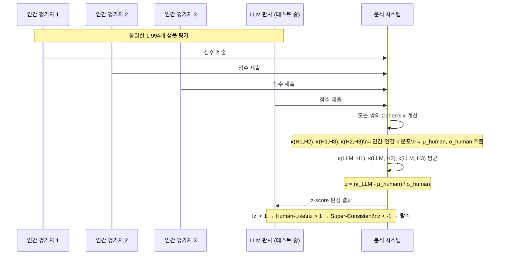
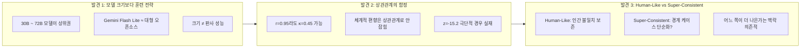
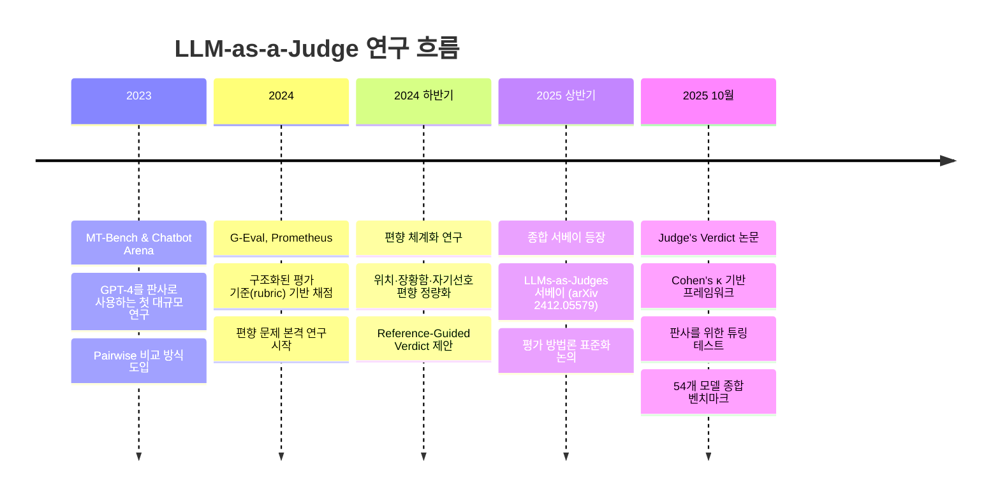
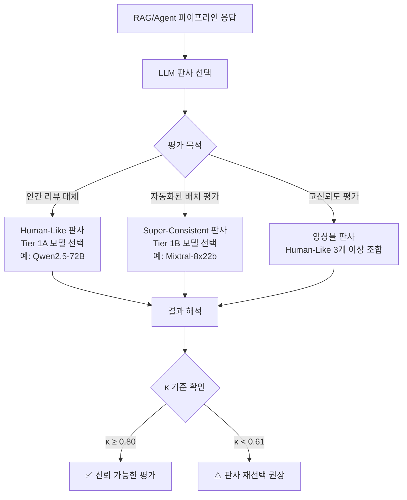

# LLM이 인간처럼 판단할 수 있을까? — "Judge's Verdict" 논문 완전 분석

> 📊 **발표자료**: [judges-verdict-presentation.pptx](./judges-verdict-presentation.pptx)

---

## 목차

1. [왜 "판사"가 필요한가 — 문제의 배경](#1-왜-판사가-필요한가--문제의-배경)
2. [기존 평가 방식의 한계 — 상관관계는 충분하지 않다](#2-기존-평가-방식의-한계--상관관계는-충분하지-않다)
3. [논문 핵심 기여 — 새로운 프레임워크](#3-논문-핵심-기여--새로운-프레임워크)
4. [방법론 완전 해부 — Cohen's κ와 z-score](#4-방법론-완전-해부--cohens-κ와-z-score)
5. [실험 설계 — 데이터셋과 인간 어노테이션](#5-실험-설계--데이터셋과-인간-어노테이션)
6. [핵심 결과 — 54개 모델의 성적표](#6-핵심-결과--54개-모델의-성적표)
7. [더 넓은 맥락 — LLM-as-a-Judge 분야 전체 그림](#7-더-넓은-맥락--llm-as-a-judge-분야-전체-그림)
8. [실무 시사점 — 언제, 어떻게 LLM 판사를 쓸 것인가](#8-실무-시사점--언제-어떻게-llm-판사를-쓸-것인가)
9. [한계와 남은 과제](#9-한계와-남은-과제)
10. [참고문헌](#10-참고문헌)

---

## 1. 왜 "판사"가 필요한가 — 문제의 배경

RAG(Retrieval-Augmented Generation) 파이프라인이나 에이전틱(Agentic) 시스템을 실제로 운영해본 사람이라면 이런 고민을 해봤을 거예요. "내 시스템이 뱉는 답변이 정말 정확한가?" 평가할 방법이 마땅치 않다는 거죠.

전통적인 방법은 두 가지예요. 첫 번째는 EM(Exact Match)이나 F1 같은 표면적 매칭 지표. 근데 이게 의미를 전혀 잡아내지 못하잖아요. "서울은 대한민국의 수도입니다"와 "대한민국 수도는 서울이에요"는 같은 말인데 EM 점수는 0이 나와버려요. 두 번째는 사람이 직접 평가하는 방법. 신뢰도는 높지만 시간과 비용이 어마어마해요.

이 공백을 메우기 위해 등장한 게 **LLM-as-a-Judge(LLM을 평가자로 사용하기)** 패러다임이에요. GPT-4 같은 강력한 LLM이 다른 모델의 출력을 채점하도록 하는 방식인데요. 2023년 [MT-Bench](https://arxiv.org/abs/2306.05685)와 [Chatbot Arena](https://arxiv.org/abs/2403.04132) 같은 연구에서 본격적으로 도입된 이후 급속도로 확산됐어요.

근데 여기서 근본적인 질문 하나가 남아요. **"LLM 판사를 어떻게 신뢰할 수 있죠?"** 그 LLM 판사가 정말 인간처럼 판단하는지 어떻게 검증하냐는 거예요. 이게 2025년 10월 [Steve Han 외 (NVIDIA)](https://arxiv.org/abs/2510.09738)의 논문 "Judge's Verdict"가 정면으로 파고드는 문제입니다.

---

## 2. 기존 평가 방식의 한계 — 상관관계는 충분하지 않다

대부분의 LLM judge 평가 연구는 **상관관계(Correlation)** 에 의존해왔어요. Spearman 상관계수나 Pearson 상관계수로 "이 LLM 판사의 점수가 인간 점수와 얼마나 같은 방향으로 움직이냐"를 보는 거죠.

### 상관관계의 함정

상관관계가 높다고 판사가 좋다는 게 아니에요. 예를 들어볼게요.

어떤 LLM 판사가 인간이 5점 주는 것에 항상 4.7점을 준다고 가정해요. 그러면 Pearson 상관계수는 0.99로 거의 완벽해 보이죠. 근데 이 판사는 **체계적으로 0.3점을 낮게 준다**는 거고, 이게 Cohen's κ로 재면 훨씬 낮게 나와요.

논문에서 직접 제시하는 극단적 예시도 있어요:

> r = 0.95인 모델이 κ = 0.45, z = -15.2를 기록할 수 있다.

r(피어슨 상관) = 0.95면 "매우 강한 상관"인데, 실제 동의 수준은 κ = 0.45로 "보통(Moderate)" 수준에 불과한 거예요. 상관관계는 방향의 일치만 보고, **실제로 같은 점수를 매기는지**는 보지 않거든요.

### 기존 LLM-as-a-Judge의 알려진 편향들

상관관계 문제 외에도, 기존 연구들이 발견한 LLM 판사의 편향이 여럿 있어요 ([Li et al., 2024](https://arxiv.org/abs/2411.16594)):

| 편향 유형 | 설명 | 실제 영향 |
|-----------|------|-----------|
| **위치 편향 (Position Bias)** | 답변 순서에 따라 점수가 달라짐 | GPT-4도 순서 바꾸면 판단 뒤집힘 |
| **장황함 편향 (Verbosity Bias)** | 답이 길수록 좋게 평가 | 핵심 없는 장문 답변이 유리 |
| **자기선호 편향 (Self-Preference Bias)** | 자신이 만든 출력 선호 | 자기인식 능력과 선형 상관 |
| **권위 편향 (Authority Bias)** | 출처·포맷에 영향받음 | 내용보다 형식에 민감 |

[Zheng et al. (NeurIPS 2024)](https://arxiv.org/pdf/2410.21819)에서는 자기선호 편향이 자기인식 능력과 선형 상관관계를 가진다는 게 증명됐고, [Ye et al. (IJCNLP 2025)](https://arxiv.org/pdf/2410.02736)에서는 위치 편향이 코드 평가에서 10% 이상 정확도 변동을 일으킬 수 있다는 게 밝혀졌어요.

---

## 3. 논문 핵심 기여 — 새로운 프레임워크

[Judge's Verdict (Han et al., 2025)](https://arxiv.org/abs/2510.09738)는 세 가지를 새롭게 제안해요.

```mermaid
mindmap
  root((Judge's Verdict))
    기여 1: Cohen's κ 도입
      상관관계를 넘어선 실제 동의 측정
      LLM 대 인간 1:1 κ 계산
      인간-인간 κ 기준선(0.801) 설정
    기여 2: 판사를 위한 튜링 테스트
      LLM을 인간 그룹에 섞기
      z-score로 분류
      Human-Like vs Super-Consistent
    기여 3: 표준화된 벤치마크
      54개 LLM 동시 평가
      2단계 티어 시스템
      오픈 데이터셋 + 리더보드 공개
```

**첫 번째**, 기존 상관계수 대신 **Cohen's κ(Kappa)** 를 사용해요. Cohen's κ는 우연 수준의 동의를 보정한 실제 동의율이에요. 단순히 점수 방향이 같냐가 아니라, **정말 같은 판단을 내리느냐**를 측정하죠.

**두 번째**, "판사를 위한 튜링 테스트(Turing Test for Judges)"를 도입해요. Alan Turing의 이미테이션 게임처럼, LLM을 인간 그룹에 섞어서 식별 가능한지 보는 거예요. z-score를 통해 **인간처럼 판단하는 판사(Human-Like)** 와 **인간보다 지나치게 일관된 판사(Super-Consistent)** 를 구분해요.

**세 번째**, 54개 LLM 전체를 동일한 기준으로 평가하는 **표준화된 벤치마크**를 만들어서 오픈소스로 공개해요.

---

## 4. 방법론 완전 해부 — Cohen's κ와 z-score

### 2단계 평가 파이프라인

```mermaid
flowchart TD
    A[54개 LLM 후보 판사] --> B{Step 1: 상관관계 필터}
    B -->|r < 0.80 탈락| C[❌ 기본 정렬 실패\n18개 모델]
    B -->|r ≥ 0.80 통과| D[✅ 36개 통과]
    D --> E{Step 2: Cohen's κ 분석}
    E --> F[Static Baseline\n개인별 κ 평균]
    E --> G[Dynamic Group Analysis\n판사를 위한 튜링 테스트]
    F --> H{κ ≥ 0.801?}
    G --> I[z-score 계산\nz = κ_LLM - μ_human / σ_human]
    H -->|Yes| J[통과]
    I --> K{|z| 값 판정}
    K -->|z > 1| L[Tier 1B: Super-Consistent\n4개 모델]
    K -->|z < -1| M[❌ 인간보다 낮은 일관성]
    K -->|-1 ≤ z ≤ 1| N[Tier 1A: Human-Like\n23개 모델]
    J --> O[최종 Tier 1: 27개 모델]
    L --> O
    N --> O
```

### Cohen's κ 이해하기

Cohen's κ는 두 평가자 간의 동의를 측정하는 지표로, **우연에 의한 동의**를 보정해요.

```
κ = (P_o - P_e) / (1 - P_e)

P_o: 실제 동의 비율 (Observed Agreement)
P_e: 우연에 의한 기대 동의 비율 (Expected Agreement)
```

Landis & Koch 기준의 해석표:

| κ 범위 | 해석 |
|--------|------|
| 0.81 – 1.00 | Almost Perfect (거의 완벽) |
| 0.61 – 0.80 | Substantial (상당함) |
| 0.41 – 0.60 | Moderate (보통) |
| 0.21 – 0.40 | Fair (약함) |
| 0.00 – 0.20 | Slight (매우 약함) |
| < 0.00 | Poor (역상관) |

논문에서 수집된 인간-인간 간 Cohen's κ 기준선은 **κ = 0.801** 이에요. 사람끼리도 항상 100% 동의하진 않고, 이 숫자가 "인간 수준"의 기준점이 돼요.

### 판사를 위한 튜링 테스트 (z-score 분류)

핵심 아이디어는 이거예요. LLM 판사를 3명의 인간 평가자 그룹에 **몰래 섞어놓고**, 그 LLM이 인간인지 AI인지 통계적으로 구분할 수 있냐는 거죠.



**z-score 해석:**
- **|z| < 1**: LLM의 동의 수준이 인간 그룹의 평균에서 1 표준편차 이내 → **Human-Like (인간처럼 판단)**
- **z > 1**: LLM이 인간보다 지나치게 일관됨 → **Super-Consistent (초일관 판사)**
- **z < -1**: LLM의 동의 수준이 인간 기준 이하 → 탈락

왜 `|z| < 1.5`나 `|z| < 1.96`이 아닌 **1**이냐고요? 논문에서 민감도 분석을 해보니, 1.5나 1.96으로 완화하면 Super-Consistent 카테고리가 사라져서 두 판단 유형의 구분이 의미를 잃어요. 실용적인 판단 기준이에요.

---

## 5. 실험 설계 — 데이터셋과 인간 어노테이션

### 데이터셋 구성

총 **1,994개 샘플**을 6개 RAG 벤치마크에서 균형 있게 뽑았어요:

| 데이터셋 | 샘플 수 | 도메인 |
|----------|---------|--------|
| SQuAD v2.0 | 346 | 일반 독해 |
| HotPotQA | 342 | 멀티홉 추론 |
| Coral | 318 | 대화형 QA |
| TechQA | 295 | 기술 문서 |
| DC767 | 347 | PDF 문서 |
| EKRAG | 346 | 기업 내부 문서 |

각 샘플에 3명의 전문 어노테이터가 평가해서 총 **5,982개 어노테이션**을 수집했어요.

### 인간 어노테이션 프로세스

채점 기준은 단순해요:

| 점수 | 기준 |
|------|------|
| 0 | 답변 실패 (완전히 틀리거나 관련 없음) |
| 0.5 | 부분 충족 (일부 정보는 맞음) |
| 1.0 | 완전 충족 (질문에 완전히 답함) |

어노테이터 자격 조건:
- 북미 거주, 학사 이상
- 해당 도메인 관련 전문 지식 보유
- 영어 원어민

3단계 프로세스도 있어요. 먼저 종합 온보딩, 그 다음 350개 파일럿(80% 정확도 기준 통과 필수), 마지막으로 3명 합의 기반 본 어노테이션. 엄격하죠?

결과적으로 인간-인간 동의 수준은:
- **Fleiss' κ = 0.79** (전체 어노테이터 합의)
- **Krippendorff's α = 0.79** (일관성 확인)

둘 다 "상당함(Substantial)" 수준이에요. 인간도 완벽하지 않다는 게 여기서도 드러나죠.

---

## 6. 핵심 결과 — 54개 모델의 성적표

### Step 1: 상관관계 필터 결과

54개 중 **36개** 모델이 r ≥ 0.80을 넘었어요. 18개는 여기서 탈락. 상관관계 상위 모델들:

| 순위 | 모델 | Pearson r |
|------|------|-----------|
| 1 | Meta-Llama-3-70B-Instruct | 0.880 |
| 2 | Mixtral-8x22b-instruct | 0.879 |
| 3 | Gemma-3-27b-it | 0.879 |

### Step 2: Tier 분류 결과

36개 중 **27개**만 Tier 1에 진입했어요.

**Tier 1A — Human-Like Judges (인간형 판사, 23개 모델):**

| 순위 | 모델 | κ | z-score |
|------|------|---|---------|
| 1 | Qwen3-30B-A3B-Instruct | 0.780 | -0.04 |
| 2 | Qwen2.5-72B-Instruct | 0.785 | +0.14 |
| 3 | Gemini-2.5-Flash-Lite | 0.777 | -0.17 |
| 4 | Llama-3.3-70B-Instruct | 0.786 | +0.18 |
| 5 | Nvidia-Llama-3.3-Nemotron-Super-49b | 0.775 | -0.20 |

**Tier 1B — Super-Consistent Judges (초일관 판사, 4개 모델):**

| 순위 | 모델 | κ | z-score |
|------|------|---|---------|
| 1 | Mixtral-8x22b-instruct | 0.813 | +1.45 |
| 2 | Meta-Llama-3-70B-Instruct | 0.811 | +1.43 |
| 3 | Gemma-3-27b-it | 0.812 | +1.34 |
| 4 | Bagel-34b-v0.2 | 0.804 | +1.01 |

### 핵심 발견들



**모델 크기는 결정적이지 않아요.** 최상위 Human-Like 판사들은 30B~72B 범위에 몰려있고, Gemini 2.5 Flash Lite(폐쇄형 소형 모델)가 훨씬 큰 오픈소스 모델들과 대등하게 경쟁해요. 아키텍처와 훈련 방식이 핵심이라는 증거예요.

**Super-Consistent 판사의 딜레마.** κ 수치만 보면 Super-Consistent 모델이 더 좋아 보여요(0.80 이상). 근데 논문은 이게 경계 케이스(애매한 답변)를 지나치게 단순화하는 거일 수 있다고 우려해요. 인간이 자연스럽게 불일치하는 케이스에서 LLM이 너무 확신하는 거라면, 그게 진짜 더 나은 판단인지 아닌지는 아직 모른다는 거죠.

---

## 7. 더 넓은 맥락 — LLM-as-a-Judge 분야 전체 그림

Judge's Verdict가 기여하는 바를 이해하려면 이 분야 전체 지형을 봐야 해요.

### LLM-as-a-Judge 패러다임의 진화



### 관련 연구들과의 비교

**[Reference-Guided Verdict (Badshah & Sajjad, 2024)](https://arxiv.org/abs/2408.09235)** 는 자유형식 QA 평가에서 단일 LLM이 아닌 여러 LLM 앙상블을 쓰면 신뢰도가 올라간다는 걸 보여줘요. Judge's Verdict와 방향은 비슷하지만, 앙상블이냐 인간 동의 기준이냐에서 접근법이 달라요.

**[From Generation to Judgment (Li et al., 2024)](https://arxiv.org/abs/2411.16594)** 는 종합 서베이로, LLM-as-a-Judge를 세 축(무엇을 판단하는가, 어떻게 판단하는가, 어떻게 검증하는가)으로 체계화해요. Judge's Verdict는 이 프레임 안에서 "어떻게 검증하는가" 부분에 특히 기여해요.

**[Agreement Metrics for LLM-as-Judge (arXiv 2606.00093)](https://arxiv.org/html/2606.00093)** 는 Judge's Verdict와 비슷한 시기에 등장한 연구로, 무엇을 보고해야 하는가(what to report and why)에 대한 체계화를 시도해요. 두 연구가 수렴하는 방향은 결국 같아요: **상관관계 하나로는 부족하다**.

---

## 8. 실무 시사점 — 언제, 어떻게 LLM 판사를 쓸 것인가

그럼 이걸 어떻게 실제로 쓰냐고요? 논문 결과를 바탕으로 정리해볼게요.

### 판사 선택 기준

**Human-Like 판사가 적합한 경우:**
- 인간 리뷰어를 대체하거나 보조하고 싶을 때
- 경계 케이스(애매한 답변)의 뉘앙스를 보존하고 싶을 때
- 판사 결과를 인간에게 설명해야 할 때

**Super-Consistent 판사가 적합한 경우:**
- 배치 평가에서 높은 재현성이 필요할 때
- 명확한 정답/오답이 있는 평가 태스크일 때
- A/B 테스트나 실험 비교에서 일관된 기준이 필요할 때

### RAG/Agent 파이프라인에 적용하기



### 실용적인 체크리스트

LLM 판사를 도입할 때 확인해야 할 것들:

1. **판사 자체를 먼저 검증했나?** Cohen's κ로 인간 동의 수준을 측정해보세요. r만 보면 안 돼요.
2. **어떤 판사 유형이 필요한가?** 용도에 따라 Human-Like vs Super-Consistent를 선택하세요.
3. **도메인 커버리지는?** Judge's Verdict 데이터셋은 주로 영어/북미 맥락이에요. 다른 언어나 도메인이면 추가 검증 필수예요.
4. **샘플 크기는 충분한가?** κ 통계치는 샘플이 작으면 불안정해요. 최소 수백 개 이상을 권장해요.
5. **편향 점검을 했나?** 위치, 장황함, 자기선호 편향은 별도로 체크해야 해요.

---

## 9. 한계와 남은 과제

논문 자체도 여러 한계를 솔직하게 인정해요.

**도메인 편향.** 현재 6개 데이터셋은 주로 영어 일반 도메인이에요. 의료, 법률, 다국어, 멀티모달로 확장하면 결과가 달라질 수 있어요.

**어노테이터 다양성.** 전문 어노테이터가 모두 북미 출신이에요. 문화적·지역적 다양성이 없다는 건 약점이에요.

**Super-Consistent의 의미.** 논문에서 가장 흥미로운 미해결 문제예요. z > 1인 모델들이 정말 경계 케이스를 더 잘 판단하는 건지, 아니면 단순화하는 건지를 명확한 정답이 있는 통제된 실험으로 밝혀야 해요.

**경량 판사 개발.** 현재 Tier 1 모델들은 대부분 30B 이상이에요. 4B~8B 파라미터 범위의 경량 판사 개발이 중요한 다음 단계예요.

**시간적 안정성.** LLM은 계속 업데이트되는데, 판사 성능도 버전에 따라 달라질 수 있어요. 주기적 재평가가 필요해요.

---

## 10. 참고문헌

| 번호 | 제목 | 저자/출처 | URL | 발행연도 |
|------|------|-----------|-----|---------|
| 1 | Judge's Verdict: A Comprehensive Analysis of LLM Judge Capability Through Human Agreement | Han et al. (NVIDIA) | [arXiv:2510.09738](https://arxiv.org/abs/2510.09738) | 2025 |
| 2 | From Generation to Judgment: Opportunities and Challenges of LLM-as-a-judge | Li et al. | [arXiv:2411.16594](https://arxiv.org/abs/2411.16594) | 2024 |
| 3 | Reference-Guided Verdict: LLMs-as-Judges in Automatic Evaluation of Free-Form QA | Badshah & Sajjad | [arXiv:2408.09235](https://arxiv.org/abs/2408.09235) | 2024 |
| 4 | LLMs-as-Judges: A Comprehensive Survey on LLM-based Evaluation Methods | Gu et al. | [arXiv:2412.05579](https://arxiv.org/abs/2412.05579) | 2024 |
| 5 | Self-Preference Bias in LLM-as-a-Judge | Zheng et al. | [arXiv:2410.21819](https://arxiv.org/abs/2410.21819) | 2024 |
| 6 | Justice or Prejudice? Quantifying Biases in LLM-as-a-Judge | Ye et al. | [arXiv:2410.02736](https://arxiv.org/abs/2410.02736) | 2024 |
| 7 | Agreement Metrics for LLM-as-Judge Evaluation: What to Report and Why | — | [arXiv:2606.00093](https://arxiv.org/abs/2606.00093) | 2026 |
| 8 | Judge's Verdict Dataset | Han et al. (NVIDIA) | [HuggingFace: nvidia/judges-verdict](https://huggingface.co/datasets/nvidia/judges-verdict) | 2025 |
| 9 | LLM-as-a-Judge vs Human Evaluation | Galileo AI | [galileo.ai](https://galileo.ai/blog/llm-as-a-judge-vs-human-evaluation) | 2024 |

---

## 📝 학습 퀴즈

지금까지 읽은 내용, 얼마나 기억나는지 가볍게 점검해 보세요. 답을 먼저 생각해 본 다음 "정답 보기"를 눌러 확인하면 돼요.

---

**Q1. Judge's Verdict 논문이 기존 LLM-as-a-Judge 평가 방식(Pearson/Spearman 상관관계)의 가장 큰 문제로 지적하는 것은 무엇인가요?**

<details markdown="1">
<summary>✅ 정답 보기</summary>

**정답**: 상관관계는 점수 방향의 유사성만 측정하고, 실제로 같은 점수를 매기는지(동의)는 측정하지 못한다.

**해설**: 논문에서 제시하는 극단적 예시처럼, Pearson r = 0.95인 모델도 체계적으로 0.3점을 낮게 주면 Cohen's κ = 0.45, z = -15.2가 나올 수 있어요. 상관관계는 선형적 방향 일치만 보기 때문에, LLM 판사가 인간과 정말 같은 판단을 내리는지 알 수 없어요. 이것이 Cohen's κ 도입의 핵심 동기예요.

</details>

---

**Q2. "판사를 위한 튜링 테스트"에서 z-score가 |z| < 1이면 어떤 의미인가요?**

<details markdown="1">
<summary>✅ 정답 보기</summary>

**정답**: 해당 LLM의 동의 수준이 인간 평가자들의 평균에서 1 표준편차 이내에 있다는 것으로, **Human-Like(인간형)** 판사로 분류됩니다.

**해설**: z-score = (κ_LLM - μ_human) / σ_human 공식을 사용해요. LLM을 인간 3명 그룹에 섞고, 모든 쌍의 κ를 계산해서 인간-인간 κ 분포와 비교해요. |z| < 1이면 통계적으로 인간 그룹의 자연스러운 변동 범위 안에 있다는 뜻이에요. 반대로 z > 1이면 인간보다 지나치게 일관된 Super-Consistent 판사로 분류돼요.

</details>

---

**Q3. Super-Consistent 판사(z > 1)와 Human-Like 판사(|z| < 1) 중 어느 쪽이 항상 더 우월한가요?**

<details markdown="1">
<summary>✅ 정답 보기</summary>

**정답**: 어느 쪽이 더 낫다고 단정할 수 없어요. 용도에 따라 달라져요.

**해설**: κ 수치만 보면 Super-Consistent 모델들(κ ≥ 0.801)이 더 좋아 보이지만, 논문은 이 모델들이 인간이 자연스럽게 불일치하는 경계 케이스를 지나치게 단순화할 수 있다고 우려해요. 배치 평가처럼 재현성이 중요하면 Super-Consistent가 적합하고, 인간 리뷰를 대체하거나 뉘앙스를 보존해야 하면 Human-Like가 더 낫죠. 이 선택의 실제 의미는 아직 미해결 과제예요.

</details>

---

**Q4. 논문에서 인간-인간 간 기준선 Cohen's κ는 얼마이고, 이 숫자의 의미는 무엇인가요?**

<details markdown="1">
<summary>✅ 정답 보기</summary>

**정답**: κ = 0.801이며, Landis & Koch 기준으로 "Almost Perfect(거의 완벽)" 범위의 하한선에 해당해요.

**해설**: 3명의 전문 어노테이터가 1,994개 샘플을 평가했을 때 나온 인간-인간 평균 동의 수준이에요. Fleiss' κ = 0.79, Krippendorff's α = 0.79도 함께 보고됐어요. 이 숫자가 "인간 수준" 판사의 기준점(baseline)이 돼요. 즉, LLM 판사가 이 수준에 도달해야 인간과 비슷하게 판단한다고 볼 수 있어요.

</details>

---

**Q5. 54개 모델 중 몇 개가 Tier 1에 진입했고, 그 비율은 어떻게 해석해야 할까요?**

<details markdown="1">
<summary>✅ 정답 보기</summary>

**정답**: 27개 (50%)가 Tier 1에 진입했어요. 1단계 상관관계 필터에서 36개 통과, 2단계 Cohen's κ 분석에서 27개 최종 통과예요.

**해설**: 언뜻 "절반은 되는구나"로 읽힐 수 있는데, 더 주목할 사실은 이 27개 안에서도 Human-Like(23개)와 Super-Consistent(4개)로 성질이 다르다는 거예요. 그리고 상관관계 기준만 썼다면 36개가 통과했을 텐데, 실제 동의 기준으로 좁히면 27개로 줄어요. 판사 선택 시 단순 상관관계 통과만으로는 충분하지 않다는 핵심 메시지를 수치가 뒷받침해줘요.

</details>

---

**Q6. LLM-as-a-Judge에서 "자기선호 편향(Self-Preference Bias)"이란 무엇이고, 왜 문제가 되나요?**

<details markdown="1">
<summary>✅ 정답 보기</summary>

**정답**: LLM이 평가자로 쓰일 때 자신이 생성한 출력을 다른 모델의 출력보다 높게 평가하는 경향이에요.

**해설**: Zheng et al. (NeurIPS 2024) 연구에서, 자기선호 편향의 강도는 자기인식 능력(self-recognition capability)과 선형 상관관계를 가진다는 게 증명됐어요. 즉, 모델이 자신의 출력을 잘 인식할수록 더 강하게 편향돼요. 예를 들어 GPT-4를 판사로 써서 GPT-4의 응답을 평가하면 편향이 생길 수 있어요. 실무에서 모델 비교 실험을 할 때 판사와 피평가 모델이 같거나 계열이 같으면 결과를 신뢰하기 어려워요.

</details>

---

**Q7. Judge's Verdict 논문이 제안하는 데이터셋과 코드는 어디서 찾을 수 있나요?**

<details markdown="1">
<summary>✅ 정답 보기</summary>

**정답**:
- 데이터셋: HuggingFace — `nvidia/judges-verdict` (600개 인간 어노테이션, 3명 평가자)
- 코드: GitHub — `nvidia/judges-verdict`
- 리더보드: HuggingFace Spaces (오픈소스/클로즈드소스 별도 랭킹)

**해설**: 논문이 오픈소스로 자료를 공개한 것은 이 평가 프레임워크를 커뮤니티가 재현하고 확장할 수 있도록 하기 위해서예요. 특히 리더보드는 지속적으로 업데이트되므로, 새로 나오는 LLM 판사 성능을 추적하는 데 유용해요.

</details>
