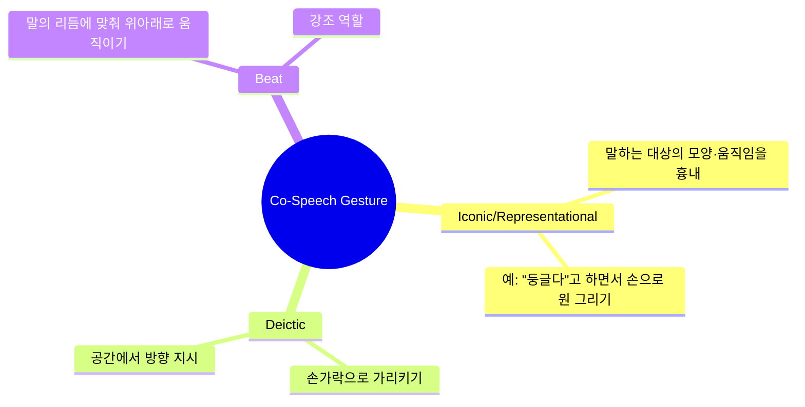
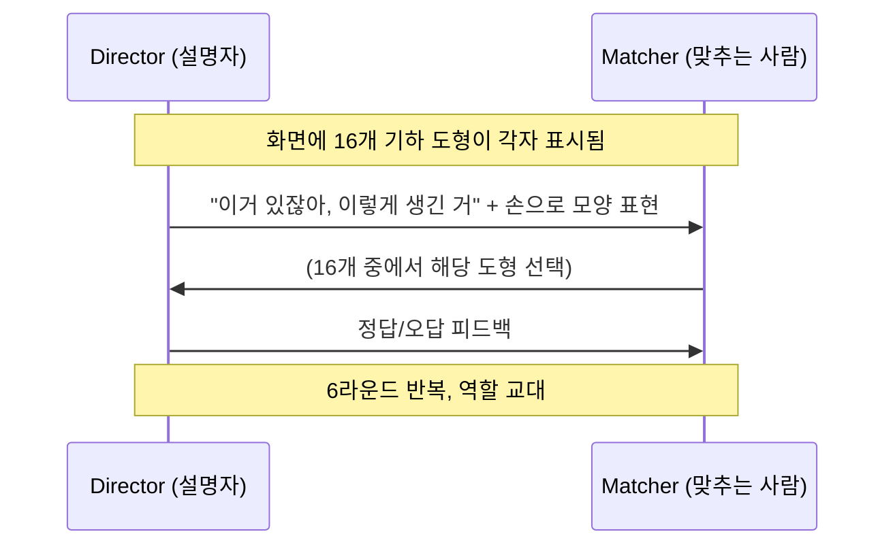
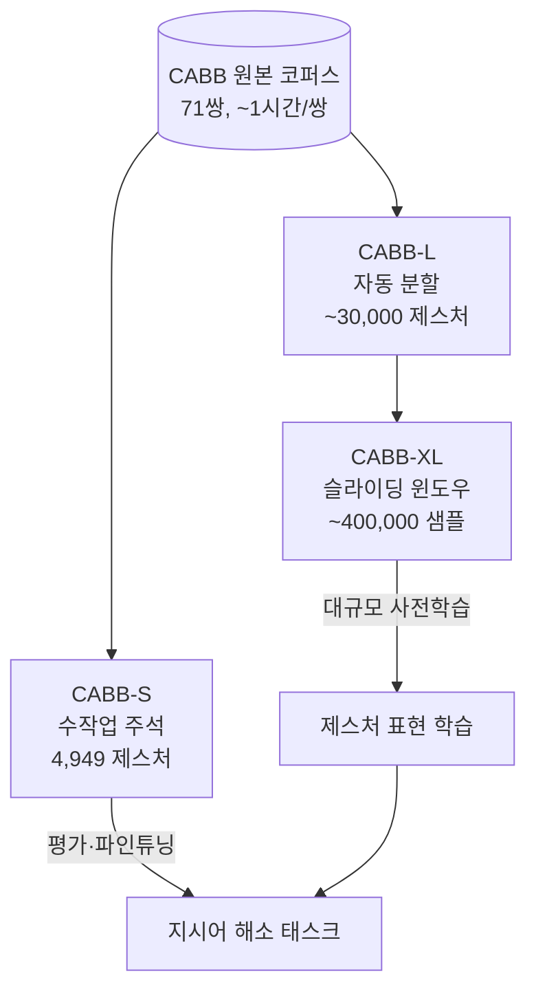
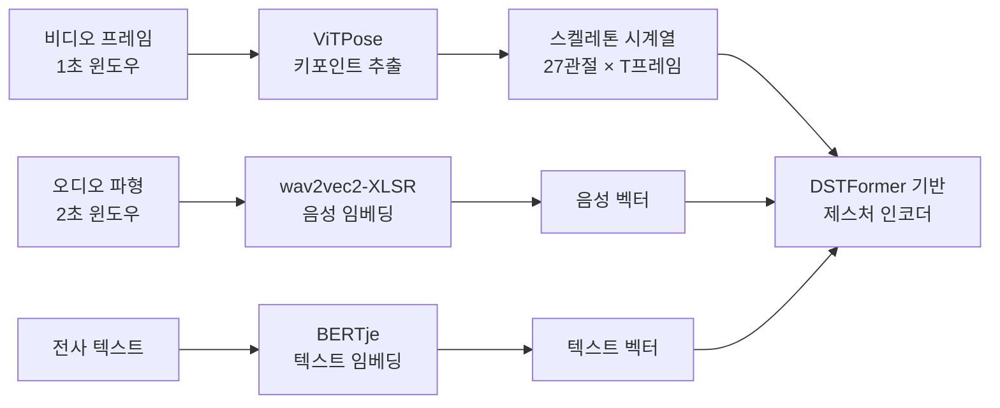
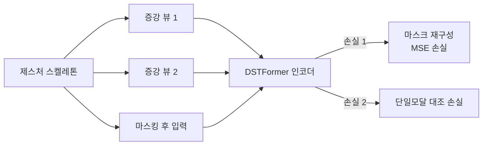
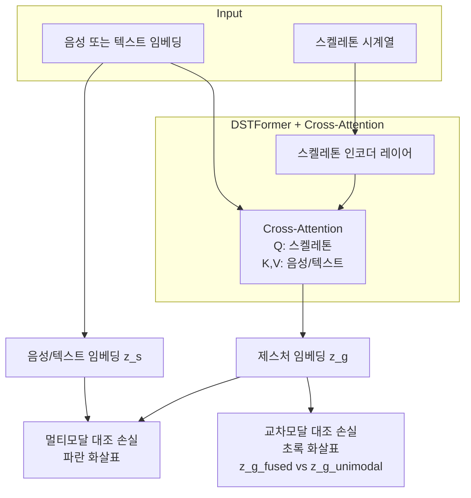
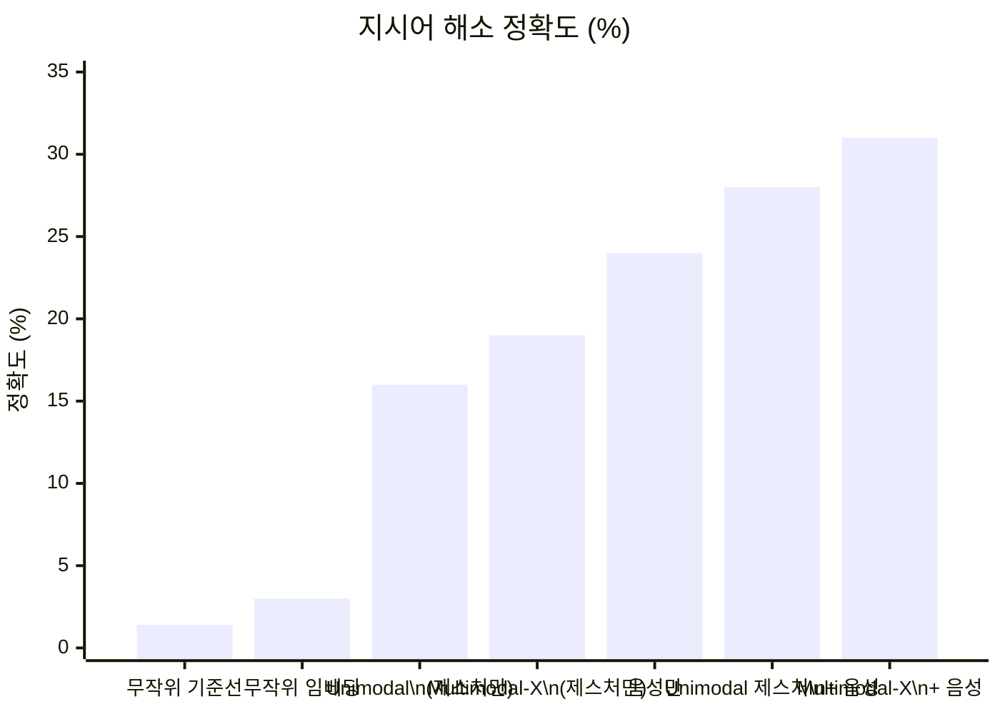
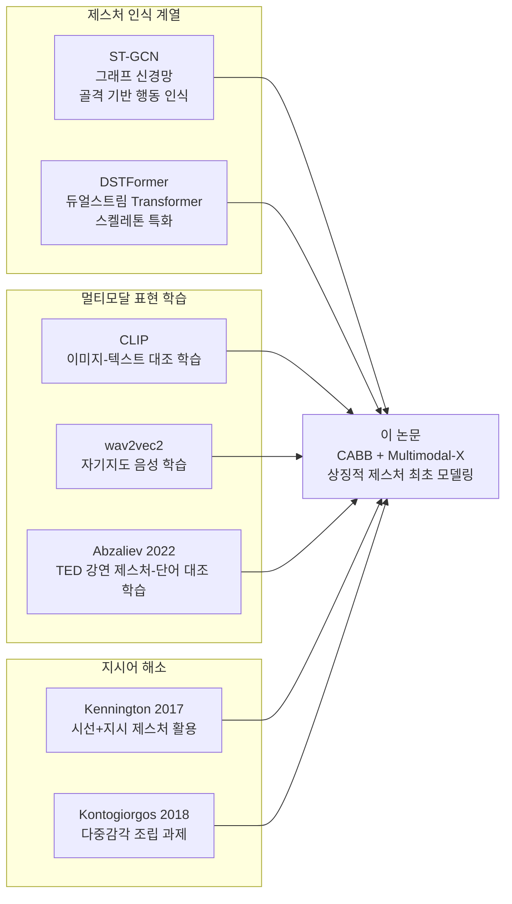
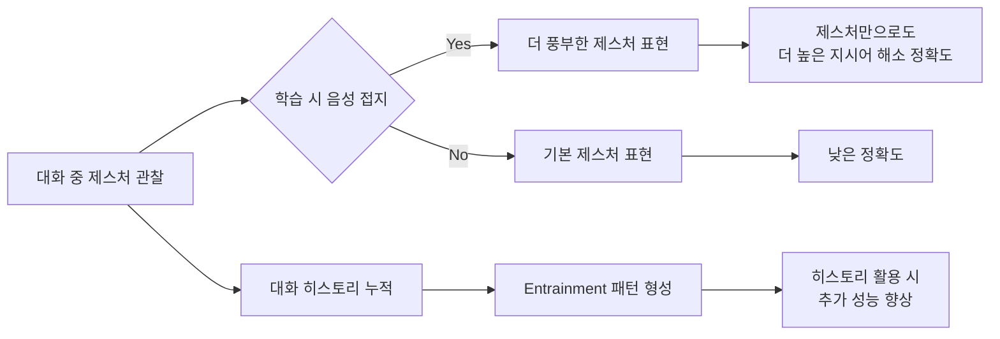

# 말과 손짓이 만나는 순간: Co-Speech Gesture로 대화 속 지시어 해소하기

> 📊 **발표자료**: [co-speech-gesture-reference-presentation.pptx](./co-speech-gesture-reference-presentation.pptx)

ACL 2025 Findings에 채택된 [Ghaleb et al. (2025)](https://aclanthology.org/2025.findings-acl.682/) 논문 "I see what you mean: Co-Speech Gestures for Reference Resolution in Multimodal Dialogue"를 깊이 읽어봤어요. 논문 제목처럼 "나 지금 뭘 말하는지 알지?"라는 상황, 즉 손짓 하나가 말의 의미를 완성시키는 순간을 컴퓨터가 이해할 수 있는지 탐구한 연구예요.

---

## 목차

1. [왜 이 연구가 필요한가?](#왜-이-연구가-필요한가)
2. [핵심 개념 해설](#핵심-개념-해설)
3. [데이터셋: CABB 삼형제](#데이터셋-cabb-삼형제)
4. [손짓을 숫자로: 특징 표현 방법](#손짓을-숫자로-특징-표현-방법)
5. [세 가지 모델 아키텍처](#세-가지-모델-아키텍처)
6. [실험 결과: 숫자로 보는 성과](#실험-결과-숫자로-보는-성과)
7. [관련 연구와의 비교](#관련-연구와의-비교)
8. [의의와 한계](#의의와-한계)
9. [참고문헌](#참고문헌)
10. [학습 퀴즈](#-학습-퀴즈)

---

## 왜 이 연구가 필요한가?

"이거 봐, 이 빨간 거!"라고 말하면서 손가락으로 가리키는 건 누구나 이해해요. 근데 "이거 있잖아, 이렇게 생긴 거"라고 말하면서 손으로 모양을 만들어 보이는 건 어때요? 그게 바로 이 연구가 다루는 **co-speech gesture(발화 동반 제스처)**예요.

사람이 대화할 때 손짓은 단순한 강조가 아니에요. "이렇게 생긴 물건을 가져다줘"라고 할 때 손으로 그 모양을 흉내 내는 건 말만으로는 전달하기 어려운 정보를 담고 있죠. 심리언어학 연구에서 이미 오래전부터 알려진 사실이에요.

그런데 계산언어학(NLP/CL) 분야에서는 왜 이게 덜 연구됐을까요?

```
이유 1: 데이터 수집이 너무 어렵다
         → 실제 대화 녹화 + 전문가 주석 필요

이유 2: "지시 제스처"(손가락으로 가리키기)에만 집중해왔다
         → 모양을 흉내 내는 "상징적 제스처"는 방치

이유 3: 멀티모달 모델이 최근에야 발전
         → 비전·음성·텍스트 동시 처리는 난이도가 높음
```

이 논문은 바로 그 빈틈을 채웠어요. 상징적 제스처(iconic/representational gesture)가 대화 속 지시어 해소(reference resolution)에 어떤 도움을 주는지 처음으로 체계적으로 모델링했죠.

---

## 핵심 개념 해설

### Co-Speech Gesture란?

Co-speech gesture(발화 동반 제스처)는 말하는 동안 함께 나오는 손이나 몸의 움직임이에요. 크게 세 종류로 나뉘어요:



이 논문의 주인공은 **Iconic(상징적/표현적) Gesture**예요. "이렇게 생긴 물건"을 설명할 때 손으로 그 모양을 만드는 행위죠.

### Reference Resolution이란?

Reference Resolution(지시어 해소)은 대화에서 "이것", "저것", "그 물건" 같은 지시 표현이 실제로 무엇을 가리키는지 파악하는 일이에요.

> "the task of identifying which object in a shared scene a speaker intends to refer to"
> (발화자가 공유된 공간에서 어떤 객체를 가리키는지 식별하는 과제)

사람한테는 쉬운 일이지만 컴퓨터한테는 아직도 꽤 어려운 문제예요. 특히 말 외에 손짓도 함께 봐야 할 때는요.

### Contrastive Learning이란?

Contrastive Learning(대조 학습)은 "비슷한 것끼리는 가깝게, 다른 것끼리는 멀게"라는 원칙으로 표현을 학습하는 방법이에요. CLIP이 이미지와 텍스트를 연결하는 방식과 같아요.

이 논문에서는 같은 시간에 나오는 손짓과 말소리를 "비슷한 쌍"으로 취급해서, 두 표현이 같은 공간에서 가까이 놓이도록 학습시켜요.

### Cross-Attention이란?

Cross-Attention(교차 어텐션)은 서로 다른 두 종류의 정보를 연결하는 메커니즘이에요. 예를 들어 손짓 정보가 "지금 말하는 내용(음성/텍스트)"을 참고해서 자신을 업데이트할 수 있어요. 단순히 합치는 게 아니라 "음성의 어느 부분이 이 손짓과 관련 있는가?"를 학습하는 거예요.

---

## 데이터셋: CABB 삼형제

이 연구의 기반이 되는 데이터셋은 **CABB(Communicative and Brain-to-Brain)**예요. 네덜란드어로 진행된 실제 대면 대화를 녹화한 코퍼스인데, 71쌍의 참가자가 **기하학적 추상 도형(Fribble)** 16개를 서로 설명하고 맞추는 게임을 해요.

게임 방식은 간단해요:



6라운드를 반복하면서 같은 도형을 점점 짧게 표현하게 돼요. 이게 **entrainment(언어 수렴)** 현상인데, 나중에 중요한 발견으로 이어져요.

CABB 데이터는 세 가지 버전으로 나뉘어요:

| 버전 | 규모 | 주석 방식 | 용도 |
|------|------|----------|------|
| **CABB-S** | 19개 대화, 4,949 제스처 | 전문가 수작업 | 평가 / 파인튜닝 |
| **CABB-L** | 49개 대화, ~30,000 제스처 | 자동 분할(mAP 76%) | 중간 규모 사전학습 |
| **CABB-XL** | CABB-L 오버샘플링, ~400,000 샘플 | 1초 윈도우 슬라이딩 | 대규모 사전학습 |

CABB-S는 두 전문가가 독립적으로 주석을 달고 합의한 고품질 데이터예요. 특히 **419쌍의 제스처 형태 유사성(form similarity)**에 대해서 손 모양, 움직임, 회전, 위치, 손 사용 여부 등 5개 이진 특성을 세밀하게 주석 달았어요.



---

## 손짓을 숫자로: 특징 표현 방법

손짓 하나를 컴퓨터가 이해하려면 어떻게 해야 할까요? 세 가지 정보를 뽑아요.

### 1. 스켈레톤 키포인트 (Skeleton Keypoints)

[ViTPose](https://arxiv.org/abs/2212.04246)를 써서 비디오 프레임마다 상체 27개 관절의 2D 좌표를 추출해요. 어깨, 팔꿈치, 손목, 손가락 마디 등이에요.

```
관절 27개 × (x, y 좌표) = 54차원 벡터 (1프레임)
1초 = 여러 프레임 → 시계열 데이터
```

이 시계열 데이터가 제스처의 "모양과 움직임"을 표현해요. 비디오 전체를 쓰는 대신 뼈대만 쓰니까 사람 외모에 영향받지 않고 순수한 동작 패턴을 학습할 수 있어요.

### 2. 음성 임베딩 (Speech Embedding)

제스처와 같은 시간에 발화되는 음성을 [wav2vec-2 XLSR-300](https://arxiv.org/abs/2006.13979)으로 처리해요. 53개 언어로 사전학습된 다국어 모델이에요.

모든 Transformer 레이어의 출력을 모아서 학습 가능한 가중 평균을 내고, CNN 레이어로 시간 차원을 압축해요. 결과적으로 "지금 이 손짓과 함께 뭐라고 말하는지"의 정보가 담긴 벡터가 나와요.

### 3. 텍스트 임베딩 (Semantic Embedding)

음성을 전사한 텍스트를 [BERTje](https://arxiv.org/abs/1912.09582)(네덜란드어 BERT)로 처리해요. wav2vec2보다 의미론적으로 풍부한 표현이에요. "지금 무슨 단어를 말하고 있는가"의 의미 정보를 담아요.



---

## 세 가지 모델 아키텍처

논문에서는 세 가지 제스처 표현 학습 방식을 제안하고 비교해요. 모두 **DSTFormer(Dual-Stream Temporal Transformer)** 기반의 스켈레톤 인코더를 쓰는데, 그 위에 어떤 학습 신호를 주냐에 따라 달라져요.

### Unimodal: 스켈레톤만으로 학습

제스처 영상만 써요. 두 가지 손실로 학습해요:

1. **마스크 재구성 손실(Masked Reconstruction Loss)**: 관절 일부를 가리고 복원하도록 학습. BERT의 마스킹 전략과 비슷해요.
2. **단일모달 대조 손실(Unimodal Contrastive Loss)**: 같은 제스처를 두 번 다르게 증강한 뷰끼리는 가깝게, 다른 제스처와는 멀게.



### Multimodal: CLIP 스타일 정렬

Unimodal에 추가로 **멀티모달 대조 손실(Multimodal Contrastive Loss)**을 더해요. CLIP처럼 제스처-음성 또는 제스처-텍스트 쌍을 같은 공간에 정렬시켜요.

같은 시간에 나오는 제스처와 말소리는 가깝게, 다른 시간의 쌍은 멀게 만들어요. 이렇게 하면 제스처 표현에 "어떤 말과 함께 나오는 손짓인지"라는 정보가 녹아들어요.

### Multimodal-X: Cross-Attention으로 정밀 융합

가장 정교한 버전이에요. Cross-attention을 써서 스켈레톤 표현이 음성/텍스트를 "쿼리"로 읽어가며 자신을 업데이트해요.



두 가지 대조 손실을 동시에 사용해요:
- **멀티모달 대조 손실**: 융합된 제스처 임베딩 ↔ 음성/텍스트 정렬
- **교차모달 대조 손실**: 융합된 제스처 임베딩 ↔ 스켈레톤만 쓴 단일모달 임베딩 정렬

이 두 손실이 함께 작동하면서 제스처 표현이 말소리의 의미도 담으면서 동시에 순수한 동작 정보도 유지하게 돼요.

---

## 실험 결과: 숫자로 보는 성과

### 1. 사전학습 품질 평가: 형태 유사성(Form Similarity)

419쌍의 제스처 쌍에 대해 "이 두 제스처가 형태적으로 얼마나 비슷한가?"를 Spearman 상관계수(ρ)로 측정했어요.

| 모델 | 데이터 | ρ (텍스트 기반) |
|------|--------|----------------|
| Unimodal | CABB-S | ~0.12 |
| Multimodal | CABB-XL | ~0.15 |
| **Multimodal-X** | **CABB-XL** | **~0.23** |
| (참고) 난수 기준선 | - | ~0.00 |

모두 통계적으로 유의미(p≪0.05)하고, Multimodal-X + 텍스트 + 대규모 데이터 조합이 가장 좋아요. 단, 절댓값 자체는 아직 낮은 편이에요.

### 2. 핵심 과제: 지시어 해소 정확도

그러면 실제로 "이 손짓이 16개 도형 중 어느 걸 가리키는가?"를 맞출 수 있을까요?



**제스처만 쓸 때**:
- 무작위 기준선: 1.4%
- Unimodal: **16%**
- Multimodal-X: **19%**

**제스처 + 음성 결합 시**:
- 음성만: 24%
- Unimodal 제스처 + 음성: ~28%
- **Multimodal-X 제스처 + 음성: 31%**

여기서 핵심 발견이 있어요. Multimodal-X로 학습할 때 음성이 함께 쓰였지만, 테스트 시에는 제스처만 줘도 성능이 더 높아요(Unimodal 16% → Multimodal-X 19%). 즉, **훈련 시에 음성으로 제스처를 접지(grounding)하면 추론 시 음성 없이도 성능이 올라요.**

### 3. 대화 히스토리의 힘

같은 도형을 6라운드에 걸쳐 반복 설명하니까, 라운드가 쌓일수록 그 사람만의 "표현 패턴"이 생겨요. 이걸 **entrainment(언어/제스처 수렴)** 현상이라고 해요.

각 대화의 이전 제스처들로 평균 프로토타입을 만들어 참조 임베딩으로 쓰면:

- **독립 t-검정: t=2.9, p≪0.05** — 대화 히스토리를 활용하면 유의미하게 정확도 향상
- Spearman ρ: Unimodal 0.32 → **Multimodal-X 0.35**

멀티모달 표현을 쓸 때 대화 히스토리 효과가 더 두드러져요.

---

## 관련 연구와의 비교



이 논문이 기존 연구와 다른 점을 명확히 짚으면:

| 구분 | 기존 연구 | 이 논문 |
|------|----------|---------|
| 제스처 유형 | 지시(pointing), 박자(beat) | **상징적(iconic) 제스처** |
| 학습 방식 | 지도 학습 위주 | **자기지도 사전학습 + 파인튜닝** |
| 데이터 | 단일 모달 또는 소규모 | **멀티모달 대화 코퍼스** |
| 평가 과제 | 제스처 분류, 행동 인식 | **지시어 해소(reference resolution)** |
| 대화 맥락 | 단일 발화 | **6라운드 대화 히스토리 활용** |

선행 연구인 [Ghaleb et al. (2024b)](https://dl.acm.org/doi/10.1145/3678957.3685707)는 같은 CABB 데이터에서 ST-GCN 기반 대조 학습을 시도했는데, 이 논문의 DSTFormer + Multimodal-X 조합이 이를 넘어섰어요.

---

## 의의와 한계

### 연구 의의

이 논문이 보여준 핵심 메시지 세 가지:

**첫째, 제스처 자체에 의미 있는 정보가 있어요.**
16개 중 1.4% 기대치에서 19%까지 올린 건, 아무것도 없는 상황에서 제스처 표현만으로 얻어낸 성과예요. 사람들이 도형을 설명할 때 손의 움직임이 일관되게 대상 정보를 담고 있다는 뜻이에요.

**둘째, 훈련 시 접지(grounding)가 추론 시 도움이 돼요.**
학습할 때 음성과 함께 제스처를 학습시키면, 나중에 음성 없이 제스처만 봐도 더 잘 맞춰요. 음성이 제스처 표현을 더 의미 있게 만들어주는 거예요.

**셋째, 대화는 축적되는 맥락이에요.**
같은 사람이 같은 도형을 반복 묘사하면서 만들어지는 패턴(entrainment)을 모델이 포착할 수 있어요. 이건 대화형 AI 시스템에 중요한 시사점이에요.



### 한계점

솔직히 말하면, 숫자 자체는 아직 낮아요:

- 형태 유사성 상관계수 ρ=0.23 — 완벽한 표현과는 거리 있어요
- 지시어 해소 31% — 여전히 틀리는 경우가 70%예요
- **네덜란드어 대화 데이터만 사용** — 다른 언어/문화로 얼마나 일반화되는지 불명확
- 2D 스켈레톤만 사용 — 깊이(depth) 정보 없이는 3D 공간 제스처 표현에 한계
- 실험실 환경의 통제된 게임 — 자연 발화 대화로의 확장 필요

---

## 참고문헌

1. [Ghaleb, E., Khaertdinov, B., Özyürek, A., & Fernández, R. (2025). I see what you mean: Co-Speech Gestures for Reference Resolution in Multimodal Dialogue. *Findings of ACL 2025*, pp. 13191–13206.](https://aclanthology.org/2025.findings-acl.682/)

2. [Ghaleb, E. et al. (2024b). Learning Co-Speech Gesture Representations in Dialogue through Contrastive Learning: An Intrinsic Evaluation. *ICMI 2024*.](https://dl.acm.org/doi/10.1145/3678957.3685707)

3. [Zhu, W. et al. (2023). ViTPose++: Vision Transformer for Generic Body Pose Estimation. *arXiv:2212.04246*.](https://arxiv.org/abs/2212.04246)

4. [Conneau, A. et al. (2020). Unsupervised Cross-Lingual Representation Learning for Speech Recognition. *arXiv:2006.13979*.](https://arxiv.org/abs/2006.13979)

5. [de Vries, W. et al. (2019). BERTje: A Dutch BERT Model. *arXiv:1912.09582*.](https://arxiv.org/abs/1912.09582)

6. [Zhu, W. et al. (2022). DSTFormer: Dual-Stream Temporal Transformer for Action Recognition. *arXiv*.](https://arxiv.org/pdf/2201.02849)

7. [Radford, A. et al. (2021). Learning Transferable Visual Models From Natural Language Supervision (CLIP). *ICML 2021*.](https://arxiv.org/abs/2103.00020)

8. [Kennington, C., & Schlangen, D. (2017). A simple generative model of incremental reference resolution for situated dialogue. *Computer Speech & Language*, 41, 43–67.](https://doi.org/10.1016/j.csl.2016.04.003)

9. [CABB Dataset (Communicative and Brain-to-Brain). Radboud University / MPI for Psycholinguistics.](https://pubmed.ncbi.nlm.nih.gov/36343884/)

10. [GitHub: EsamGhaleb/MultimodalReferenceResolution](https://github.com/EsamGhaleb/MultimodalReferenceResolution)

---

## 📝 학습 퀴즈

지금까지 읽은 내용, 얼마나 기억나는지 가볍게 점검해 볼게요. 답을 먼저 생각해 본 다음 "정답 보기"를 눌러 확인해요.

---

**Q1. 이 논문이 다루는 co-speech gesture 유형은 무엇이고, 기존 연구에서 덜 다뤄진 이유는 뭔가요?**

<details markdown="1">
<summary>✅ 정답 보기</summary>

**정답**: Iconic(상징적/표현적) Gesture — 말하는 대상의 모양이나 움직임을 손으로 흉내 내는 제스처

**해설**: 기존 계산언어학 연구는 손가락으로 공간을 가리키는 Deictic(지시) 제스처나 리듬을 강조하는 Beat 제스처에 집중해왔어요. Iconic gesture는 데이터 수집과 주석이 어렵고, 멀티모달 모델 기술이 최근에야 발전했기 때문에 계산적 모델링이 거의 이뤄지지 않았어요.

</details>

---

**Q2. CABB-S, CABB-L, CABB-XL 각각의 핵심 차이점은 무엇인가요?**

<details markdown="1">
<summary>✅ 정답 보기</summary>

**정답**: 주석 방식과 규모가 다르며 용도도 달라요.

**해설**: CABB-S는 19개 대화, 약 4,949 제스처를 전문가가 수작업으로 주석을 달아서 고품질이지만 작아요. 주로 평가와 파인튜닝에 사용돼요. CABB-L은 49개 대화에 자동 분할 모델(mAP 76%)로 약 3만 개 제스처를 만들고, CABB-XL은 1초 슬라이딩 윈도우로 약 40만 개 샘플로 불려서 대규모 사전학습에 써요.

</details>

---

**Q3. Multimodal-X 아키텍처에서 Cross-Attention은 어떤 역할을 하나요?**

<details markdown="1">
<summary>✅ 정답 보기</summary>

**정답**: 스켈레톤 표현이 음성 또는 텍스트 임베딩을 Key/Value로 참조하면서 자신을 업데이트하는 정밀 융합 메커니즘이에요.

**해설**: 단순히 제스처 벡터와 음성 벡터를 더하거나 이어붙이는 Multimodal과 달리, Multimodal-X는 DSTFormer 인코더 내에 Cross-Attention 모듈을 삽입해요. 제스처의 어느 시간 구간이 발화의 어느 부분과 관련 있는지를 학습하기 때문에 더 정밀한 융합이 가능해요.

</details>

---

**Q4. "훈련 시 음성 접지, 추론 시 제스처만" 실험에서 무엇을 발견했나요? 이게 왜 중요한가요?**

<details markdown="1">
<summary>✅ 정답 보기</summary>

**정답**: Multimodal-X로 학습(음성 포함)한 모델이 추론 시 제스처만 줘도 Unimodal 모델(16%)보다 높은 19% 정확도를 달성했어요.

**해설**: 이건 실용적으로 매우 중요해요. 실제 상황에서는 로봇이나 AI 시스템이 언제나 음성을 처리할 수 있는 건 아닌데, 훈련 시에만 음성을 활용해도 더 나은 제스처 표현을 배울 수 있다는 거예요. 즉, "제스처를 말소리와 함께 학습시키면 제스처 표현 자체가 더 의미 있어진다"는 걸 실증했어요.

</details>

---

**Q5. Entrainment 현상이란 무엇이고, 이 논문에서 어떻게 활용됐나요?**

<details markdown="1">
<summary>✅ 정답 보기</summary>

**정답**: Entrainment(언어/제스처 수렴)은 같은 대화 파트너와 반복 대화할수록 표현 방식이 비슷해지는 현상이에요.

**해설**: CABB 게임에서 참가자들은 같은 도형을 6라운드에 걸쳐 설명하면서 점점 자신만의 고유한 제스처 패턴을 형성해요. 이 논문은 이전 라운드의 제스처 임베딩을 평균내어 "프로토타입 참조 벡터"로 활용했어요. 독립 t-검정 결과 t=2.9, p≪0.05로 통계적으로 유의미한 향상을 보였고, Multimodal-X 표현에서 이 효과가 더 두드러졌어요.

</details>

---

**Q6. 이 논문의 데이터가 네덜란드어라는 사실이 한계인 이유는 뭔가요? 어떤 보완이 필요할까요?**

<details markdown="1">
<summary>✅ 정답 보기</summary>

**정답**: 제스처 표현 방식은 언어와 문화에 따라 다를 수 있어서 일반화가 불명확해요.

**해설**: 예를 들어 어떤 문화권에서는 특정 모양을 표현하는 손짓이 다른 문화권에서는 다른 의미를 가질 수 있어요. 또 네덜란드어 사용자의 제스처 패턴이 다른 언어 사용자와 다를 수 있죠. 다양한 언어·문화의 멀티모달 대화 코퍼스로 실험을 확장하거나, 언어에 독립적인 시각적 특징(예: 3D 관절 움직임)에 더 집중하는 방향이 필요해요.

</details>

---

**Q7. 지시어 해소 정확도가 31%라는 결과를 어떻게 해석해야 할까요? 실용적으로 충분한가요?**

<details markdown="1">
<summary>✅ 정답 보기</summary>

**정답**: 무작위 기준선(1.4%) 대비 약 22배 향상이지만, 실용적 배포에는 아직 부족해요.

**해설**: 16개 도형 중 하나를 맞추는 과제에서 31%는 무작위 대비 큰 향상이에요. 하지만 실제 사람-로봇 대화에서 70% 오류율은 실용적이지 않아요. 논문 자체도 이를 인정하며, 이 연구의 의의는 "처음으로 상징적 제스처를 참조 해소에 활용할 수 있음을 실증한 것"에 있어요. 향후 연구에서 3D 데이터, 더 큰 코퍼스, 더 강력한 모델로 성능을 높이는 것이 과제예요.

</details>
