# VLM은 "내 취향"을 알고 있을까? — 개인화 이미지 미학 평가의 새 패러다임

> 📊 **발표자료**: [vlm-piaa-presentation.pptx](./vlm-piaa-presentation.pptx)

같은 사진을 봐도 어떤 사람은 "와, 구도가 멋지다!"고 하고, 다른 사람은 "별로인데?"라고 해요. 미적 감각은 정말 주관적이거든요. 그렇다면 AI는 이 '개인 취향'을 얼마나 포착할 수 있을까요?

ACL 2026 Findings에 실린 논문 ["What Do Vision-Language Models Encode for Personalized Image Aesthetics Assessment?"](https://arxiv.org/abs/2604.11374)는 이 질문에 정면으로 답합니다. 핵심 아이디어는 이렇습니다: **VLM(Vision-Language Model)이 이미 내부 표현 안에 다양한 미학 속성 정보를 담고 있으니, 모델을 새로 학습시킬 필요 없이 그 표현만 꺼내 쓰면 개인화가 된다**는 것이에요.

---

## 배경: 미학 평가는 왜 어려운가?

### 보편 미학 vs 개인 취향

이미지 미학 평가 연구는 크게 두 갈래로 나뉩니다.

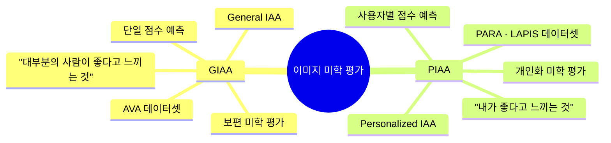

**GIAA(General Image Aesthetics Assessment, 보편 미학 평가)**는 다수의 사람이 이미지를 어떻게 평가하는지 평균을 구하는 방식이에요. "객관적으로 좋은 사진"을 찾는 거죠.

**PIAA(Personalized Image Aesthetics Assessment, 개인화 미학 평가)**는 한 발 더 나아가, **특정 개인**이 이미지에 어떤 점수를 줄지 예측하는 겁니다. 이게 훨씬 어렵습니다. 구도가 완벽한 풍경 사진을 싫어하는 사람도 있고, 흔들린 사진을 오히려 좋아하는 사람도 있으니까요.

### 기존 PIAA의 한계

기존 PIAA 방법들은 대부분 도메인 특화 모델을 처음부터 학습시켰어요. 문제는 두 가지입니다.

1. **계산 비용이 크다** — 사용자가 바뀔 때마다 모델을 다시 학습해야 함
2. **도메인 전이가 안 된다** — 사진용으로 학습한 모델이 예술 작품 평가에는 형편없음

---

## 연구 문제와 핵심 아이디어

이 연구는 세 가지 질문을 던집니다.

1. VLM의 내부 표현에 미학 속성 정보가 **선형으로** 인코딩되어 있나?
2. 그 정보가 **언어 디코더 레이어까지** 전파되나?
3. 모델 파인튜닝 없이 **경량 개인화**가 가능한가?

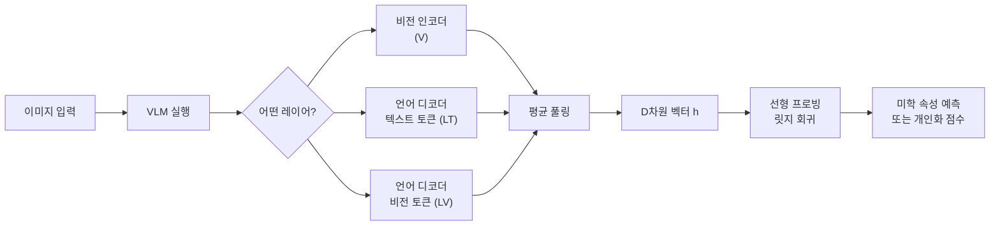

---

## 방법론 — 선형 프로빙이 뭔가요?

### 선형 프로빙(Linear Probing)이란?

**선형 프로빙**은 모델의 내부 표현이 어떤 정보를 담고 있는지 알아내는 기법이에요. 간단히 말하면 이렇습니다.

> "VLM의 어느 레이어에서 숨겨진 벡터를 뽑아와서, 그 벡터를 입력으로 단순한 선형 모델(직선)을 학습시켜봐. 선형 모델이 잘 맞으면, 그 벡터 안에 그 정보가 이미 들어있다는 뜻이야."

핵심 수식은 이렇습니다.

$$M \cdot \mathbf{h}(I) \approx \mathbf{v}_I$$

- $\mathbf{h}(I)$: 이미지 $I$를 VLM에 넣었을 때 특정 레이어에서 나오는 D차원 숨겨진 벡터
- $\mathbf{v}_I$: 해당 이미지의 K차원 미학 속성 점수
- $M$: 학습할 선형 변환 행렬

이 행렬 $M$을 학습하는 데 **릿지 회귀(Ridge Regression)**를 씁니다.

### 릿지 회귀(Ridge Regression)가 뭔가요?

일반 선형 회귀에 **L2 정규화**를 추가한 방식이에요. 벡터 차원이 수천~수만 개인 경우 일반 회귀는 과적합되기 쉬운데, 릿지 회귀는 계수를 작게 유지하도록 페널티를 줘서 이를 막습니다. 정규화 강도(α)는 교차검증으로 자동 선택해요.

### 세 가지 레이어 표현 비교

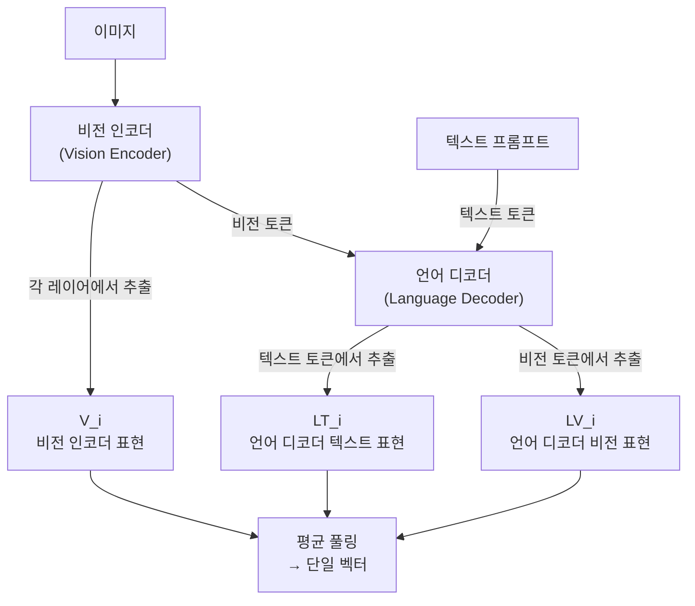

텍스트 프롬프트는 `"Assess the aesthetics of this image."`를 씁니다. 각 레이어에서 여러 토큰을 **평균 풀링**해서 하나의 벡터로 만들어요.

---

## 데이터셋 — 세 가지 벤치마크

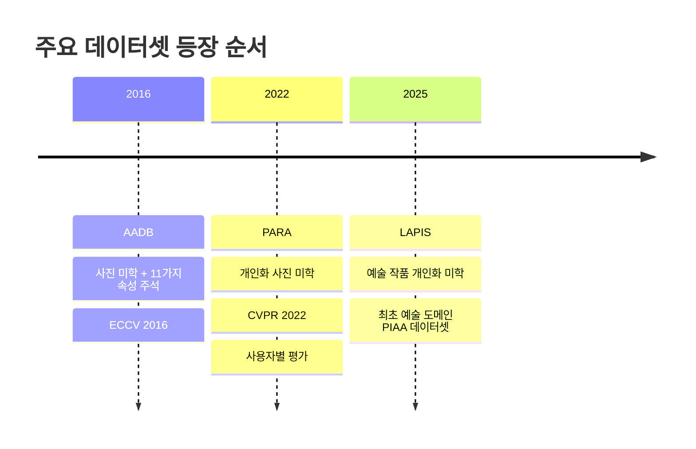

### AADB — 미학 속성 탐색의 기반

[AADB(Aesthetics with Attributes Database)](https://ics.uci.edu/~skong2/aesthetics.html)는 Flickr에서 수집한 사진 10,000장으로 구성돼요. 각 사진에는 **11가지 미학 속성**이 연속값([-1, 1] 범위)으로 주석달려 있어요.

| 속성 | 설명 |
|------|------|
| BalancingElements | 화면 균형 |
| ColorHarmony | 색 조화 |
| Content | 콘텐츠 매력도 |
| DoF | 피사계 심도 |
| Light | 조명 |
| MotionBlur | 모션 블러 |
| Object | 피사체 강조 |
| Repetition | 반복 패턴 |
| RuleOfThirds | 삼분법 |
| Symmetry | 대칭 |
| VividColor | 선명한 색상 |

### PARA — 사진 도메인의 개인화 벤치마크

[PARA(Personalized Image Aesthetics database with Rich Attributes)](https://arxiv.org/abs/2203.16754)는 CVPR 2022에서 발표된 데이터셋으로, 31,220장의 이미지에 438명의 사용자가 개인별 평가를 달았어요. 사진 도메인에 특화된 개인화 미학 평가 데이터셋입니다.

한 가지 특징: 속성들 간에 상관계수가 ~0.5 이상으로 꽤 강한 편이에요. 동일한 주석 인터페이스 안에서 여러 속성을 함께 평가하다 보니 일관된 채점 패턴이 생기는 거거든요.

### LAPIS — 예술 작품 도메인의 선구자

[LAPIS(Leuven Art Personalized Image Set)](https://arxiv.org/abs/2504.07670)는 2025년에 등장한 데이터셋으로, PIAA 연구 역사상 **최초로 예술 작품에 특화된 개인화 미학 데이터셋**이에요. WikiArt에서 가져온 11,723장의 그림을 미술사학자들과 협력해서 큐레이션했어요. 르네상스부터 미니멀리즘까지 26가지 스타일, 7가지 장르를 포함합니다.

---

## 실험 설계

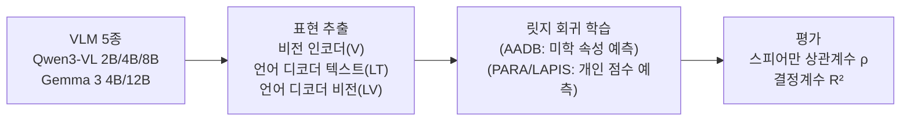

**실험 세팅:**
- 200명 사용자 무작위 샘플링
- 지원 집합: 10장(소) 또는 100장(대)
- 평가 집합: 사용자당 50장

---

## 핵심 발견 1 — VLM은 미학 속성을 선형으로 인코딩한다

AADB의 11가지 미학 속성에 대해 선형 프로빙을 돌린 결과예요.

| 속성 | Qwen3-VL 2B | Qwen3-VL 4B | Qwen3-VL 8B | Gemma 3 4B | Gemma 3 12B |
|------|:-----------:|:-----------:|:-----------:|:----------:|:----------:|
| Object | **0.722** | 0.719 | 0.716 | 0.706 | 0.714 |
| Overall Score | 0.725 | **0.727** | 0.720 | 0.700 | 0.719 |
| VividColor | 0.686 | 0.695 | **0.696** | 0.671 | 0.687 |
| Content | 0.633 | 0.632 | 0.627 | **0.621** | 0.624 |
| DoF | **0.535** | 0.518 | 0.530 | 0.512 | 0.515 |
| ColorHarmony | 0.516 | **0.523** | 0.515 | 0.493 | 0.504 |
| Light | **0.509** | 0.507 | 0.490 | 0.452 | 0.468 |
| MotionBlur | ~0.134 | ~0.140 | ~0.138 | ~0.130 | ~0.135 |

속성별 상관계수가 **0.13에서 0.73**까지 분포해요. 절반 이상의 속성에서 0.4 이상의 중간~강한 상관관계가 나왔습니다. 희소하게 나타나는 MotionBlur나 RuleOfThirds 같은 속성도 일관된 양의 상관관계를 보여요.

특히 흥미로운 건 모델 크기와 성능이 꼭 비례하지 않는다는 점이에요. Qwen3-VL 2B, 4B, 8B가 속성마다 번갈아 최고 성능을 기록합니다. 일반적인 VLM 벤치마크 순위와 미학 속성 인코딩 능력은 별개인 거죠.

---

## 핵심 발견 2 — 언어 디코더 레이어가 더 많은 정보를 담는다

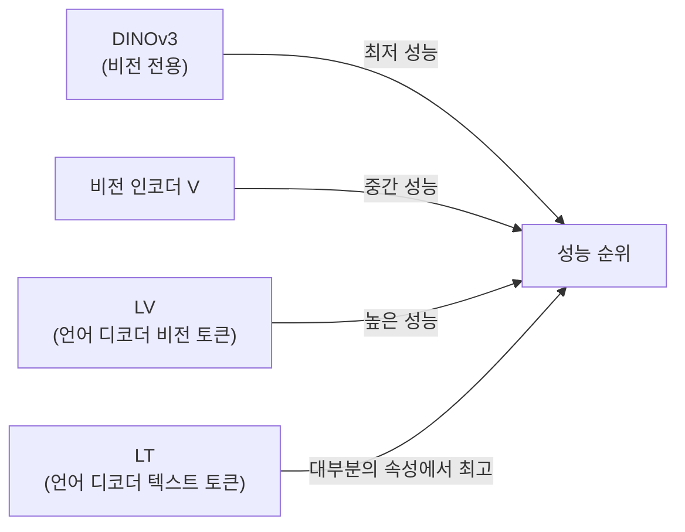

비전 전용 모델인 DINOv3는 거의 모든 속성에서 최저 성능을 보여요. VLM의 비전 인코더로 가면 성능이 오르고, 언어 디코더 레이어까지 가면 더 좋아집니다. **미학 정보가 언어적 처리 과정을 거치면서 더 풍부하게 정제된다**는 뜻이에요.

### 아키텍처별 차이: Gemma 3 vs Qwen3-VL

두 모델군은 레이어별 정보 분포 방식이 달라요.

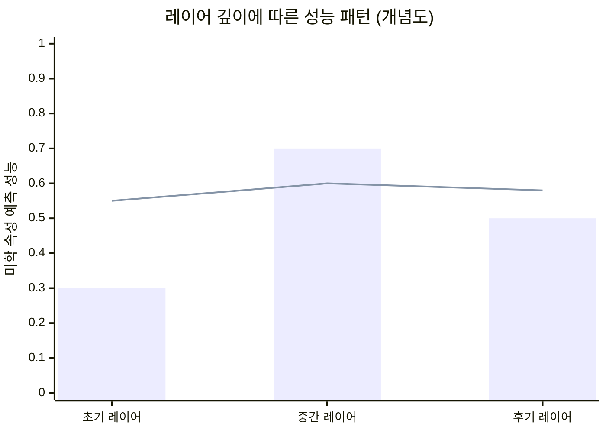

- **Gemma 3**: 언어 디코더의 초기~중간 레이어에서 성능이 크게 올랐다가 이후 안정됩니다. 텍스트 감독(미학 관련 텍스트 코퍼스로 학습된 영향)이 특정 레이어에 집중된 패턴이에요.
- **Qwen3-VL**: DeepStack 메커니즘 덕분에 비전 표현이 여러 레이어에 걸쳐 분산·통합되어, 레이어 간 성능이 상대적으로 안정적입니다.

---

## 핵심 발견 3 — 경량 개인화: 선형 모델이 파인튜닝을 이긴다

### PIAA 방법 비교

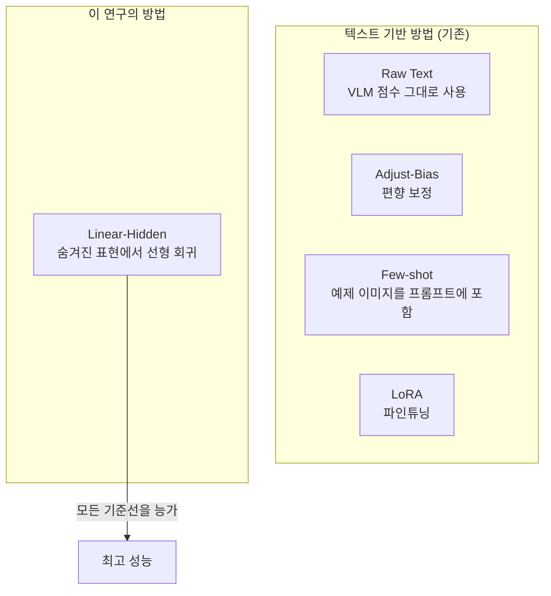

100-shot 설정에서의 결과를 봅시다.

**PARA(사진) 데이터셋:**

| 방법 | Qwen3-VL 2B | Qwen3-VL 4B | Gemma 3 4B |
|------|:-----------:|:-----------:|:----------:|
| Raw Text | ρ=0.504, R²=-0.571 | ρ=0.570, R²=-1.277 | ρ=0.462, R²=-1.107 |
| LoRA | ρ=0.487, R²=-1.970 | ρ=0.578, R²=-1.751 | ρ=0.489, R²=-0.893 |
| **Linear-Hidden** | **ρ=0.604, R²=0.363** | **ρ=0.611, R²=0.362** | **ρ=0.591, R²=0.346** |

**LAPIS(예술) 데이터셋:**

| 방법 | Qwen3-VL 2B | Qwen3-VL 4B | Gemma 3 4B |
|------|:-----------:|:-----------:|:----------:|
| Raw Text | ρ=0.098, R²=-0.778 | ρ=0.176, R²=-0.937 | ρ=0.119, R²=-1.340 |
| LoRA | ρ=0.026, R²=-0.701 | ρ=0.153, R²=-1.580 | ρ=0.116, R²=-0.936 |
| **Linear-Hidden** | **ρ=0.568, R²=0.321** | **ρ=0.568, R²=0.319** | **ρ=0.568, R²=0.328** |

ρ는 **스피어만 순위 상관계수**(상대적 선호 순서가 얼마나 일치하나), R²는 **결정계수**(절대 점수 예측 정확도)입니다.

주목할 점이 있어요. LAPIS에서 텍스트 기반 방법(특히 Raw Text)의 성능이 ρ=0.098~0.233으로 형편없는데, Linear-Hidden은 ρ≥0.568을 유지합니다. LoRA가 LAPIS에서 오히려 Raw Text보다 더 나쁜 경우도 있어요 — 토큰 수준 가능도 최적화가 개인화 미학 순위에 안 맞는 거거든요.

### 실제 개인화 프로세스

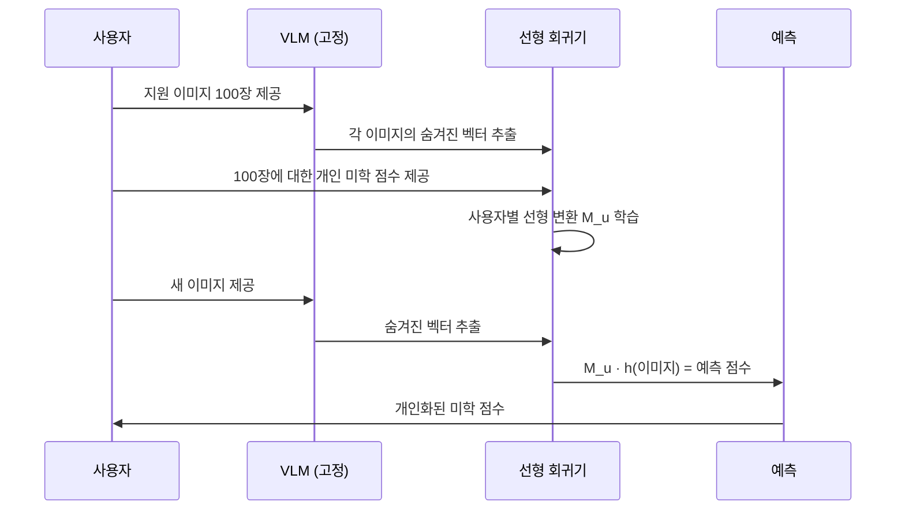

**VLM은 전혀 수정하지 않습니다.** 사용자당 100장의 이미지와 그에 대한 개인 점수만 있으면, 사용자별 선형 회귀기(M_u)를 학습해서 예측할 수 있어요.

---

## 핵심 발견 4 — 도메인 전이: VLM이 훨씬 강건하다

PARA(사진)로 학습한 모델을 LAPIS(예술 작품)에 적용하면 어떻게 될까요?

| 방법 | PARA (학습 도메인) | LAPIS (새 도메인) | 성능 저하 |
|------|:-----------------:|:-----------------:|:--------:|
| PIAA-ICI (기존 최강) | ρ=0.620 | ρ=0.206 | **급락** |
| Linear-Hidden (이 연구) | ρ=0.611 | ρ=0.568 | 소폭 감소 |

기존 PIAA 모델인 PIAA-ICI는 사진 도메인에서 학습하면 예술 작품에 거의 적용이 안 돼요(0.620 → 0.206). 반면 VLM 표현을 쓰는 Linear-Hidden은 0.611 → 0.568로 **강건하게 유지**됩니다. VLM의 범용 표현이 도메인 변화에 훨씬 잘 버티는 거예요.

---

## 도메인별 차이: 사진 vs 예술 작품

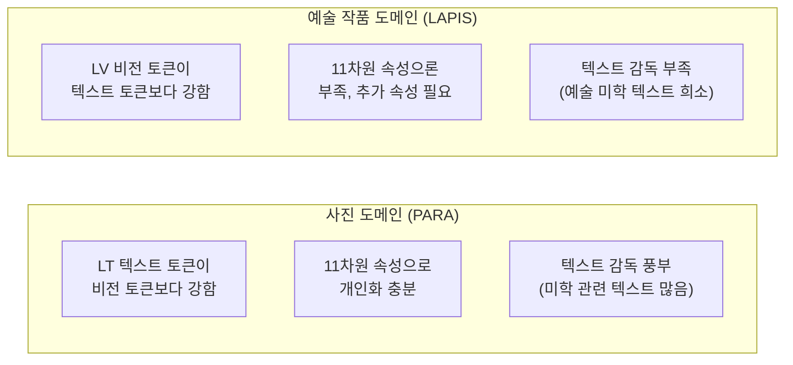

예술 작품 도메인에서 흥미로운 패턴이 나타납니다. Qwen3-VL에서 LV(비전 토큰) 표현이 LT(텍스트 토큰) 표현을 일관되게 능가해요. 연구팀의 가설은 이렇습니다: VLM 학습 데이터에 미술 작품 관련 미학 텍스트가 상대적으로 적어서, 예술 미학 정보가 언어적으로 처리되지 못하고 비전 표현에 머물러 있다는 거예요.

---

## "까다로운" 사용자에게도 통한다

일반 미학 점수(GIAA)와 상관관계가 가장 낮은 50명, 즉 개인 취향이 대중과 가장 다른 사람들에 대해서도 실험했어요.

| 방법 | Qwen3-VL 2B | Qwen3-VL 4B | Gemma 3 4B |
|------|:-----------:|:-----------:|:----------:|
| Raw Text | ρ=0.380 | ρ=0.405 | ρ=0.347 |
| **Linear-Hidden** | **ρ=0.467** | **ρ=0.472** | **ρ=0.463** |

Raw Text 대비 0.06~0.08 정도 개선이 됩니다. 취향이 독특한 사람도 어느 정도 포착할 수 있다는 거예요.

---

## 한계와 앞으로의 과제

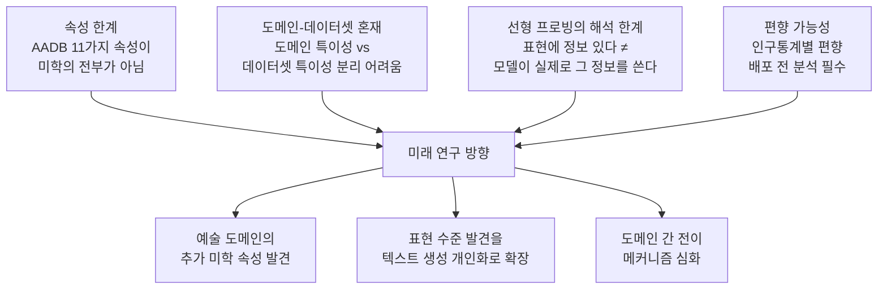

논문이 솔직하게 인정하는 한계가 있어요. 선형 프로빙으로 "표현에 정보가 있다"는 걸 보여줄 수 있지만, 이게 "VLM이 실제로 그 정보를 이용해서 답을 낸다"는 뜻은 아니에요. 또한 실험에 쓴 200명 사용자 샘플이 전체 인구를 대표하는지도 불확실하고, 다양한 인구통계 그룹에서 개인화 편향이 생길 가능성도 있습니다.

---

## 관련 연구 맥락에서의 위치

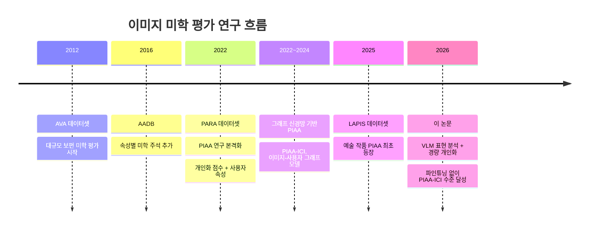

VLM 기반 미학 평가 연구(VILA, Q-Bench, AesBench 등)는 주로 객관식이나 이진 형식으로 VLM을 평가했어요. 이 논문은 **연속 다중 속성 인코딩**을 선형 탐사로 검증한 첫 시도입니다. 기존 VLM 표현 분석 연구들이 3D 인식, 의미론적 표현 등을 다뤘다면, 이 연구는 처음으로 미학 속성의 **다층 전파**와 **도메인 간 차이**를 체계적으로 규명했습니다.

---

## 정리하면

이 연구가 보여준 것을 한 줄로 요약하면: **"VLM은 이미 내 취향을 알아채는 데 필요한 정보를 가지고 있고, 선형 회귀 하나면 꺼내 쓸 수 있다."**

파인튜닝 없이 사용자당 100장으로 VLM의 숨겨진 표현에서 선형 회귀기를 학습하는 것만으로, 비교 대상 중 가장 강력한 도메인 특화 모델(PIAA-ICI)과 맞먹는 성능을 냈어요. 도메인이 바뀌어도 강건하고, 계산 비용도 훨씬 적습니다.

물론 아직 갈 길은 있어요. 11가지 속성으로는 예술 도메인의 개인화가 아직 부족하고, VLM이 '보는 것'과 '말하는 것' 사이의 갭도 풀어야 할 숙제입니다. 하지만 **VLM의 내부 표현이 개인화 미학 평가의 강력한 기반이 된다**는 사실은 이제 확실해졌습니다.

---

## 참고문헌

1. [Nakamura et al. (2026). "What Do Vision-Language Models Encode for Personalized Image Aesthetics Assessment?" — arXiv:2604.11374](https://arxiv.org/abs/2604.11374)
2. [vlm-latent-piaa GitHub Repository](https://github.com/ynklab/vlm-latent-piaa)
3. [Kong et al. (2016). "Photo Aesthetics Ranking Network with Attributes and Content Adaptation" — ECCV 2016](https://ics.uci.edu/~skong2/aesthetics.html)
4. [Yang et al. (2022). "Personalized Image Aesthetics Assessment with Rich Attributes" — CVPR 2022](https://arxiv.org/abs/2203.16754)
5. [Murray et al. (2025). "LAPIS: A Novel Dataset for Personalized Image Aesthetic Assessment" — CVPR 2025](https://arxiv.org/abs/2504.07670)
6. [Qwen3-VL Technical Report (2025)](https://arxiv.org/pdf/2511.21631)
7. [Mechanistic Interpretability Meets Vision Language Models — ICLR Blogposts 2025](https://d2jud02ci9yv69.cloudfront.net/2025-04-28-vlm-understanding-29/blog/vlm-understanding/)
8. [AesBiasBench: Evaluating Bias and Alignment in Multimodal Language Models for PIAA (2025)](https://arxiv.org/pdf/2509.11620)
9. [PIAA-ICI: Personalized Image Aesthetics Assessment based on Graph Neural Network — ScienceDirect](https://www.sciencedirect.com/science/article/abs/pii/S0950705124003848)
10. [Graviti AADB Dataset Overview](https://gas.graviti.com/dataset/graviti/AADB)

---

## 📝 학습 퀴즈

지금까지 읽은 내용, 얼마나 기억나는지 가볍게 점검해 보세요. 답을 먼저 생각해 본 다음 "정답 보기"를 눌러 확인하면 돼요.

**Q1. PIAA(Personalized Image Aesthetics Assessment)와 GIAA(General Image Aesthetics Assessment)의 가장 큰 차이점은 무엇인가요?**

✅ 정답 보기

**정답**: GIAA는 다수의 평가 평균으로 "일반적으로 좋은 이미지"를 예측하고, PIAA는 특정 개인이 이미지에 줄 점수를 예측합니다.

**해설**: GIAA는 여러 사람의 평가를 평균 내어 보편적 미학 점수를 구하는 방식이에요. 반면 PIAA는 사용자 A가 이 사진에 몇 점을 줄지, 사용자 B가 저 그림에 몇 점을 줄지를 개인별로 예측합니다. 같은 사진도 사람마다 다르게 느끼기 때문에 PIAA가 훨씬 어려운 문제예요.

**Q2. 선형 프로빙(linear probing)에서 "선형(linear)"이 중요한 이유는 무엇인가요?**

✅ 정답 보기

**정답**: 선형 모델은 단순하기 때문에, 선형 모델이 잘 맞으면 그 성능이 데이터에서 비롯된 것이 아니라 모델 내부 표현의 질에서 비롯된 것이라는 해석이 가능합니다.

**해설**: 만약 복잡한 딥러닝 모델로 프로빙하면 "이 정보가 표현 안에 있어서 잘 맞는 건지, 아니면 프로브 모델이 알아서 정보를 만들어내는 건지" 구분이 안 돼요. 단순한 선형 회귀가 높은 상관계수를 내면 "표현에 그 정보가 선형으로 담겨 있다"는 결론을 내릴 수 있습니다.

**Q3. 이 논문 실험에서 비전 인코더(V)와 언어 디코더(LT) 표현 중 미학 속성 예측에 더 유리한 쪽은 무엇이고, 그 이유는 무엇인가요?**

✅ 정답 보기

**정답**: 언어 디코더(LT)의 텍스트 토큰 표현이 대부분의 속성에서 더 높은 성능을 보였습니다.

**해설**: 미학 관련 정보는 비전 인코더에서 출발해서 언어 디코더를 거치면서 더 풍부하게 정제됩니다. 비전 전용 모델인 DINOv3는 오히려 가장 낮은 성능을 보였는데, 이는 언어적 처리 과정이 미학 속성 인코딩에 중요하다는 것을 보여줘요. VLM 학습 데이터에 미학 관련 텍스트가 많이 포함되어 있어서, 언어 디코더 레이어에 해당 정보가 농축되는 것으로 해석됩니다.

**Q4. (OX 문제) 모델 파라미터가 클수록(2B < 4B < 8B) 미학 속성 예측 성능이 항상 높아진다. O일까요, X일까요?**

✅ 정답 보기

**정답**: X (거짓)

**해설**: 실험 결과에서 Qwen3-VL 2B, 4B, 8B가 속성마다 번갈아 최고 성능을 기록했어요. 파라미터 수와 일반 VLM 벤치마크 성능이 미학 속성 인코딩 능력과 직접적인 상관관계가 없다는 것을 보여줍니다. 따라서 PIAA 태스크에서는 더 큰 모델이 반드시 더 좋은 건 아니에요.

**Q5. Gemma 3과 Qwen3-VL의 레이어별 미학 정보 분포 방식은 어떻게 다른가요?**

✅ 정답 보기

**정답**: Gemma 3은 언어 디코더의 초기~중간 레이어에서 성능이 집중적으로 올라가는 패턴을 보이고, Qwen3-VL은 DeepStack 메커니즘 덕분에 레이어 전반에 걸쳐 성능이 비교적 안정적으로 분포합니다.

**해설**: Gemma 3는 텍스트 감독의 영향이 특정 레이어에 집중되어 나타나는 패턴입니다. Qwen3-VL은 비전 표현을 여러 레이어에 걸쳐 통합하는 DeepStack 구조를 쓰기 때문에, 어느 레이어를 쓰더라도 성능이 크게 흔들리지 않아요. 이 차이는 두 모델의 아키텍처 설계 철학의 차이를 반영합니다.

**Q6. PARA(사진)와 LAPIS(예술 작품) 도메인에서 선형 프로빙 결과가 다른 이유로 논문이 제시하는 가설은 무엇인가요?**

✅ 정답 보기

**정답**: VLM 학습 데이터에 사진 미학 관련 텍스트는 풍부하지만 예술 작품 미학 관련 텍스트는 상대적으로 희소하기 때문에, 예술 도메인에서는 미학 정보가 언어 디코더(LT)보다 비전 토큰(LV)에 더 많이 남아있다는 것입니다.

**해설**: 사진 도메인에서는 LT(텍스트 토큰) 표현이 강세를 보이는데, 이는 사진 미학에 관한 텍스트 코퍼스가 많아서 언어적 처리 과정에 해당 정보가 녹아들기 때문이에요. 반면 예술 작품 미학에 관한 텍스트 리소스가 적어서, LAPIS에서는 비전 토큰(LV)이 더 많은 정보를 담고 있습니다.

**Q7. 도메인 전이 실험에서 PIAA-ICI와 Linear-Hidden의 결과 차이는 무엇을 의미하나요? (PARA로 학습 → LAPIS 평가)**

✅ 정답 보기

**정답**: PIAA-ICI는 ρ=0.620에서 0.206으로 급락하지만, Linear-Hidden은 ρ=0.611에서 0.568로 소폭만 감소합니다. 이는 도메인 특화 모델보다 VLM의 범용 표현이 도메인 변화에 훨씬 강건하다는 것을 의미합니다.

**해설**: PIAA-ICI는 사진 도메인의 특성에 최적화되어 학습되었기 때문에, 예술 작품이라는 새 도메인에 적용하면 학습한 패턴이 무용지물이 돼요. 반면 VLM은 대규모 멀티모달 데이터로 학습된 범용 표현을 쓰기 때문에, 도메인이 달라져도 핵심 시각적-의미론적 정보가 유지됩니다. 이 강건성이 VLM 기반 접근의 큰 장점이에요.

**Q8. Linear-Hidden(Reduce) 변형이 LAPIS에서 일반 Linear-Hidden보다 성능이 낮은 것(ρ=0.48 vs 0.57)은 무엇을 시사하나요?**

✅ 정답 보기

**정답**: AADB의 11가지 미학 속성만으로는 예술 작품 도메인의 개인화 미학을 충분히 설명하지 못한다는 것을 시사합니다. 즉, 예술 작품에는 그 11가지 속성 이외의 추가 미학 정보가 VLM 표현에 인코딩되어 있고, 그것을 활용해야 더 좋은 성능이 나온다는 뜻입니다.

**해설**: Linear-Hidden(Reduce)는 VLM 표현 전체를 쓰지 않고, AADB 11가지 속성으로 압축된 표현을 중간 단계로 씁니다. 사진(PARA)에서는 이 방식이 거의 손실 없이 작동하지만, 예술(LAPIS)에서는 뚜렷한 성능 격차가 생겨요. 예술 도메인 개인화에는 아직 우리가 명명하지 못한 속성들이 중요하다는 거예요.

