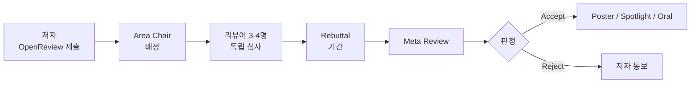

# ICML 2026 완전 정리: 논문 경향성 분석 · 카테고리별 트렌드 · 한국 기관 큐레이션

> 📍 **개최지**: 서울 COEX Convention & Exhibition Center
> 📅 **일정**: 2026년 7월 6~11일 (Tutorial 7/6 · Main 7/7-9 · Workshops 7/10-11)
> 📊 **규모**: 23,918편 제출 → 6,352편 채택 (**26.6%**) — Spotlight 536편(2.2%), Oral 168편(0.7%)
> 🗓️ **조사 시점**: 2026년 7월 9일 (학회 진행 중, 일부 정보 최종본 아님)

---

## 정보 공개 현황 (2026-07-09 기준)

ICML 2026는 학회가 **현재 진행 중**입니다. 이에 따라 본 리포트는 다음 소스를 종합해 작성됐습니다.

- 공식 accepted papers 리스트: [icml.cc/virtual/2026/papers.html](https://icml.cc/virtual/2026/papers.html)
- OpenReview: [openreview.net/group?id=ICML.cc/2026/Conference](https://openreview.net/group?id=ICML.cc/2026/Conference)
- Awards 공식 발표: [ICML Blog 2026-07-05](https://blog.icml.cc/2026/07/05/announcing-the-icml-2026-awards/)
- Paper Copilot 통계: [papercopilot.com](https://papercopilot.com/statistics/icml-statistics/icml-2026-statistics/)
- 각 기관·랩 자체 발표(NAVER Labs Europe, KAIST LK Lab, LG AI Research 등)

> **⚠ 신뢰도 표기 규칙**
> - **확정**: 공식 소스에서 이중 확인된 정보
> - **확인 필요**: 검색 결과에서 인용되었으나 공식 소스에서 직접 검증되지 않은 항목 (특히 개별 논문 arXiv ID, 저자 소속, 채택 여부)
> - arXiv URL 중 `26xx.xxxxx` 형식은 2026년 배포 프리프린트로, 학회 최종 registered ID와 다를 수 있음

---

## 목차

1. [ICML 2026 한눈에 보기](#1-icml-2026-한눈에-보기)
2. [Awards & 프로그램 하이라이트](#2-awards--프로그램-하이라이트)
3. [카테고리별 경향성 분석 (11개 대분류)](#3-카테고리별-경향성-분석)
4. [크로스컷 트렌드: 전체 흐름](#4-크로스컷-트렌드)
5. [한국 기관 채택 논문](#5-한국-기관-채택-논문)
6. [주목할 만한 7편 큐레이션](#6-주목할-만한-7편-큐레이션)
7. [ICML 2026 한 줄 요약](#7-icml-2026-한-줄-요약)
8. [부록: BibTeX 스니펫](#8-부록-bibtex-스니펫)
9. [참고 문헌](#9-참고-문헌)

---

## 1. ICML 2026 한눈에 보기

| 항목 | 내용 |
|------|------|
| 정식 명칭 | 제43회 International Conference on Machine Learning |
| 일시 | 2026년 7월 6~11일 |
| 장소 | 서울 COEX Convention & Exhibition Center |
| 제출 논문 수 | **23,918편** (2025 대비 12,107 → 약 2배) |
| 채택 논문 수 | **6,352편** (26.6%) |
| Spotlight | 536편 (2.2%) |
| Oral | 168편 (0.7%) |
| General Chair | Tong Zhang (UIUC) |
| Program Chairs | Miroslav Dudik (MSR), Martin Jaggi (EPFL), Alekh Agarwal (Google), Sharon Li (UW-Madison) |
| Test of Time Award | **Asynchronous Methods for Deep Reinforcement Learning** (Mnih et al., 2016) |

### 제출/채택 추이 (2015 → 2026)

```
2015:  1,037 제출 / 270 채택 (26.0%)
2020:  4,990 제출 / 1,088 채택 (21.8%)
2024:  9,653 제출 / 2,610 채택 (27.0%)
2025: 12,107 제출 / 3,260 채택 (26.9%)
2026: 23,918 제출 / 6,352 채택 (26.6%)  ← 사상 최대, 전년 대비 +98%
```

### 리뷰 프로세스 요약



---

## 2. Awards & 프로그램 하이라이트

### Outstanding Paper Award (2편 공동 수상 — 모두 Diffusion 계열)

**1. The Flexibility Trap: Rethinking the Value of Arbitrary Order in Diffusion Language Models**

- 저자: Zanlin Ni, Shanchuan Wang, Yisen Yue 외 (Tsinghua × ByteDance)
- URL: [icml.cc Oral 71086](https://icml.cc/virtual/2026/oral/71086)
- 한 줄: **Diffusion LM의 임의 순서(arbitrary-order) 생성이 RL 튜닝 시 엔트로피 붕괴를 유발**함을 규명하고, 좌→우 궤적을 강제하는 **JustGRPO**로 GSM8K 89.1% 달성.

**2. High-Accuracy Sampling for Diffusion Models and Log-Concave Distributions**

- 저자: Fan Chen, Sinho Chewi, Constantinos Daskalakis (MIT / IAS / MIT)
- URL: [ICML 2026 Oral 71132](https://icml.cc/virtual/2026/oral/71132)
- 한 줄: 훈련 불필요한 **First-Order Rejection Sampling (FORS)** 로 diffusion·log-concave 샘플링 이론 상한을 polylog(1/δ) 스텝으로 개선.

### Outstanding Position Paper Award

**Position: The Alignment Community is Unintentionally Building a Censor's Toolkit**

- 저자: Sarah Ball, Phil Hackemann 외 (MCML / LMU Munich)
- URL: [icml.cc Oral 71119](https://icml.cc/virtual/2026/oral/71119) · [프로젝트 페이지](https://s-ball-10.github.io/censors-toolkit/)
- 한 줄: RLHF·guardrail 등 정렬 도구가 검열·정보 지배 도구로 오용될 수 있는 **dual-use 위험**을 매핑.

### Honorable Mention (일부)

| 논문 | 저자/소속 | 요약 |
|---|---|---|
| A Random Matrix Perspective on the Consistency of Diffusion Models | Binxu Wang, Jacob Zavatone-Veth, Cengiz Pehlevan / Kempner–Harvard | 랜덤 행렬 이론으로 diffusion 일관성 스케일링 해명 |
| Position: AI/ML Deepfake Research is Misaligned with AIG-NCII | Li Qiwei 외 (확인 필요) | Deepfake 연구가 정치인 편중, 실제 최대 피해인 비합의 성적 이미지 대응 결여 |

### Test of Time Award

**Asynchronous Methods for Deep Reinforcement Learning** — Volodymyr Mnih, Adrià Puigdomènech Badia 외 (DeepMind, 2016). A3C의 시대적 재조명은 최근 **비동기·분산 RL post-training** 대량화 흐름과 맞물려 상징적 의미가 큼.

---

## 3. 카테고리별 경향성 분석

### 3.1 LLM Core

#### 부상 하위 트렌드

- **RLVR 이론화** — GRPO·DAPO·Dr.GRPO 계열의 손실 동역학·길이 편향·성공 증폭을 이론적으로 해부
- **Test-time compute scaling** — 병렬 샘플링(Forest-of-Thought) vs 순차적 긴 CoT 병존
- **Data Wall 대응** — 합성 데이터 스케일링 법칙 재정식화, 고품질 토큰 큐레이션
- **Pluralistic alignment** — DPO의 refusal-learning 한계 지적, Population-Proportional Alignment
- **Agentic RL 산업화** — planner/executor/verifier를 in-the-flow로 end-to-end 훈련

#### 대표 논문

| 제목 | 저자·소속 | URL | 요약 |
|---|---|---|---|
| Reinforcement Learning with Verifiable Rewards: GRPO's Loss, Dynamics, and Success Amplification | (확인 필요) | [Poster 60548](https://icml.cc/virtual/2026/poster/60548) | GRPO 대조 손실 구조 · 성공 증폭 동역학 이론화 |
| Beyond RLHF and NLHF: Population-Proportional Alignment under an Axiomatic Framework | (확인 필요) | ICML 2026 OpenReview | 인구 비례 공리 기반 pluralistic alignment |
| Principled Synthetic Data Enables the First Scaling Laws for LLMs in Recommendation | (확인 필요) | [Poster 64820](https://icml.cc/virtual/2026/poster/64820) | 합성 데이터 계층화 → 추천 LLM 최초 power-law scaling |
| Scaling Behaviors of LLM RL Post-Training | (확인 필요) | [OpenReview KBut2YCZ4g](https://openreview.net/forum?id=KBut2YCZ4g) | 수학 추론 RL의 pass@k · 컴퓨트 축 스케일링 커브 실증 |
| Outcome-Based Rewards Do Not Guarantee Faithful and Verifiable Reasoning | (확인 필요) | [Poster 63576](https://icml.cc/virtual/2026/poster/63576) | RLVR은 정확도만 올리고 reasoning 인과성(CIR)·검증가능성(SR)은 개선 못함 |

#### 2025 대비 변화

2025년은 DPO 개량 · 초기 RLHF 이론이 다수였다면, 2026년은 **RLVR/GRPO의 이론적 해부**가 지배적. Alignment 축이 "인간 선호 fitting"에서 "검증 가능한 보상 + pluralism"으로 이동. Pretraining 논문 비중 감소, **post-training scaling · 데이터 품질**로 무게중심 이동.

---

### 3.2 Diffusion & Generative Models

#### 부상 하위 트렌드

- **Diffusion Language Models (dLLM) realism check** — DiffusionGemma(26B MoE) 등 오픈 릴리스 이후 주류화, 반론성 연구(Flexibility Trap 등)도 강력 제기
- **dLLM용 RL 레시피** — JustGRPO, DiffusionNFT, GDSD, Stabilizing RL for dLM 등이 새 서브필드 형성
- **Flow Matching 통합 이론** — Rectified Flow의 score distillation 통합, RealUID, π-Flow
- **고정밀 샘플러 이론** — FORS 등 훈련 불필요 고정밀 샘플링
- **효율화된 비디오/오디오 diffusion** — 선형 attention 상수-메모리, Any-Diffusion 등 통합 discrete diffusion

#### 대표 논문

| 제목 | 저자·소속 | URL | 요약 |
|---|---|---|---|
| **The Flexibility Trap** *(Outstanding)* | Zanlin Ni, S. Wang, Y. Yue / Tsinghua×ByteDance | [Oral 71086](https://icml.cc/virtual/2026/oral/71086) | dLLM의 임의순서가 RL 시 성능 저하 → JustGRPO로 좌→우 궤적 강제 |
| **High-Accuracy Sampling for Diffusion Models** *(Outstanding)* | Fan Chen, S. Chewi, C. Daskalakis / MIT-IAS | [Oral 71132](https://icml.cc/virtual/2026/oral/71132) | FORS로 diffusion·log-concave 샘플링 이론 상한 개선 |
| A Random Matrix Perspective on the Consistency of Diffusion Models *(Honorable)* | B. Wang, J. Zavatone-Veth, C. Pehlevan / Kempner-Harvard | [Kempner News](https://kempnerinstitute.harvard.edu/news/kempner-institute-researchers-receive-icml-2026-outstanding-paper-honorable-mention/) | 랜덤 행렬 이론으로 diffusion consistency 해명 |
| Stabilizing Reinforcement Learning for Diffusion Language Models | (확인 필요, HKUST/Huawei 추정) | ICML 2026 Oral | dLLM의 RL 학습 불안정성 진단·완화 |
| DiffusionNFT: Diffusion Negative-aware FineTuning | (확인 필요) | ICML 2026 OpenReview | Flow matching으로 forward 프로세스에서 diffusion 직접 최적화 온라인 RL |

#### 2025 대비 변화

2025년 rectified flow / DiT 이미지 생성 중심 → 2026년 **dLLM이 diffusion 세션의 주인공**. Outstanding Paper 2편 모두 diffusion 계열, 특히 언어 방향. **RL × Diffusion 융합**이 새 서브필드로 확립. 비디오 diffusion은 **효율성 축**(선형 attention, NanoFLUX)으로 이동. **이론 계열 재부상**: log-concave 샘플링·랜덤 행렬 consistency가 award 두 자리.

---

### 3.3 Multimodal

#### 부상 하위 트렌드

- **Unified any-to-any 이해·생성 모델** — Any-Diffusion, UniMRG, Unison 벤치마크 (masked discrete diffusion 기반)
- **VLA의 diffusion화** — dVLA, dVLA-RL, Dream-VLA
- **로봇 메모리 · long-horizon 벤치마크** — RoboMME (π₀.₅ 기반 14개 메모리 증강 변형)
- **World Model as Physics Engine** — RoboFlow4D, PH-Dreamer, Looped World Models
- **VLM 추론 데이터 합성** — "Long Grounded Thoughts" 계열

#### 대표 논문

| 제목 | 저자·소속 | URL | 요약 |
|---|---|---|---|
| Any-Diffusion: Unified Multimodal Understanding and Generation with Masked Discrete Diffusion | Lijiang Li 외 / Tencent Youtu (확인 필요) | [Poster 65305](https://icml.cc/virtual/2026/poster/65305) | 순수 masked discrete diffusion으로 텍스트·음성·이미지 통합 |
| Generation Enhances Understanding in Unified Multimodal Models (UniMRG) | (확인 필요) | [Poster 61013](https://icml.cc/virtual/2026/poster/61013) | 다중 표현 생성 → 통합 MLLM 이해력 강화 |
| Unison: Benchmarking Unified Multimodal Models | (확인 필요) | [Poster 65384](https://icml.cc/virtual/2026/poster/65384) | 통합 MLLM 이해·생성 상호작용을 시너지 관점 벤치마크 |
| RoboMME | (확인 필요) | ICML 2026 proceedings | 16개 long-horizon 조작 태스크 × 14개 메모리 증강 VLA 변형 |
| RoboFlow4D: Lightweight Flow World Model | (확인 필요) | ICML 2026 proceedings | 실시간 flow 기반 world model로 로봇 조작 유도 |

#### 2025 대비 변화

2025년 CLIP/LLaVA 계열 · 비디오 QA 중심 → 2026년 **generation과 understanding의 통합** (masked discrete diffusion 기반 unified MLLM)이 지배. VLA는 절대량은 ICLR 2026이 많지만 ICML 2026은 **diffusion × VLA, memory × VLA, world model × VLA** 교차점에서 차별화. Embodied AI가 워크숍 → 메인 트랙 이동, "산업 배포 단계" 톤이 강함.

---

### 3.4 Agents & Tool Use

#### 부상 하위 트렌드

- **In-the-flow agentic RL** — planner/executor/verifier/generator를 multi-turn 루프 안에서 end-to-end 훈련
- **Verifier 내장형 에이전트** — 별도 reward model 대신 tool-use와 reasoning을 interleave
- **도메인 특화 벤치마크 세분화** — SWE-Bench Pro, VenusBench-Mobile, AutoWebWorld
- **Agent orchestration** — decomposition + specialization + coordination
- **JIT / Latency 최적화** — 프로덕션 배포 겨냥한 planning-scheduling 결합

#### 대표 논문

| 제목 | 저자·소속 | URL | 요약 |
|---|---|---|---|
| RLAnything: Forge Environment, Policy, and Reward Model in Completely Dynamic RL System | Gen-Verse | [GitHub Open-AgentRL](https://github.com/Gen-Verse/Open-AgentRL) | 환경/정책/보상 동시 동적 생성-학습 통합 RL |
| AutoTool: Dynamic Tool Selection and Integration | Gen-Verse | 확인 필요 | Reasoning 흐름 안에서 도구 동적 선택-통합 RL |
| AgentV-RL: Scaling Reward Modeling with Agentic Verifier | (확인 필요) | [arXiv:2604.16004](https://arxiv.org/abs/2604.16004) | Tool-use + reasoning interleave verifier가 SOTA ORM 대비 +25.2% |
| Agent JIT Compilation for Latency-Optimizing Computer-Use Agent | (확인 필요) | ICML 2026 Oral | Computer-use 에이전트 latency 최적화 JIT |
| Feedback-to-Plan Decisions for Self-Evolving LLM Agents in CUDA Kernel Generation | (확인 필요) | ICML 2026 Oral | 실행 피드백 → 계획 결정 환류, CUDA 커널 생성 |

> ⚠ AgentFlow (Stanford, arXiv:2510.05592)은 자주 ICML 2026으로 인용되나 실제로는 **ICLR 2026 채택**.

#### 2025 대비 변화

2025년 ReAct 프롬프트 + external verifier 조합, 툴셋 고정 → 2026년 **에이전트 시스템 전체 end-to-end RL** (in-the-flow), verifier가 에이전트 내부 모듈화, 도메인별(SWE, GUI, science) 특화 벤치마크로 평가 다변화. 산업화 신호(JIT, orchestration)가 오랄에 진입.

---

### 3.5 Evaluation & Benchmark

#### 부상 하위 트렌드

- **Post-comprehension 벤치마킹** — 인간이 완전히 이해 못하는 태스크에서 critique-resilient 평가
- **Verifier ≠ faithful reasoning** — RLVR이 정확도만 올리고 인과 중요도(CIR)·충분성(SR) 개선 못함을 정량화
- **LLM-as-Judge 정교화** — Cohen's Kappa 기반 인간-판단 대체 가능성 정량화 (Judge's Verdict)
- **Contamination-resistant / dynamic 벤치마크** — LastingBench, MMLU-CF, AntiLeakBench
- **Preference leakage** — LLM-as-Judge와 학습 데이터 상호 오염 문제

#### 대표 논문

| 제목 | 저자·소속 | URL | 요약 |
|---|---|---|---|
| Outcome-Based Rewards Do Not Guarantee Faithful and Verifiable Reasoning | (확인 필요) | [Poster 63576](https://icml.cc/virtual/2026/poster/63576) | RLVR의 정확도-충실성 괴리를 정량화 |
| Judge's Verdict: A Comprehensive Analysis of LLM Judge Capability Through Human Agreement | (확인 필요) | [arXiv:2510.09738](https://arxiv.org/abs/2510.09738) | 54개 LLM 판사에 대해 Kappa 기반 2단계 평가, 27개가 인간-유사 판단 재현 |
| LastingBench: Defend Benchmarks Against Knowledge Leakage | (확인 필요) | [arXiv:2506.21614](https://arxiv.org/abs/2506.21614) | 지식 누출 감지·방어 벤치마크 재구성 |

#### 2025 대비 변화

2025년 정적 벤치마크 + MT-Bench류 LLM-as-Judge 중심 → 2026년 (1) 벤치마크의 **동적화·오염 저항성**이 필수, (2) verifier의 **이론적 문제 제기**(outcome reward 불충분성), (3) LLM-as-Judge를 인간 대체로 볼 수 있는 조건을 정량화. "판사 자체를 판사한다"는 메타 평가가 정착.

---

### 3.6 Efficiency

#### 부상 하위 트렌드

- **MoE 재부흥 + 세분화** — Slimmable expert(variable width), expert offloading, batch-aware selection
- **KV cache 압축의 다전선** — eviction, quantization, low-rank, hybrid memory, 새 attention 구조
- **Speculative decoding + quantization 결합** — QuantSpec 계열 확산
- **Quantization 이론화** — Straight-Through Estimator 학습 dynamics 고차원 분석
- **Reasoning-aware efficiency** — 긴 CoT 압축·분류하는 KV cache 방법이 별도 하위 분야

#### 대표 논문

| 제목 | 저자·소속 | URL | 요약 |
|---|---|---|---|
| MoSE: Mixture of Slimmable Experts | (확인 필요) | [Poster 66711](https://icml.cc/virtual/2026/poster/66711) | Nested slimmable expert로 activation width 조건부 계산, 단일 모델로 accuracy-compute 조정 |
| High-Dimensional Learning Dynamics of Quantized Models with Straight-Through Estimator | Fujitsu, RIKEN AIP, U. Tokyo, NTT Research | ICML 2026 accepted | STE 기반 quantized 학습의 고차원 dynamics 이론 |
| AutoQRA: Joint Optimization of Mixed-Precision Quantization and Low-rank Adapters | (확인 필요) | ICML 2026 accepted | Mixed-precision quantization + LoRA 결합 최적화 |
| AGoQ: Activation and Gradient Quantization for Memory-Efficient Distributed Training | (확인 필요) | ICML 2026 accepted | Activation·gradient 동시 quantization 분산 학습 |

#### 2025 대비 변화

2025년 KIVI · QuantSpec 등 개별 기법 병렬 진행 → 2026년 (1) **결합·통합** (quantization+speculative+KV eviction), (2) MoE가 dense 대체 유력 후보로 재부상하며 slimmable/dynamic routing 세분화, (3) **이론적 백본**(STE 학습 dynamics)이 붙기 시작.

---

### 3.7 Optimization & Training Theory

#### 부상 하위 트렌드

- **Muon 계열 폭발적 확장** — LiMuon, MuonEq, Muon^p, DeMuon, AdaMuon, PolarGrad 등 10편 이상 후속
- **Shampoo–Muon 통일 이론** — 두-사이드 프리컨디셔닝을 비유클리드 SGD로 일반화
- **Scaling Laws → Learning Dynamics 전환** — "손실 예측"에서 "훈련 궤적 개입"으로
- **Mechanistic Interpretability = SAE 이후 서킷 발견** — SAE=Topic Model 확률적 재해석
- **RL Post-Training 스케일링** — 수학 추론 대상 RL 스케일링 법칙

#### 대표 논문

| 제목 | 저자·소속 | URL | 요약 |
|---|---|---|---|
| On the Convergence of Muon and Beyond | Shen 외 | [arXiv:2509.15816](https://arxiv.org/abs/2509.15816) | Muon의 stochastic non-convex 수렴률 개선, MVR1/MVR2 변형 제안 |
| LiMuon: Light and Fast Muon Optimizer for Large Models | (확인 필요) | ICML 2026 accepted | STORM 분산축소 + Randomized SVD로 SFO 복잡도 O(ε⁻⁴)→O(ε⁻³) |
| Sparse Autoencoders are Topic Models | L. Girrbach, Z. Akata / U. Tübingen | [GitHub SAE-TM](https://github.com/ExplainableML/SAE-TM) | SAE 목적함수를 연속 LDA의 MAP로 유도 |
| A Random Matrix Perspective on the Consistency of Diffusion Models | B. Wang, J. Zavatone-Veth, C. Pehlevan / Harvard Kempner | Honorable Mention | 랜덤 행렬 이론으로 diffusion 일관성 스케일링 분석 |
| Scaling Behaviors of LLM RL Post-Training | (확인 필요) | [OpenReview KBut2YCZ4g](https://openreview.net/forum?id=KBut2YCZ4g) | 수학 추론 RL의 pass@k · 컴퓨트 스케일링 커브 |

#### 2025 대비 변화

2025년 Adam-W · soft-MoE 튜닝 중심 → 2026년 **행렬 구조 옵티마이저(Muon/Shampoo) 이론화**가 지배적. Grokking·phase-transition 논문들이 "학습 동역학 → 스케일링 예측"으로 연결.

---

### 3.8 Safety & Alignment

#### 부상 하위 트렌드

- **Alignment의 dual-use 자기반성** — RLHF 등 alignment 도구 자체가 검열·조작에 재활용될 수 있음 (Best Position)
- **Deepfake 연구의 blind spot** — 정치인 딥페이크 편중, AIG-NCII 대응 부재 지적
- **Multi-turn / 적응형 red teaming** — monitor-aware 에이전트에 대한 hierarchical monitoring
- **Unlearning의 mechanistic localization** — mechanism component 국한 편집·삭제로 robustness 향상
- **RLHF/DPO 이론적 재검토** — DPO가 misspecified estimator라는 결과, 선호 순서 역전 실증

#### 대표 논문

| 제목 | 저자·소속 | URL | 요약 |
|---|---|---|---|
| **Position: The Alignment Community is Unintentionally Building a Censor's Toolkit** *(Best Position)* | Sarah Ball, Phil Hackemann / MCML–LMU | [Oral 71119](https://icml.cc/virtual/2026/oral/71119) | Alignment 기법 dual-use 위험 매핑 |
| Position: AI/ML Deepfake Research is Misaligned with AIG-NCII *(Honorable)* | Li Qiwei 외 | ICML 2026 Position | Deepfake 연구 정치인 편중, AIG-NCII 놓침 |
| Mechanistic Unlearning 계열 후속 | (확인 필요) | ICML 2026 proceedings | Mechanism-localized editing으로 relearn 공격 robust |

#### 2025 대비 변화

2025년 HarmBench · WMDP 벤치마크 중심 → 2026년 (1) alignment 방법론에 대한 **윤리적·정치경제적 자기비판**이 학회 최고상으로 인정, (2) unlearning이 **mechanistic interpretability 결합**, (3) red teaming이 **monitor-aware / multi-turn**으로 진화, (4) RLHF/DPO **이론적 한계**가 실증 논문으로 정리.

---

### 3.9 RL Classic

#### 부상 하위 트렌드

- **모델 기반 오프라인 RL의 탈-보수주의** — Posterior over world models로 인식론적 불확실성 처리
- **Universal / Long-Horizon 월드 모델** — "임의 지평 예측기"로 오류 누적 해결
- **Diffusion 기반 탐사** — 확산 모델로 밀도 추정하고 score를 내재적 보상으로
- **Flow World Model → 로봇 실시간 제어** — 4D flow prediction으로 지연 최소화
- **비대칭 Saddle-Point 최적화** — 한쪽 payoff만 섭동해 안정성 확보

#### 대표 논문

| 제목 | 저자·소속 | URL | 요약 |
|---|---|---|---|
| Long-Horizon Model-Based Offline RL Without Conservatism (NEUBAY) | T. Ni, E. Derman, V. Jain / Mila–McGill | [Poster 64471](https://icml.cc/virtual/2026/poster/64471) | Neutral Bayesian 원리로 pessimism 없이 긴 지평 오프라인 학습 |
| Offline RL with Universal Horizon Models (UHM) | (확인 필요) | [Poster 65156](https://icml.cc/virtual/2026/poster/65156) | 임의 지평 상태 직접예측으로 compounding error 완화 |
| Exploratory Diffusion Model (ExDM) | (확인 필요) | ICML 2026 poster | 확산 기반 밀도 추정 → score-based intrinsic reward, unsupervised RL pretraining SOTA |
| LASER: Latent World Model for Active Sensing (POMDP) | (확인 필요) | ICML 2026 Oral | Continuum field latent world model + POMDP로 물리 동역학 포착 |

#### 2025 대비 변화

2025년 Decision Transformer · Diffusion Planner → 2026년 **월드 모델의 물리·연속장(continuum field) 구조화** 및 **오프라인 RL의 확률적 이론화**. Test of Time의 A3C(2016) 선정은 아이러니하게 **비동기·분산 RL 재부흥**을 상징 — 대규모 RL post-training 흐름과 연동.

---

### 3.10 ML Theory

#### 부상 하위 트렌드

- **확산 모델 이론화** — Outstanding Paper 두 편 모두 diffusion 계열
- **정보이론적 일반화 경계** — VAE, transductive learning, 잠재변수·인코더 역할 분해
- **Grokking·상전이 물리학** — 차원 상전이, 자기조직임계(SOC), 특징 출현 스케일링
- **PAC-Bayes on data-dependent sets** — 랜덤 집합 위 PAC-Bayes
- **ICL의 non-parametric 이론화** — 트랜스포머 ICL을 조건부 확률 추정으로

#### 대표 논문

| 제목 | 저자·소속 | URL | 요약 |
|---|---|---|---|
| High-Accuracy Sampling for Diffusion Models and Log-Concave Distributions *(Outstanding)* | F. Chen, S. Chewi, C. Daskalakis | [Oral 71132](https://icml.cc/virtual/2026/oral/71132) | FORS로 polylog(1/δ) 스텝 고정밀 샘플링 |
| The Flexibility Trap: Rethinking Arbitrary Order in Diffusion LMs *(Outstanding)* | Z. Ni, S. Wang, Y. Yue / Tsinghua–ByteDance | [Oral 71086](https://icml.cc/virtual/2026/oral/71086) | dLLM 임의순서가 RL 추론 저해, JustGRPO로 좌→우 강제 |
| Uniform Generalization Bounds on Data-Dependent Hypothesis Sets via PAC-Bayes | (확인 필요) | [arXiv:2404.17442](https://arxiv.org/pdf/2404.17442) | 데이터 의존 가설집합에 대한 최초 균등 PAC-Bayes |
| In-Context Learning as Nonparametric Conditional Probability Estimation | (확인 필요) | [arXiv:2508.08673](https://arxiv.org/pdf/2508.08673) | ICL을 비모수적 조건부확률 추정으로 정식화, minimax 최적성 |

#### 2025 대비 변화

2025년 NTK · overparameterization 중심 → 2026년 **생성모형(diffusion) 이론이 주류로 등극**하며 두 Outstanding Paper 모두 diffusion. PAC-Bayes와 information-theoretic 경계는 학습 알고리즘(SGD·RL)과의 결합으로 실용화.

---

### 3.11 Domain Applications

#### 부상 하위 트렌드

- **Biomedical: AlphaFold3 후속 오픈생태계** — Boltz-2/BoltzGen이 결합친화도·바인더 설계 통합, generative binder design 원년
- **Robotics VLA: Action tokenization · Flow matching** — π₀/OpenVLA 계보에 flow-matching, mixture-of-horizons chunk
- **Materials/Physics: Agentic reasoning** — 다중에이전트 진화탐색 역미세구조 설계, port-Hamiltonian 물리 구조 삽입
- **Math: Autoformalization의 라이브러리화** — 문장 → 이론 전체(공리·정의·전술) 형식화
- **World-Action Models (WAM)** — pretrain-imagine + fine-tune-act 로봇 파운데이션

#### 대표 논문

| 제목 | 저자·소속 | URL | 요약 |
|---|---|---|---|
| Proteo-R1: Thinking Foundation Models for De Novo Protein Binder Design | Stanford (확인 필요) | ICML 2026 accepted | Chain-of-thought reasoning을 단백질 바인더 설계에 도입 |
| Flexibility-Aware Geometric Latent Diffusion for Full-Atom Peptide Design | MindRank AI · 칭다오대 | ICML 2026 accepted | 전-원자 펩타이드 설계용 유연성 인지 기하 잠재 확산 |
| Mesh Field Theory: Port-Hamiltonian Formulation of Mesh-Based Physics | S. Noguchi (JAMSTEC/RIKEN AIP), Y. Kawahara (오사카대) | ICML 2026 accepted | 메쉬 기반 물리에 port-Hamiltonian 구조 부여 |
| AutoMat: Multi-Agent Evolutionary Search for Inverse Microstructure | (확인 필요) | ICML 2026 accepted | LLM 에이전트가 물리 유도 추론으로 역미세구조 설계 |
| Mixture of Horizons in Action Chunking (VLA) | (확인 필요) | [arXiv:2511.19433](https://arxiv.org/abs/2511.19433) | VLA action-chunking에서 다중 지평 혼합 |

#### 2025 대비 변화

2025년 AlphaFold3 · RT-2 하이라이트 → 2026년 **"오픈 파운데이션의 성숙"**: Boltz-2/BoltzGen이 오픈소스로 산업 채택, VLA는 flow-matching · world-action이 지배. 수학은 문장 형식화 → 이론 형식화로, 물리는 순수 데이터 학습 → port-Hamiltonian 등 구조 삽입으로 성숙. Biomedical Spotlights 27편(총 315편)으로 전년 대비 규모 급증.

---

## 4. 크로스컷 트렌드

### 4.1 "확장의 시대 → 검증·유지보수의 시대"인가?

**부분적으로 YES**. 근거:

- Pretraining 논문 비중 감소 → **RLVR · post-training · 데이터 품질**로 축 이동
- Best Paper가 diffusion **샘플링 이론**(FORS)과 **RL 안정성**(Flexibility Trap) → 실무 폭발 이후 원리적 이해 확보 단계
- STE 학습 dynamics · Muon 수렴 · SAE=Topic Model 등 **이론적 백본**이 옵티마이저·quantization·mech interp 각 분야에 부착
- Best Position이 alignment 도구의 **dual-use 자기반성** → 커뮤니티가 "지금까지 만들어온 것"을 다시 검증
- 벤치마크의 **contamination-resistance / 동적화**가 표준 요건화

동시에 **확장의 관성**도 여전:

- 제출 편수 12,107 → 23,918 두 배 증가, 모델·컴퓨트 확장 논문은 여전히 최상위 비중
- Agentic RL 산업화, VLA 실기 배포, 오픈 파운데이션(Boltz-2, EXAONE 등) 등 **배포 지향** 논문 증가

### 4.2 Diffusion LM의 부상

- **DiffusionGemma** (26B MoE, 2026-06 오픈 릴리스)를 기점으로 dLLM이 주류 후보
- ICML 2026 Outstanding Paper 두 편 중 하나(Flexibility Trap)가 dLLM
- Stabilizing RL for dLM, JustGRPO, DiffusionNFT, GDSD 등 **dLLM용 RL 학습법**이 새 서브필드
- 이론은 랜덤 행렬 consistency, log-concave 샘플링으로 심화

### 4.3 RLVR / verifier 계열 급증

- RLHF → **RLVR** (검증 가능한 보상 기반)이 사실상 표준 post-training 스테이지
- GRPO 계열 이론화: 손실 dynamics, 성공 증폭, 편향 스케줄러, DPO 부정합
- **Verifier ≠ faithful reasoning**이라는 반론성 연구도 동시 부상
- Judge's Verdict 등 **LLM-as-Judge 성숙도** 정량화

### 4.4 Agentic RL 학습의 산업화

- In-the-flow agentic RL: planner+executor+verifier 통합 end-to-end 훈련
- Latency 최적화(Agent JIT), self-evolving CUDA 커널 에이전트
- SWE-Bench Pro, VenusBench-Mobile 등 도메인 특화 벤치마크
- Krafton, LG EXAONE BI(주식 애널리스트 에이전트), NAVER Seoul World Model 등 **산업 데모** 연동

### 4.5 Mechanistic Interpretability 대중화

- SAE = Topic Model 확률적 재해석으로 **이론적 정당성** 확보
- Mechanism-localized unlearning으로 **safety와 결합**
- Mech Interp 워크숍 확대([mechinterpworkshop.com](https://mechinterpworkshop.com/))

### 4.6 부상 vs 사그라드는 키워드

| 부상 🔥 | 사그라드 🥶 |
|---|---|
| RLVR, GRPO, DAPO | Vanilla RLHF, DPO baseline |
| Diffusion LM (dLLM) | Pure autoregressive scaling |
| Muon, Shampoo (matrix optim) | Adam-W tuning 논문 |
| SAE, Circuit finding | Attention visualization |
| Agentic RL / verifier | ReAct-only prompting |
| Unified any-to-any (masked diffusion) | Separate encoder-decoder MLLM |
| Contamination-resistant benchmark | MMLU-style 정적 벤치마크 |
| Flow world model, port-Hamiltonian | Pure data-driven world model |
| Population-proportional alignment | Single-preference alignment |
| Boltz-2 / BoltzGen (오픈 생태계) | Closed AlphaFold3 대체품 |

---

## 5. 한국 기관 채택 논문

### 5.1 개요

- 아시아 최초 개최이자 host country인 한국 기관들의 참여가 두드러짐
- **NAVER**: Platinum Sponsor
- **LG AI Research**: **14편 발표** (한국 산업계 최다, Korea Times/Herald 보도 기준)
- **KAIST**: 20편 이상 추정 (여러 랩 종합), 자체 [KAIST @ ICML 2026 위성 이벤트](https://kaist-icml.github.io/) 개최

전체 한국 기관 총 채택 편수 공식 집계는 **확인 필요**.

### 5.2 학계

**KAIST** — LK Lab, DM Lab, AMI Lab, SAIL 등 다수 랩

| 논문 | 저자 | 지위 | URL |
|---|---|---|---|
| Dynamics Reveals Structure: Challenging the Linear Propagation Assumption | KAIST LK Lab (Minjoon Seo 랩) | **Spotlight** | [arXiv:2601.21601](https://arxiv.org/abs/2601.21601) |
| Early Decisions Matter: Proximity Bias and Initial Trajectory Shaping in Non-Autoregressive Diffusion Language Models | KAIST LK Lab | Poster | [arXiv:2604.10567](https://arxiv.org/abs/2604.10567) |
| Intrinsic Task Symmetry Drives Generalization in Algorithmic Tasks | KAIST LK Lab | Poster | [arXiv:2603.01968](https://arxiv.org/abs/2603.01968) |
| Q-Flow: Stable and Expressive RL with Flow-Based Policy | KAIST LK Lab | Poster | 확인 필요 |
| Decentralized Instruction Tuning: Conflict-Aware Splitting and Weight Merging | KAIST LK Lab | Poster | 확인 필요 |
| Breaking the Lock-in: Diversifying T2I Generation via Representation Modulation | Dahee Kwon, Jaesik Choi (SAIL) | Poster | 확인 필요 |
| Manifold-Aligned Guided Integrated Gradients | Soyeon Kim, Jaesik Choi (SAIL) | Poster | 확인 필요 |
| DistMatch: Adaptive Binning via Distribution Matching for Sequential Conformal Prediction | Enver Menadjiev, Jaesik Choi (SAIL) | Poster | 확인 필요 |
| Breaking the Reference Bottleneck via Learning to Rewrite Conversational Queries | Doyoung Kim, Jae-Gil Lee (DM Lab) | Poster | 확인 필요 |
| Time-PEFT: Temporal and Multichannel Complexity-Based Fine-Tuning for Time-Series FM | Jihye Na, Jae-Gil Lee (DM Lab) | Poster | 확인 필요 |
| Measurement-Consistent Langevin Corrector for Latent Diffusion Inverse Problem | Hyoseok Lee, Tae-Hyun Oh (AMI Lab) | Poster | 확인 필요 |

**SNU (서울대)** — MLLAB, Vision & Learning Lab, PI Lab

| 논문 | 저자 | URL |
|---|---|---|
| Rule2DRC: Benchmarking LLM Agents for DRC Script Synthesis | SNU MLLAB | [arXiv:2605.15669](https://arxiv.org/abs/2605.15669) |
| Identifiable Token Correspondence for World Models | SNU MLLAB | [arXiv:2605.16457](https://arxiv.org/abs/2605.16457) |
| WEASEL: OOD Generalization for Web Agents via Importance-Diversity Data Selection | Fatemeh Pesaran Zadeh 외 (Gunhee Kim), SNU-Mila 공동 | [arXiv:2605.20291](https://arxiv.org/abs/2605.20291) |

**POSTECH** — KAIST AMI Lab과 공동 저자 다수 (Tae-Hyun Oh 그룹)

| 논문 | 저자 |
|---|---|
| Zero-Shot Rankability: Revealing Latent Ordinal Structure in Multimodal LLMs via Language | Nam Hyeon-Woo, Moon Ye-Bin, Kwon Byung-Ki (POSTECH), 외 KAIST |
| A Language-Guided Bayesian Optimization for Efficient LoRA Hyperparameter Search | Baek Seong-Eun, Kim Sung-Bin (POSTECH), 외 KAIST |

**Yonsei (연세대)** — MICV Lab (Seong Jae Hwang 그룹)

| 논문 | 저자 |
|---|---|
| Physics in 2-Steps: Locking Motion Priors Before Visual Refinement Erases Them | Woojung Han, Seil Kang, Youngjun Jun, Min-Hung Chen (NVIDIA), 외 |
| Mitigating Mask Prior Drift and Positional Attention Collapse in Large Diffusion VLMs | Sujung Hong, Chanyong Yoon, Seong Jae Hwang |

**Korea University, UNIST, GIST, KIAS, ETRI, KISTI**: 랩 단위 공식 공지 미확인. **확인 필요**.

### 5.3 산업계

**NAVER (Platinum Sponsor)**

- Expo Talk: **"Seoul World Model: Grounding World Simulation Models in a Real-World Metropolis"** (7/6 KST 11:30) — 서울시 데이터 기반 도시 world model
- NAVER Labs Europe: "Behavioral Mode Discovery for Fine-Tuning Multimodal Generative Policies" (Alberta Longhini 외)
- HyperCLOVA X 관련 ICML 2026 채택 논문 개별 확인은 어려움 (기술 보고서 arXiv 사전 배포 상태)

**LG AI Research (EXAONE)** — **14편 채택** (한국 산업계 최다)

주요 성과:
- **LeMat-GenBench 세계 2위** (AI 생성 결정 구조 안정성·신규성·다양성)
- **EXAONE Discovery**: 하루 만에 발견한 탈모 완화 성분 "Rhamsydil"
- **EXAONE BI**: 8,000개 종목 분석 주식 애널리스트 에이전트
- **EXAONE Data Foundry**: 데이터 생산성 1,000배 개선 플랫폼

개별 논문 제목 · arXiv는 **LG 공식 리스트 미공개, 확인 필요**.

**Krafton (KRAFTON AI)**

Kangwook Lee CAIO가 ICML 2026에서 **게임 AI 3대 아젠다** 발표 (in-game AI agents, interactive world models, production AI). 대표 논문: **"미래 상태 예측 후 조건부 행동 결정"** 기법이 Behavior Cloning보다 이론적으로 우월함을 증명.

**Samsung Research, SK Telecom (A.X), Kakao Brain, Upstage, KT**

공식 채택 공지 미확인 — **확인 필요**. SK Telecom은 ICLR 2026이 주요 발표 채널.

---

## 6. 주목할 만한 7편 큐레이션

### ⭐ 1. The Flexibility Trap (Outstanding Paper)

- **저자**: Zanlin Ni, Shanchuan Wang, Yisen Yue 외 (Tsinghua × ByteDance)
- **URL**: [icml.cc Oral 71086](https://icml.cc/virtual/2026/oral/71086) · [JustGRPO GitHub](https://github.com/LeapLabTHU/JustGRPO)

**요약**: Diffusion Language Model의 큰 장점으로 여겨졌던 arbitrary-order 생성이 RL 튜닝 단계에서 오히려 엔트로피 붕괴를 유발해 추론 성능을 저해함을 밝혔다. 이를 해결하는 JustGRPO는 좌→우 궤적을 강제해 GSM8K 89.1%를 달성.

**왜 주목**: dLLM 부상의 방향성을 재정의. "자유도가 항상 좋은 것은 아니다"라는 반론성 통찰이 커뮤니티 전환점이 될 가능성.

### ⭐ 2. High-Accuracy Sampling for Diffusion Models (Outstanding Paper)

- **저자**: Fan Chen, Sinho Chewi, Constantinos Daskalakis (MIT / IAS / MIT)
- **URL**: [icml.cc Oral 71132](https://icml.cc/virtual/2026/oral/71132)

**요약**: 훈련 불필요한 First-Order Rejection Sampling(FORS)으로 diffusion과 log-concave 분포 샘플링을 polylog(1/δ) 스텝으로 처리. score만으로 고정밀 샘플링을 최초 달성.

**왜 주목**: Diffusion 이론의 실용적 한계를 정면 돌파. 향후 실시간 · 저지연 diffusion inference의 이론적 기반.

### ⭐ 3. Position: The Alignment Community is Unintentionally Building a Censor's Toolkit (Best Position)

- **저자**: Sarah Ball, Phil Hackemann 외 (MCML / LMU Munich)
- **URL**: [Oral 71119](https://icml.cc/virtual/2026/oral/71119) · [프로젝트](https://s-ball-10.github.io/censors-toolkit/)

**요약**: RLHF · guardrail 등 alignment 도구가 검열 · 정보 지배 도구로 오용될 수 있는 dual-use 위험을 매핑. Alignment 커뮤니티가 스스로 위험 생성 주체가 될 수 있음을 지적.

**왜 주목**: 커뮤니티의 **자기반성** 신호로서 Best Position Paper 수상. 향후 규제 · 정책 논의의 학문적 근거.

### ⭐ 4. Dynamics Reveals Structure: Challenging the Linear Propagation Assumption (Spotlight)

- **저자**: KAIST LK Lab (Minjoon Seo 그룹)
- **URL**: [arXiv:2601.21601](https://arxiv.org/abs/2601.21601)

**요약**: Transformer · GNN 등에서 오랫동안 당연시된 "선형 전파 가정"에 도전. 표현 학습 dynamics를 통해 잠재 구조를 밝히는 새로운 프레임워크.

**왜 주목**: 한국 학계 ICML 2026 Spotlight 대표작. 표현 학습 이론의 근본 가정을 재검토하는 방향.

### ⭐ 5. On the Convergence of Muon and Beyond

- **저자**: Shen 외
- **URL**: [arXiv:2509.15816](https://arxiv.org/abs/2509.15816)

**요약**: Muon 옵티마이저의 stochastic non-convex 수렴률을 개선하고 MVR1/MVR2 변형을 제안. Muon 계열 10편 이상 후속 논문의 이론적 기반.

**왜 주목**: 2025-2026 옵티마이저 지형 재편의 대표작. Kimi 등 대규모 학습에 채택된 Muon의 "왜 잘 되는가"에 대한 이론적 답변.

### ⭐ 6. Sparse Autoencoders are Topic Models

- **저자**: L. Girrbach, Z. Akata (Univ. Tübingen)
- **URL**: [GitHub SAE-TM](https://github.com/ExplainableML/SAE-TM)

**요약**: SAE 목적함수를 연속 LDA의 MAP로 유도. Mech interp의 핵심 도구인 SAE의 확률적 정당성을 확보.

**왜 주목**: Mechanistic Interpretability를 "발견적 도구"에서 "확률적 모델"로 격상. 향후 SAE 관련 이론 연구의 출발점.

### ⭐ 7. Seoul World Model (NAVER Expo)

- **소속**: NAVER Cloud · NAVER Labs
- **URL**: [seoul-world-model.github.io](https://seoul-world-model.github.io/)

**요약**: 실제 서울시 메트로폴리스 데이터를 grounding한 world simulation model. Host city Seoul에서 열리는 학회의 상징적 기획.

**왜 주목**: World model이 순수 시뮬레이션에서 **실도시 grounding**으로 확장. NAVER의 platinum sponsor 위상과 결합한 산업 배포 관점 대표작.

---

## 7. ICML 2026 한 줄 요약

> **"확장의 관성은 남아 있으나, 이론적 성숙과 자기반성이 함께 시작된 해 — Diffusion이 이론의 왕좌를 차지하고, RLVR과 Agentic RL이 실무를 지배하며, Alignment 커뮤니티가 스스로를 검증하기 시작한 ICML 2026."**

핵심 5줄 요약:

1. **Diffusion 이론화**: Outstanding Paper 2편 모두 diffusion 계열 (Flexibility Trap, FORS)
2. **RLVR 지배**: RLHF에서 RLVR/GRPO로 alignment 축이 완전 이동, 동시에 verifier의 한계도 이론적으로 지적
3. **Muon-Shampoo 옵티마이저 지형 재편**: LiMuon 등 10편 이상 후속 논문, 비유클리드 SGD 프레임 정립
4. **Agentic RL 산업화 + Alignment 자기반성**: Best Position이 alignment 도구의 dual-use 위험 지적, 커뮤니티 전환점
5. **한국 개최의 상징성**: NAVER Platinum, LG AI 14편, KAIST 20편+, Seoul World Model 등 host country 위상 강화

---

## 8. 부록: BibTeX 스니펫

```bibtex
@inproceedings{ni2026flexibility,
  title={The Flexibility Trap: Rethinking the Value of Arbitrary Order in Diffusion Language Models},
  author={Ni, Zanlin and Wang, Shanchuan and Yue, Yisen and others},
  booktitle={Proceedings of the 43rd International Conference on Machine Learning (ICML)},
  year={2026},
  note={Outstanding Paper Award}
}

@inproceedings{chen2026fors,
  title={High-Accuracy Sampling for Diffusion Models and Log-Concave Distributions},
  author={Chen, Fan and Chewi, Sinho and Daskalakis, Constantinos},
  booktitle={Proceedings of the 43rd International Conference on Machine Learning (ICML)},
  year={2026},
  note={Outstanding Paper Award}
}

@inproceedings{ball2026alignment,
  title={Position: The Alignment Community is Unintentionally Building a Censor's Toolkit},
  author={Ball, Sarah and Hackemann, Phil and others},
  booktitle={Proceedings of the 43rd International Conference on Machine Learning (ICML)},
  year={2026},
  note={Outstanding Position Paper Award}
}

@inproceedings{wang2026randommatrix,
  title={A Random Matrix Perspective on the Consistency of Diffusion Models},
  author={Wang, Binxu and Zavatone-Veth, Jacob A. and Pehlevan, Cengiz},
  booktitle={Proceedings of the 43rd International Conference on Machine Learning (ICML)},
  year={2026},
  note={Honorable Mention}
}

@inproceedings{shen2026muon,
  title={On the Convergence of Muon and Beyond},
  author={Shen, ... and others},
  booktitle={Proceedings of the 43rd International Conference on Machine Learning (ICML)},
  year={2026},
  eprint={2509.15816},
  archivePrefix={arXiv}
}

@inproceedings{girrbach2026sae,
  title={Sparse Autoencoders are Topic Models},
  author={Girrbach, Leander and Akata, Zeynep},
  booktitle={Proceedings of the 43rd International Conference on Machine Learning (ICML)},
  year={2026}
}

@inproceedings{kaist2026dynamics,
  title={Dynamics Reveals Structure: Challenging the Linear Propagation Assumption},
  author={KAIST LK Lab},
  booktitle={Proceedings of the 43rd International Conference on Machine Learning (ICML)},
  year={2026},
  note={Spotlight},
  eprint={2601.21601},
  archivePrefix={arXiv}
}

@inproceedings{snu2026weasel,
  title={WEASEL: Out-of-Domain Generalization for Web Agents via Importance-Diversity Data Selection},
  author={Pesaran Zadeh, Fatemeh and Choi, Seyeon and L{\`u}, Xing Han and Reddy, Siva and Kim, Gunhee},
  booktitle={Proceedings of the 43rd International Conference on Machine Learning (ICML)},
  year={2026},
  eprint={2605.20291},
  archivePrefix={arXiv}
}

@inproceedings{mnih2016asynchronous,
  title={Asynchronous Methods for Deep Reinforcement Learning},
  author={Mnih, Volodymyr and Badia, Adri{\`a} Puigdom{\`e}nech and Mirza, Mehdi and Graves, Alex and Lillicrap, Timothy and Harley, Tim and Silver, David and Kavukcuoglu, Koray},
  booktitle={International Conference on Machine Learning},
  year={2016},
  note={ICML 2026 Test of Time Award}
}
```

---

## 9. 참고 문헌

### 공식 소스

- [ICML 2026 공식 홈페이지](https://icml.cc/)
- [ICML 2026 Awards Blog Post](https://blog.icml.cc/2026/07/05/announcing-the-icml-2026-awards/)
- [ICML 2026 Orals 리스트](https://icml.cc/virtual/2026/events/oral)
- [ICML 2026 Position Papers](https://icml.cc/virtual/2026/events/2026-position-papers)
- [ICML 2026 Papers 리스트](https://icml.cc/virtual/2026/papers.html)
- [ICML 2026 OpenReview](https://openreview.net/group?id=ICML.cc/2026/Conference)

### 통계 · 분석

- [ICML 2026 Acceptance Stats (CS Conf Stats)](https://csconfstats.xoveexu.com/conferences/icml/2026/)
- [Paper Copilot ICML 2026](https://papercopilot.com/statistics/icml-statistics/icml-2026-statistics/)
- [Paper Digest ICML 2026 Highlights](https://www.paperdigest.org/2026/05/icml-2026-papers-highlights/)
- [OpenAccept ICML 2026](https://openaccept.org/c/ai/icml/2026/)

### 기관 발표

- [KAIST @ ICML 2026 위성 이벤트](https://kaist-icml.github.io/)
- [KAIST LK Lab](https://lklab.kaist.ac.kr/)
- [KAIST DM Lab ICML 2026](https://www.kaistdmlab.org/post/icml-2026-paper-accept)
- [KAIST AMI Lab](https://ami.kaist.ac.kr/353fdae6-c854-80d6-966d-f8307129f4dc)
- [KAIST SAIL](https://sail.kaist.ac.kr/)
- [SNU MLLAB](https://mllab.snu.ac.kr/)
- [SNU Vision & Learning Lab](https://vision.snu.ac.kr/)
- [NAVER Labs Europe ICML 2026](https://europe.naverlabs.com/updates/icml/)
- [LG AI Research (Korea Times)](https://www.koreatimes.co.kr/business/tech-science/20260708/lg-ai-research-showcases-real-world-exaone-ai-applications-at-icml-2026)
- [LG (Korea Herald)](https://www.koreaherald.com/article/10802277)
- [Krafton AI Publications](http://krafton.ai/en/publications/)
- [Google at ICML 2026](https://research.google/conferences-and-events/google-at-icml-2026/)
- [Apple at ICML 2026](https://machinelearning.apple.com/updates/apple-at-icml-2026)
- [Yandex ICML 2026](https://research.yandex.com/blog/papers-accepted-to-icml-2026)
- [Kempner Institute Honorable Mention](https://kempnerinstitute.harvard.edu/news/kempner-institute-researchers-receive-icml-2026-outstanding-paper-honorable-mention/)
- [45 papers at ICML 2026 - RIKEN AIP](https://aip.riken.jp/news/icml2026/)
- [Papers accepted at ICML 2026 - UCL Engineering](https://www.ucl.ac.uk/engineering/news/papers-accepted-icml-2026)

### 워크숍 · 튜토리얼

- [High Dimensional Learning Dynamics Workshop](https://icml.cc/virtual/2026/workshop/54077)
- [3rd AI for Math Workshop @ ICML 2026](https://ai4math2026.github.io/)
- [3rd Workshop on Multi-modal FMs for Life Sciences](https://icml2026fm4ls.github.io/index.html)
- [Mechanistic Interpretability Workshop](https://mechinterpworkshop.com/)
- [ML for Audio Workshop](https://mlforaudioworkshop.github.io/)
- [Generalization and Memorization in Flow Matching and Diffusion Tutorial](https://memorization-generalization.github.io/)

### 개별 논문 · 커뮤니티 자료

- [ArxivIQ: The Flexibility Trap](https://arxiviq.substack.com/p/icml-2026-the-flexibility-trap-rethinking)
- [ArxivIQ: High-accuracy sampling](https://arxiviq.substack.com/p/icml-2026-high-accuracy-sampling)
- [Position: The Alignment Community's Censor's Toolkit (project page)](https://s-ball-10.github.io/censors-toolkit/)
- [MCML — Sarah Ball Best Paper Award](https://mcml.ai/news/2026-07-08-ball-award-best-paper-icml/)
- [GitHub: icml-2026-agent-papers](https://github.com/jiaxianyan/icml-2026-agent-papers)
- [GitHub: Open-AgentRL (RLAnything, AutoTool)](https://github.com/Gen-Verse/Open-AgentRL)
- [Sparse Autoencoders are Topic Models (GitHub)](https://github.com/ExplainableML/SAE-TM)
- [JustGRPO (GitHub)](https://github.com/LeapLabTHU/JustGRPO)
- [DiffusionGemma 발표 (MarkTechPost)](https://www.marktechpost.com/2026/06/10/google-ai-releases-diffusiongemma-a-26b-moe-open-model-using-text-diffusion-for-up-to-4x-faster-generation/)
- [TechTimes: ICML 2026 Opens in Seoul](https://www.techtimes.com/articles/319243/20260628/icml-2026-opens-seoul-next-week-record-23918-submissions-signal-ai-agent-safety-era.htm)
- [Boltz-2 preprint](https://www.biorxiv.org/content/10.1101/2025.06.14.659707v1)
- [BoltzGen (MIT Jameel Clinic)](https://jclinic.mit.edu/boltzgen/)
- [V-JEPA 2 paper](https://arxiv.org/html/2506.09985v1)

### 대표 arXiv

- [arXiv:2509.15816 — On the Convergence of Muon and Beyond](https://arxiv.org/abs/2509.15816)
- [arXiv:2505.23737 — On the Convergence Analysis of Muon](https://arxiv.org/abs/2505.23737)
- [arXiv:2508.08673 — ICL as Nonparametric Conditional Probability Estimation](https://arxiv.org/pdf/2508.08673)
- [arXiv:2404.17442 — Uniform Generalization Bounds via PAC-Bayes on Random Sets](https://arxiv.org/pdf/2404.17442)
- [arXiv:2510.09738 — Judge's Verdict](https://arxiv.org/abs/2510.09738)
- [arXiv:2506.21614 — LastingBench](https://arxiv.org/abs/2506.21614)
- [OpenReview KBut2YCZ4g — Scaling Behaviors of LLM RL Post-Training](https://openreview.net/forum?id=KBut2YCZ4g)

---

*작성: 2026-07-09 / Powered by Claude & Auto Research Pipeline*
