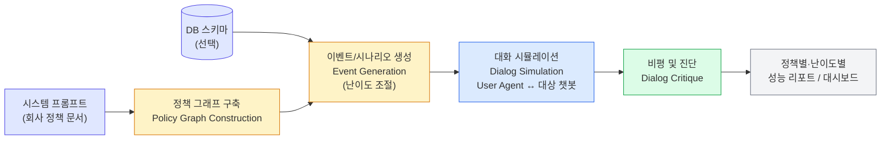
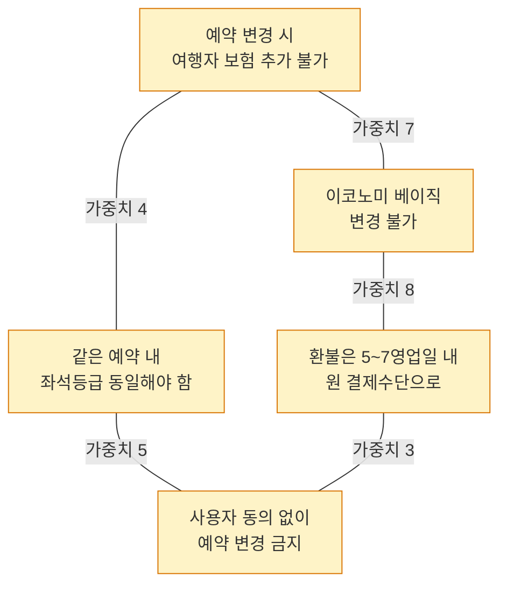
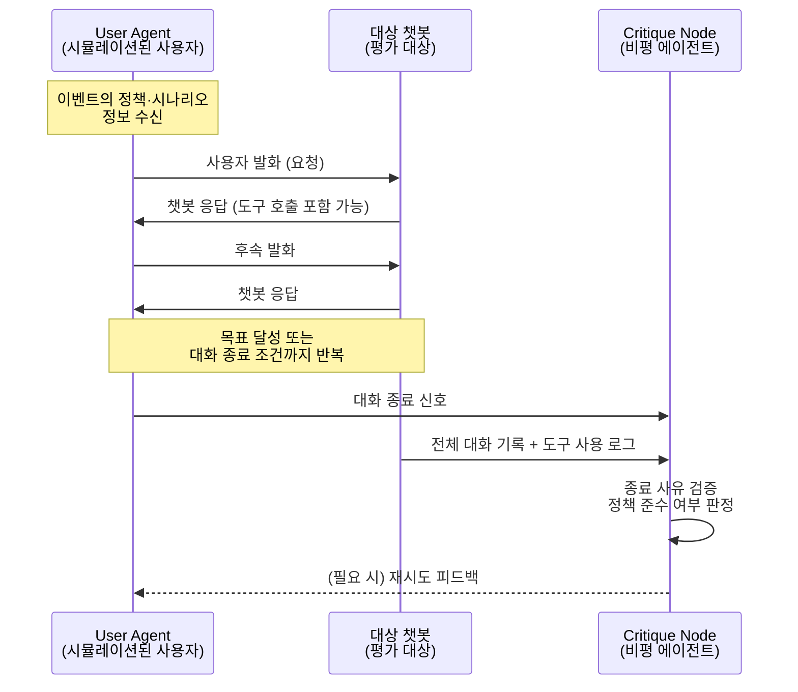

# IntellAgent 완전 정복: 정책 그래프로 대화형 에이전트의 숨은 취약점을 찾아내는 법

📊 **발표자료**: [intellagent-presentation.pptx](./intellagent-presentation.pptx)

> **핵심 질문**: 항공사 고객지원 챗봇을 배포하기 전, "잘 작동하는지"를 어떻게 검증하는가? 사람이 손으로 만든 테스트 케이스 50개를 통과하면 충분한가? IntellAgent는 이 질문에 "아니다"라고 답하며, 정책을 그래프로 모델링하고 시뮬레이션으로 수천 개의 시나리오를 자동 생성하는 평가 프레임워크를 제시한다.

---

## 1. 문제의식: 왜 정적 벤치마크로는 부족한가

대화형 AI 에이전트는 이제 단순 질의응답을 넘어 멀티턴 대화를 이어가며 도메인별 API를 호출하고, 회사가 정한 정책 제약을 지켜야 하는 시스템으로 진화했다. 문제는 이런 에이전트를 평가하는 방법이 이 복잡도를 따라가지 못하고 있다는 점이다.

Plurai의 Elad Levi와 Ilan Kadar가 2025년 1월 공개한 논문 [IntellAgent: A Multi-Agent Framework for Evaluating Conversational AI Systems](https://arxiv.org/abs/2501.11067)(arXiv:2501.11067)는 이 간극을 정확히 짚는다. 대표적 비교 대상인 τ-bench(tau-bench)를 예로 들면, 이 벤치마크는 항공사 도메인에 50개, 리테일 도메인에 115개의 수작업 큐레이션 샘플만 제공한다. 사람이 하나하나 만든 테스트 케이스이다 보니 규모를 키우기 어렵고, 실제 프로덕션에서 마주치는 정책 조합의 다양성을 충분히 커버하지 못한다.

논문이 지적하는 기존 방법의 한계는 크게 두 가지다.

- **확장성 부족**: 수작업 큐레이션에 의존하다 보니 시나리오 수가 적고, 새 도메인이나 정책이 추가될 때마다 사람이 다시 테스트 케이스를 만들어야 한다.
- **거친 평가 지표(coarse-grained metrics)**: 대화가 "성공했다/실패했다"는 이진 판정만 제공할 뿐, 어떤 정책에서 실패했는지, 정책 난이도가 올라갈수록 성능이 어떻게 저하되는지에 대한 세밀한 진단을 제공하지 못한다.

RAG 파이프라인 평가 도구인 RAGAS는 개별 컴포넌트(검색, 생성)를 분리해서 평가하는 데 최적화되어 있어 멀티턴 대화의 복잡성을 다루지 못하고, 고객지원 도메인에 특화된 ALMITA 벤치마크 역시 다른 도메인으로의 일반화가 검증되지 않았다는 한계를 논문은 함께 지적한다. IntellAgent는 이 세 축의 한계 — 확장성, 진단 세밀도, 도메인 일반화 — 를 동시에 겨냥한 프레임워크로 제시된다.

---

## 2. IntellAgent란 무엇인가

IntellAgent는 **정책 기반 그래프 모델링(policy-driven graph modeling), 현실적 이벤트 생성(realistic event generation), 대화형 사용자-에이전트 시뮬레이션(interactive user-agent simulation)** 세 가지를 결합해 합성 벤치마크를 자동으로 만들어내는 오픈소스 멀티에이전트 프레임워크다([GitHub: plurai-ai/intellagent](https://github.com/plurai-ai/intellagent), Apache 2.0 라이선스).

핵심 아이디어는 단순하다. 챗봇의 시스템 프롬프트(정책 문서)를 입력으로 받아 정책 간의 관계를 그래프로 구조화하고, 이 그래프에서 난이도를 조절하며 시나리오를 뽑아낸 뒤, 시뮬레이션된 사용자 에이전트가 실제 챗봇과 대화를 나누게 하고, 마지막으로 별도의 비평(critique) 에이전트가 어떤 정책이 지켜졌고 어떤 정책이 위반됐는지를 세밀하게 진단한다.



출력물은 단일 통과율(pass rate)이 아니라, "어떤 정책 조합에서 어떤 모델이 실패하는지"를 보여주는 세분화된 리포트와 Streamlit 기반 대시보드다([Architecture 문서](https://intellagent-doc.plurai.ai/How_it_Works/architecture/)). 이 지점이 τ-bench류의 이진 성공/실패 벤치마크와 가장 근본적으로 다른 부분이다.

---

## 3. 핵심 아키텍처: 3단계 파이프라인

### 3.1 정책 그래프 구축 (Policy Graph Construction)

첫 단계는 챗봇의 시스템 프롬프트를 그래프로 분해하는 작업이다. 처리 과정은 다음과 같이 진행된다.

1. LLM(`DescriptionGenerator`)이 시스템 프롬프트를 "흐름(flow)" 단위로 분해한다. 예를 들어 항공사 챗봇이라면 "예약 변경", "취소 및 환불", "좌석 업그레이드" 같은 흐름으로 나뉜다.
2. 각 흐름 안에서 개별 정책을 추출하고, LLM이 각 정책에 **난이도 가중치**를 부여한다.
3. 정책 쌍마다 "같은 대화에서 함께 등장할 가능성"을 LLM이 1~10 척도로 점수화해 **엣지 가중치**로 저장한다.

결과물은 노드가 정책이고 엣지 가중치가 정책 간 공존 확률을 나타내는 가중치 그래프다. 논문 Table 1에 실린 항공사 도메인 정책 예시를 보면 이 구조가 무엇을 의미하는지 명확해진다.

| 정책 | 내용 |
|---|---|
| 초기 정책 | 예약 변경 시 최초 예약 이후에는 여행자 보험을 추가할 수 없다 |
| 관련 정책 A | 예약 취소 시 환불은 원 결제 수단으로 영업일 기준 5~7일 이내 처리된다 |
| 관련 정책 B | 같은 예약 내 모든 항공편의 좌석 등급은 동일해야 한다 |
| 관련 정책 C | 이코노미 베이직 항공편은 변경이 불가능하다 |

이렇게 서로 얽혀 있는 정책들을 그래프로 모델링해두면, 다음 단계에서 "현실적으로 함께 등장할 법한" 정책 조합을 확률적으로 샘플링할 수 있게 된다.



### 3.2 이벤트/시나리오 생성과 난이도 조절

정책 그래프가 만들어지면, 이 그래프 위에서 **가중 랜덤워크(weighted random walk)** 를 수행해 시나리오를 생성한다. 논문의 Algorithm 1이 이 절차를 규정한다.

1. 목표 복잡도 구간 `[n1, n2]`에서 값 하나를 균일분포로 샘플링한다. 이벤트의 복잡도는 "선택된 정책들의 난이도 가중치 합"으로 정의된다.
2. 그래프에서 시작 정책 하나를 균일분포로 무작위 선택한다.
3. 현재 정책 노드에서 인접 노드로 이동할 확률을 엣지 가중치에 비례하게 설정한 뒤 가중 랜덤워크를 수행해 다음 정책을 선택한다 — 즉 $P(X=h \mid Y=g) = E_{g,h} / \sum_h E_{h,g}$.
4. 누적 복잡도가 목표값을 넘어설 때까지 이 과정을 반복해 정책 집합을 확정한다.

이렇게 뽑힌 정책 집합을 바탕으로 `EventsGenerator`가 (1) 정책 목록, (2) 이 정책들에 부합하는 사용자 요청 설명, (3) 초기 데이터베이스 상태를 생성한다. 복잡한 DB 스키마가 있는 도메인(예: 항공사)에서는 엔티티를 심볼로 먼저 표현한 뒤 이를 실제 DB 행으로 인스턴스화하는 방식을 쓴다.

이 메커니즘 덕분에 난이도 2에서 11까지 걸쳐 있는 시나리오를 각 도메인당 최대 1,000개까지 완전 자동으로 생성할 수 있었다고 논문은 보고한다 — τ-bench의 50개, 115개와 대비되는 규모다.

### 3.3 대화 시뮬레이션 (Dialog Simulation)

이벤트가 준비되면 시뮬레이션된 사용자 에이전트(User Agent)가 이벤트에 담긴 정책과 시나리오 정보를 받아 대상 챗봇과 실제로 대화를 시작한다. 내부적으로는 LangGraph 기반의 상태 머신(`DialogState`)이 메시지 히스토리, 사용자의 내부 사고 과정, 비평 피드백을 함께 추적한다.



이 구조에서 주목할 점은 사용자 에이전트가 단순히 미리 정해진 대사를 읽는 것이 아니라, 이벤트에 부여된 정책 목표를 바탕으로 매 턴마다 동적으로 다음 발화를 생성한다는 것이다. 실행 모드는 동기(`run`), 비동기(`arun`), 배치(`run_events`) 세 가지를 지원하며, 대화 로그는 SQLite에 저장된다.

### 3.4 비평 및 세부 진단 (Dialog Critique)

시뮬레이션이 끝나면 별도의 Critique 컴포넌트가 사용자-챗봇 전체 대화와 챗봇의 시스템 프롬프트를 함께 입력받아 다음을 판정한다.

1. 대화가 종료된 이유가 타당한지 검증한다. 타당하지 않다면 피드백을 주고 시뮬레이션을 이어간다.
2. 대화 중 실제로 테스트된 정책의 부분집합을 식별한다 — 이벤트에 심어둔 정책 전부가 실제 대화에서 검증되는 것은 아니기 때문이다.
3. 챗봇이 지키지 않은 정책의 부분집합을 짚어낸다.
4. 이를 종합해 정책별·난이도별로 세분화된 성능 리포트를 만든다.

이 4단계가 IntellAgent를 단순 pass/fail 벤치마크와 구별짓는 핵심이다. "이 모델이 몇 점을 받았는가"가 아니라 "이 모델이 정확히 어떤 정책 조합에서, 어떤 난이도부터 무너지는가"를 답할 수 있게 해준다.

---

## 4. 기존 평가 방법 대비 차별점

| 항목 | 수작업 테스트 | τ-bench | RAGAS | ALMITA | **IntellAgent** |
|---|---|---|---|---|---|
| 시나리오 생성 | 사람이 직접 작성 | 수작업 큐레이션 (항공 50 / 리테일 115) | 자동(RAG 파이프라인 한정) | 도메인 특화 데이터셋 | **정책 그래프 기반 완전 자동 생성** |
| 규모 확장성 | 매우 낮음 | 낮음 | 중간 | 낮음 | **도메인당 최대 1,000개+** |
| 평가 대상 범위 | 전체 대화 | 멀티턴 대화 + 정책 + 도구 사용 | 검색/생성 등 개별 컴포넌트 | 고객지원 대화 | **멀티턴 대화 + 정책 + 도구 사용** |
| 진단 세밀도 | 낮음(합/불합) | 낮음(이진 성공/실패) | 컴포넌트 단위 지표 | 중간 | **정책별·난이도별 세분화 진단** |
| 난이도 제어 | 불가 | 불가(고정 샘플) | 해당 없음 | 불가 | **그래프 랜덤워크로 난이도 연속 조절** |
| 도메인 일반화 | 케이스별 재작업 필요 | 항공/리테일 한정 | RAG 파이프라인 한정 | 고객지원 중심, 일반화 미검증 | **정책 문서만 있으면 신규 도메인 적용 가능** |

논문은 관련 연구 절에서 τ-bench에 대해 "수작업 큐레이션에 의존하기 때문에 항공 50개, 리테일 115개로 샘플 수가 제한된다"고 명시적으로 지적하며, RAGAS에 대해서는 "RAG 파이프라인의 개별 컴포넌트를 평가하는 데 초점을 맞추고 있어 멀티턴 대화나 실제 대화형 AI 애플리케이션의 복잡성을 충분히 다루지 못한다"고 짚는다. ALMITA는 "고객지원 도메인에 집중되어 있어 다른 도메인으로의 일반화 가능성이 열린 질문으로 남아 있다"고 평가한다([arXiv:2501.11067](https://arxiv.org/abs/2501.11067)).

흥미로운 점은 IntellAgent가 τ-bench를 완전히 대체하는 게 아니라 그 환경(항공, 리테일 도메인의 DB 스키마와 API)을 그대로 재사용해 검증했다는 것이다. 즉 "새 벤치마크를 처음부터 만든 것"이 아니라 "같은 도메인에서 완전 자동으로 훨씬 많은 시나리오를 생성하는 방법"을 제시한 것에 가깝다.

---

## 5. 실험 결과: 무엇을 발견했는가

논문은 GPT-4o, GPT-4o-mini, Gemini-1.5-pro, Gemini-1.5-flash, Claude-3.5-sonnet, Claude-3.5-haiku 여섯 모델을 τ-bench의 항공/리테일 도메인 환경 위에서 평가했다. 이벤트 생성, 사용자 에이전트, 비평 에이전트에는 모두 GPT-4o를 사용했다.

### 5.1 τ-bench와의 상관관계

가장 먼저 검증한 것은 "완전 합성 데이터만으로 만든 벤치마크가 실제 신호를 담고 있는가"였다. IntellAgent 점수와 τ-bench 점수 사이의 피어슨 상관계수는 **항공 도메인 0.98, 리테일 도메인 0.92**로 나타났다. 합성 시나리오만으로 구성했음에도 기존 수작업 벤치마크와 강한 상관관계를 보였다는 것은, 정책 그래프 기반 샘플링이 실제 모델 성능 차이를 왜곡 없이 재현한다는 근거로 제시된다.

### 5.2 모델별 성능 비교

| 모델 | τ-bench 항공 | IntellAgent 항공 | τ-bench 리테일 | IntellAgent 리테일 |
|---|---|---|---|---|
| Claude-3.5-Sonnet | 0.46 | 0.70 | 0.69 | 0.71 |
| GPT-4o | 0.44 | 0.70 | 0.51 | 0.68 |
| Gemini-1.5-Pro | 0.34 | 0.63 | 0.43 | 0.58 |
| GPT-4o-mini | 0.30 | 0.55 | 0.46 | 0.62 |
| Claude-3.5-Haiku | 0.28 | 0.53 | 0.44 | 0.56 |
| Gemini-1.5-Flash | 0.21 | 0.40 | 0.31 | 0.48 |

두 벤치마크의 절대 점수 자체는 채점 방식이 달라(τ-bench는 전체 태스크 단위 pass@1, IntellAgent는 정책 단위 세분화 채점) 직접 비교하기보다는, 모델 간 상대적 순위와 상관관계를 보는 것이 논문의 핵심 논지에 부합한다. 두 벤치마크 모두에서 Claude-3.5-Sonnet과 GPT-4o가 상위권, Gemini-1.5-Flash가 하위권으로 나타나는 순위 일관성이 상관관계 수치로 확인된다.

### 5.3 난이도가 올라갈수록 성능은 어떻게 저하되는가

정책 그래프의 난이도 조절 기능을 활용해 복잡도 구간별로 모델 성능을 측정한 결과, 모든 모델이 난이도가 올라갈수록 성능이 하락했지만 **하락하는 패턴은 모델마다 달랐다**. 예를 들어 Gemini-1.5-Pro는 항공 도메인에서 난이도 10 수준까지는 GPT-4o-mini보다 우위를 보이다가, 그 이상의 고난이도 구간에서는 두 모델의 성능이 수렴하는 양상을 보였다. 이는 "단일 숫자 점수"만으로는 드러나지 않는, 난이도 구간별 강건성(robustness)의 차이를 정책 그래프 기반 난이도 조절이 포착해낸 사례다.

### 5.4 정책별 취약점: 사용자 동의(user consent)

정책별로 세분화해 보니, 테스트한 모든 모델이 공통적으로 **사용자 동의를 구하는 정책**에서 어려움을 겪었다. 예를 들어 "예약을 변경하기 전 사용자에게 명시적으로 확인받아야 한다"는 유형의 정책은 모델이 도구 호출을 서두르며 놓치기 쉬운 항목이었다. 이는 τ-bench의 이진 성공/실패 지표에서는 잘 드러나지 않았던, IntellAgent의 정책 단위 세분화 진단이 밝혀낸 발견이다.

---

## 6. 실무 활용: 설치와 사용법

IntellAgent는 Python 3.9 이상 환경에서 다음과 같이 설치한다([GitHub README](https://github.com/plurai-ai/intellagent/blob/main/README.md)).

```bash
git clone git@github.com:plurai-ai/intellagent.git
cd intellagent
pip install -r requirements.txt
```

`config/llm_env.yml`에서 OpenAI, Azure, Vertex AI, Anthropic 등 사용할 LLM 제공자의 API 키를 설정한 뒤, 도메인별 config 파일을 지정해 실행한다.

```bash
# DB 없이 간단한 도메인 (예: 교육)
python run.py --output_path results/education --config_path ./config/config_education.yml

# DB가 있는 복잡한 도메인 (예: 항공사)
python run.py --output_path results/airline --config_path ./config/config_airline.yml
```

결과는 Streamlit 대시보드로 시각화할 수 있다.

```bash
streamlit run simulator/visualization/Simulator_Visualizer.py
```

주요 config 옵션은 다음과 같다.

| 옵션 | 역할 |
|---|---|
| `llm_intellagent` | 정책 그래프 구축, 이벤트 생성, 비평 등 프레임워크 자체가 쓰는 LLM 설정 |
| `llm_chat` | 평가 대상 챗봇에 사용할 LLM 설정 |
| `num_samples` | 생성할 이벤트(DB 샘플) 개수 |
| `cost_limit` | LLM 호출 비용 상한 |
| `num_workers` | API 레이트리밋 관리를 위한 병렬 워커 수 |
| `timeout` | 개별 호출 타임아웃 |

저장소는 `/config`(설정 파일), `/examples`(예제), `/simulator`(시뮬레이션 엔진 및 시각화), `/tests`로 구성되며, 저장소 자체는 항공사(복잡한 DB 기반)와 교육(단순) 두 도메인을 예제로 제공한다. GitHub 기준 약 1.3k stars, 154 forks 규모다(2026-07 기준, [저장소](https://github.com/plurai-ai/intellagent)).

### 한계와 향후 방향

논문은 별도의 Limitations 절을 두지는 않지만, 결론에서 향후 연구 방향을 통해 현재 설계의 제약을 간접적으로 드러낸다. "소규모의 실제 사용자-챗봇 상호작용 데이터를 시뮬레이션 환경에 통합하는 방안"을 향후 과제로 언급하는데, 이는 뒤집어 보면 현재 버전의 정책 그래프와 난이도 가중치가 전적으로 **LLM의 판단에 의존**하며, 실제 프로덕션 트래픽 분포로 검증되지는 않았다는 뜻이다. 마찬가지로 "실제 데이터 분포로부터 엣지 가중치와 난이도 가중치를 도출하는" 방향도 미래 과제로 남아 있다.

실무적으로 고려할 점도 있다. 이벤트 생성·사용자 시뮬레이션·비평까지 모든 단계가 LLM 호출로 이루어지므로, 도메인당 1,000개 규모의 벤치마크를 생성하고 여러 모델을 평가하려면 상당한 API 비용이 발생한다(`cost_limit` 옵션이 존재하는 이유이기도 하다). 또한 비평 에이전트 자체가 LLM이므로 "LLM으로 LLM을 평가하는" 구조의 근본적 한계 — 즉 비평 에이전트의 판단 오류 가능성 — 도 함께 고려해야 한다.

### Plurai의 현재 방향

논문 발표 이후 Plurai는 IntellAgent의 연구 성과를 상용 플랫폼으로 확장했다. 현재 회사 웹사이트는 스스로를 "AI 에이전트 신뢰 플랫폼(AI Agent Trust Platform)"으로 소개하며, 시뮬레이션·평가·가드레일을 결합한 상용 제품을 제공한다([plurai.ai](https://www.plurai.ai/)). 회사가 제시하는 도입 성과 지표로는 프로덕션 엣지 케이스 커버리지 15배 확대, 프로덕션 준비 기간 7배 단축, 정책 위반·할루시네이션 100배 감소 등이 있다(회사 자체 보고 수치이므로 참고용으로만 활용할 것을 권한다). IntellAgent 오픈소스 저장소는 이 상용 플랫폼의 연구 기반이자 커뮤니티 진입점 역할을 하고 있으며, 로드맵에는 LangGraph·CrewAI·AutoGen과의 통합, 기존 데이터베이스 기반 이벤트 생성, 사용자 에이전트에 성격(persona) 차원 추가 등이 포함되어 있다.

---

## 7. 정리

IntellAgent가 던지는 메시지는 명확하다. **대화형 에이전트를 "몇 개의 테스트 케이스를 통과했는가"로 평가하는 시대는 끝나야 한다.** 정책은 서로 얽혀 있고, 실제 사용자는 예측 불가능한 순서로 정책의 경계를 건드리며, 이 조합의 난이도는 연속적으로 변한다. 정책 그래프라는 구조로 이 복잡도를 명시적으로 모델링하고, 난이도를 조절하며 자동으로 시나리오를 생성하고, 세분화된 진단으로 "어디서 왜 실패하는지"를 짚어내는 접근은 τ-bench 이후 에이전트 평가 방법론이 나아간 자연스러운 다음 단계로 읽힌다.

동시에 이 접근이 만능은 아니라는 점도 분명히 해야 한다. 정책 그래프의 가중치와 난이도 산정이 여전히 LLM의 주관적 판단에 의존하고, 비평 에이전트 자체도 LLM이라는 점에서 "평가자를 누가 평가하는가"라는 질문은 여전히 열려 있다. 그럼에도 τ-bench와의 강한 상관관계(0.92~0.98)는 이 합성 접근이 최소한 방향성 측면에서는 신뢰할 만한 신호를 제공한다는 것을 보여준다.

---

## 참고문헌

- Elad Levi, Ilan Kadar, ["IntellAgent: A Multi-Agent Framework for Evaluating Conversational AI Systems"](https://arxiv.org/abs/2501.11067), arXiv:2501.11067, 2025-01-19.
- [plurai-ai/intellagent GitHub 저장소](https://github.com/plurai-ai/intellagent)
- [IntellAgent 공식 문서 - Architecture](https://intellagent-doc.plurai.ai/How_it_Works/architecture/)
- [Plurai 공식 블로그 - Introducing IntellAgent](https://www.plurai.ai/blog/introducing-intellagent-your-agent-evaluation-framework)
- [MarkTechPost - Plurai Introduces IntellAgent](https://www.marktechpost.com/2025/01/23/plurai-introduces-intellagent-an-open-source-multi-agent-framework-to-evaluate-complex-conversational-ai-system/)
- [Plurai 공식 웹사이트](https://www.plurai.ai/)
- [Hugging Face Papers - IntellAgent](https://huggingface.co/papers/2501.11067)

---

## 📝 학습 퀴즈

IntellAgent의 핵심 아이디어를 얼마나 이해했는지 점검해보자. 질문에 대한 답을 먼저 생각해본 뒤 "정답 보기"를 눌러 확인하면 된다.

**Q1. IntellAgent가 τ-bench 같은 기존 벤치마크의 한계로 지적하는 두 가지는 무엇인가?**

<details markdown="1">
<summary>✅ 정답 보기</summary>

**정답**: (1) 확장성 부족(수작업 큐레이션으로 인한 적은 샘플 수 — 항공 50개, 리테일 115개), (2) 거친 평가 지표(coarse-grained metrics)로 인해 어떤 정책에서 실패했는지 세밀하게 진단하지 못하는 점.

**해설**: 논문은 τ-bench가 수작업 큐레이션에 의존해 규모를 키우기 어렵고, 이진 성공/실패 판정만 제공해 구체적인 실패 원인을 알기 어렵다고 지적한다. IntellAgent는 이 두 축을 모두 정책 그래프 기반 자동 생성과 정책별 세분화 진단으로 해결하고자 한다.

</details>

**Q2. 정책 그래프(Policy Graph)에서 노드와 엣지는 각각 무엇을 의미하는가?**

<details markdown="1">
<summary>✅ 정답 보기</summary>

**정답**: 노드는 개별 정책(과 그 난이도 가중치)을, 엣지는 두 정책이 같은 대화/상호작용에서 함께 등장할 가능성(1~10 척도의 공존 확률)을 나타낸다.

**해설**: LLM이 시스템 프롬프트를 흐름 단위로 분해해 정책을 추출하고 난이도를 매긴 뒤, 정책 쌍마다 공존 가능성을 점수화해 그래프를 구성한다. 이 구조 덕분에 "현실적으로 함께 등장할 법한" 정책 조합을 확률적으로 샘플링할 수 있다.

</details>

**Q3. IntellAgent의 난이도 조절 메커니즘(Algorithm 1)은 어떤 방식으로 동작하는가?**

<details markdown="1">
<summary>✅ 정답 보기</summary>

**정답**: 목표 복잡도 구간에서 값을 하나 균일 샘플링한 뒤, 정책 그래프 위에서 임의의 시작 노드부터 엣지 가중치에 비례한 확률로 가중 랜덤워크를 수행해 정책을 하나씩 추가한다. 선택된 정책들의 난이도 가중치 합이 목표 복잡도를 넘어설 때까지 이 과정을 반복한다.

**해설**: 이 방식 덕분에 사람이 직접 시나리오를 설계하지 않고도 난이도 2~11 수준까지 연속적으로 조절된 시나리오를 자동 생성할 수 있다. 이는 τ-bench 같은 고정 샘플 벤치마크에서는 불가능한 기능이다.

</details>

**Q4. (OX) IntellAgent의 대화 시뮬레이션은 사용자 에이전트가 미리 정해진 대사를 순서대로 읽는 방식으로 진행된다.**

<details markdown="1">
<summary>✅ 정답 보기</summary>

**정답**: X (거짓)

**해설**: 사용자 에이전트는 고정된 스크립트를 읽는 것이 아니라, 이벤트에 담긴 정책 목표와 시나리오 정보를 바탕으로 매 턴마다 동적으로 다음 발화를 생성한다. 이는 LangGraph 기반 상태 머신(`DialogState`)이 메시지 히스토리와 사용자의 내부 사고 과정을 추적하며 이루어진다.

</details>

**Q5. Dialog Critique 컴포넌트가 수행하는 네 가지 판정 단계를 설명해보자.**

<details markdown="1">
<summary>✅ 정답 보기</summary>

**정답**: (1) 대화 종료 사유의 타당성 검증, (2) 실제로 대화에서 테스트된 정책 부분집합 식별, (3) 챗봇이 지키지 않은 정책 부분집합 파악, (4) 이를 종합한 정책별·난이도별 성능 리포트 생성.

**해설**: 이벤트에 심어둔 정책 전부가 실제 대화에서 검증되는 것은 아니기 때문에, Critique 컴포넌트는 "무엇이 테스트됐는지"부터 먼저 판정한 뒤 위반 여부를 가린다. 이 세분화된 진단이 IntellAgent를 단순 pass/fail 벤치마크와 구별짓는 핵심 요소다.

</details>

**Q6. 논문 실험에서 IntellAgent 점수와 τ-bench 점수 사이의 상관관계는 어느 정도로 나타났으며, 이 수치가 왜 중요한가?**

<details markdown="1">
<summary>✅ 정답 보기</summary>

**정답**: 피어슨 상관계수 기준 항공 도메인 0.98, 리테일 도메인 0.92의 강한 상관관계가 나타났다. 완전 합성 데이터로만 만든 벤치마크임에도 기존 수작업 벤치마크와 거의 동일한 모델 순위·신호를 재현했다는 것이 핵심이다.

**해설**: 만약 상관관계가 낮았다면 "정책 그래프 기반 자동 생성 시나리오가 실제 모델 성능 차이를 왜곡한다"는 반론이 가능했을 것이다. 높은 상관관계는 이 자동화 접근이 신뢰할 만한 대안이 될 수 있다는 핵심 근거로 제시된다.

</details>

**Q7. 실험에서 테스트한 모든 모델이 공통적으로 취약했던 정책 유형은 무엇이며, 이 발견이 τ-bench만으로는 왜 드러나기 어려웠을까?**

<details markdown="1">
<summary>✅ 정답 보기</summary>

**정답**: 사용자 동의(user consent)를 구해야 하는 정책(예: 예약 변경 전 명시적 확인)에서 모든 모델이 공통적으로 취약했다. τ-bench는 이진 성공/실패 지표만 제공하기 때문에, 전체 태스크가 성공으로 판정되더라도 그 안에서 특정 정책 하나를 놓친 사실은 드러나지 않는다.

**해설**: IntellAgent의 정책 단위 세분화 진단이 있었기에 이런 미세한 실패 패턴을 포착할 수 있었다. 이는 "총점"만으로는 볼 수 없는, 정책별 세분화 평가의 실무적 가치를 보여주는 사례다.

</details>

**Q8. 다음과 같은 상황이라면 IntellAgent 같은 접근을 도입하는 것이 특히 유용할까, 아닐까? — "이미 벤치마크 셋이 잘 구축되어 있고 정책이 거의 바뀌지 않는 단순 FAQ 챗봇을 평가하려 한다."**

<details markdown="1">
<summary>✅ 정답 보기</summary>

**정답**: 유용성이 낮을 가능성이 높다. IntellAgent의 강점은 정책이 복잡하게 얽혀 있고 조합이 다양하며, 새 도메인·정책이 자주 추가되는 상황에서 극대화된다. 정책이 단순하고 안정적인 FAQ 챗봇이라면 수작업 벤치마크로도 충분히 커버되며, LLM 호출 비용까지 발생하는 자동 생성 파이프라인의 이점이 상대적으로 작다.

**해설**: 반대로 항공/금융/의료처럼 정책이 많고 서로 얽혀 있으며 대화 흐름에 따라 정책 위반 위험이 달라지는 도메인일수록, 정책 그래프 기반 자동 시나리오 생성과 난이도 조절, 세분화 진단의 가치가 커진다. 도구는 문제의 복잡도에 맞춰 선택해야 한다.

</details>
