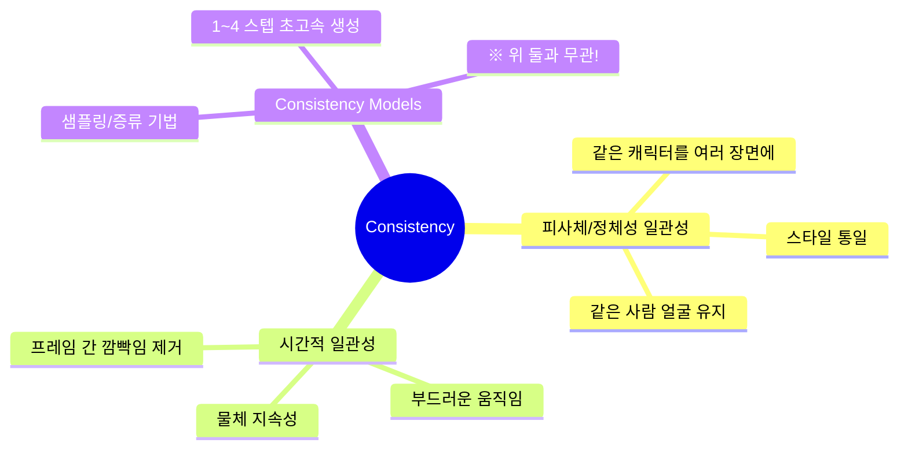
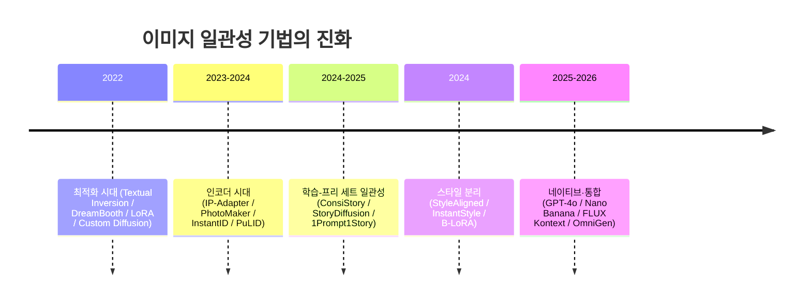
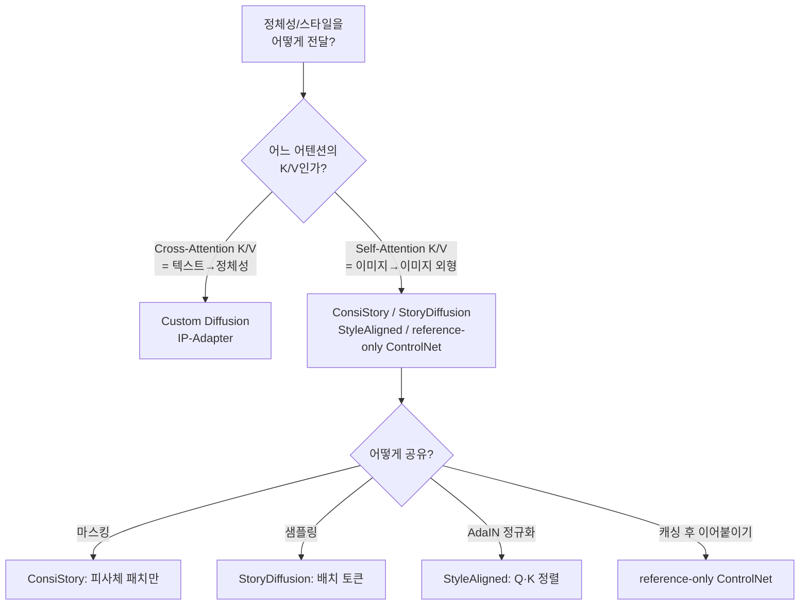
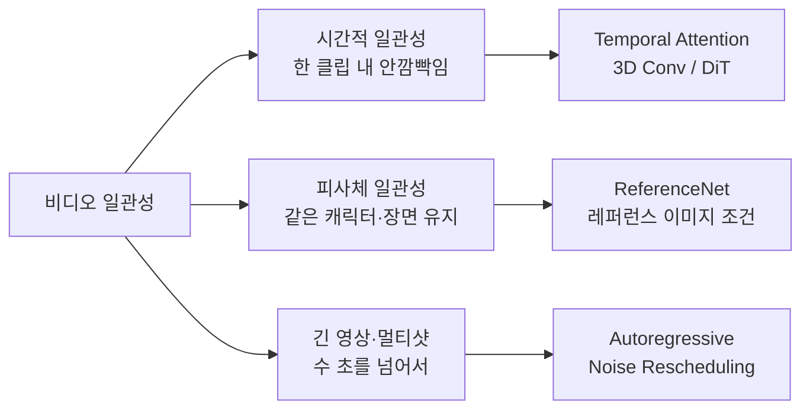
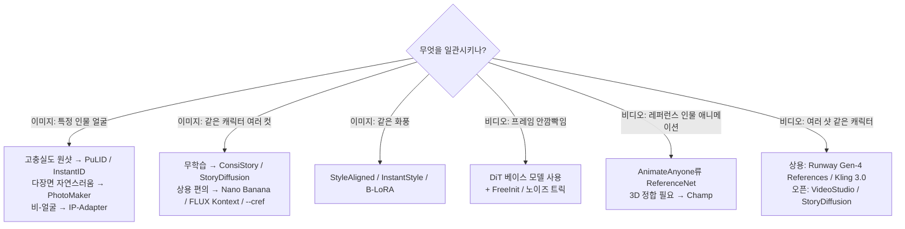

# 같은 얼굴, 안 흔들리는 화면: 이미지·비디오 생성의 Consistency 완전 정복 (2022~2026)

> 🎯 이 글은 "생성 결과의 **일관성(consistency)**을 어떻게 높이는가"라는 하나의 질문을, 이미지 생성과 비디오 생성 양쪽에서 파헤친 종합 리서치입니다. DreamBooth부터 Nano Banana·FLUX Kontext, AnimateDiff부터 Sora 2·Kling 3.0, 그리고 헷갈리기 쉬운 "Consistency Models"까지 한 번에 정리했어요.

---

## 목차

1. [먼저: "일관성"은 세 가지 다른 뜻이다](#먼저-일관성은-세-가지-다른-뜻이다)
2. [이미지 생성의 일관성 — 큰 그림](#이미지-생성의-일관성--큰-그림)
3. [① 최적화 시대: 개념을 모델에 새겨 넣기](#-최적화-시대-개념을-모델에-새겨-넣기)
4. [② 인코더 시대: 학습 없이 얼굴 주입하기](#-인코더-시대-학습-없이-얼굴-주입하기)
5. [③ 학습-프리 세트 일관성: 어텐션을 공유하라](#-학습-프리-세트-일관성-어텐션을-공유하라)
6. [④ 스타일 일관성: 내용과 스타일 분리하기](#-스타일-일관성-내용과-스타일-분리하기)
7. [⑤ 네이티브·통합 시대 (2025~2026)](#-네이티브통합-시대-20252026)
8. [관통하는 하나의 원리: K/V를 어디서 공유하는가](#관통하는-하나의-원리-kv를-어디서-공유하는가)
9. [비디오 생성의 일관성 — 큰 그림](#비디오-생성의-일관성--큰-그림)
10. [⑥ 시간적 일관성의 기초: 왜 화면이 끓는가](#-시간적-일관성의-기초-왜-화면이-끓는가)
11. [⑦ 레퍼런스 기반 캐릭터 애니메이션](#-레퍼런스-기반-캐릭터-애니메이션)
12. [⑧ 파운데이션 모델은 어떻게 일관성을 얻는가 (DiT의 부상)](#-파운데이션-모델은-어떻게-일관성을-얻는가-dit의-부상)
13. [⑨ 긴 영상·멀티샷 일관성](#-긴-영상멀티샷-일관성)
14. [⑩ 카메라·3D·월드 일관성](#-카메라3d월드-일관성)
15. [⑪ 함정 주의: "Consistency Models"는 일관성이 아니다](#-함정-주의-consistency-models는-일관성이-아니다)
16. [2025~2026 상용 모델 지형도](#20252026-상용-모델-지형도)
17. [실무 선택 가이드](#실무-선택-가이드)
18. [참고문헌](#참고문헌)
19. [🧠 학습 퀴즈](#-학습-퀴즈)

---

## 먼저: "일관성"은 세 가지 다른 뜻이다

"consistency 높이는 방법"을 검색하면 전혀 다른 세 가지 주제가 뒤섞여 나와요. 이걸 먼저 구분하지 않으면 논문을 읽어도 계속 헷갈립니다.

| 구분 | 무엇을 일관되게? | 대표 방법 | 다루는 절 |
|------|------------------|-----------|-----------|
| **피사체/스타일 일관성** | 여러 이미지·샷에서 **같은 대상·스타일** | DreamBooth, IP-Adapter, ConsiStory | §3~§8, §11 |
| **시간적 일관성** | 한 클립 내 **프레임 간 안정성** | AnimateDiff, 3D DiT | §10, §12~§14 |
| **Consistency Models** | (일관성 아님) **빠른 샘플링** | Consistency Models, LCM | §15 |

세 번째는 이름만 같고 목적이 완전히 달라요. 한국어·영어 기술 글에서 가장 흔한 혼동 지점이라 §15에서 따로 짚습니다. 그럼 이미지부터 시작할게요.

---

## 이미지 생성의 일관성 — 큰 그림

이미지 쪽 "일관성"은 대개 이런 요구예요: **"이 캐릭터/사람/제품을 다른 포즈·배경·장면에서도 똑같이 그려줘."** 이 문제를 푸는 방법은 5년에 걸쳐 아래처럼 진화했어요.

핵심 트레이드오프는 항상 **정체성 충실도(fidelity) ↔ 비용·편집성(editability)** 사이의 줄다리기예요. 세대가 지날수록 "피사체마다 학습이 필요한가?"라는 비용이 줄어드는 방향으로 발전합니다.

---

## ① 최적화 시대: 개념을 모델에 새겨 넣기

레퍼런스 이미지 3~5장으로 **새 개념 자체를 모델에 학습**시키는 방식이에요. 충실도는 높지만 피사체마다 학습이 필요해 느리고 무겁습니다.

### Textual Inversion — 단어 하나를 배우다
- 📄 *An Image is Worth One Word* (Gal et al., **arXiv:2208.01618**, 2022 / ICLR 2023)
- **핵심**: 모델 전체를 얼려두고, 프롬프트에 넣으면 그 개념을 재현하는 **새 텍스트 임베딩 벡터 하나**($S_*$, 일명 pseudo-word)만 학습.
- **메커니즘**: ~768/1024차원 임베딩만 표준 디노이징 손실로 최적화. 나머지는 그대로.
- **한계**: 용량이 수 KB로 극소형이지만 **충실도가 낮음**. 벡터 하나로 복잡한 얼굴·정체성 디테일을 담기 어려움.

### DreamBooth — 모델 전체를 미세조정
- 📄 *DreamBooth* (Ruiz et al., Google, **arXiv:2208.12242**, 2022 / CVPR 2023)
- **핵심**: `"a [V] dog"`처럼 희귀 토큰에 피사체를 묶고 **UNet 전체 가중치**를 미세조정.
- **결정적 장치 — Prior-preservation loss**: `"a dog"` 같은 클래스 이미지를 함께 학습시켜 **언어 드리프트(language drift)**와 과적합을 방지. 특정 개체를 배우면서도 "개 일반"의 개념을 잃지 않게 함.
- **한계**: 초기 기법 중 최고 충실도. 하지만 **피사체당 수 GB 체크포인트**, 수 분~수 시간 학습, 과적합·편집성 저하 위험.

### LoRA — 저랭크로 가볍게
- 📄 *LoRA* (Hu et al., **arXiv:2106.09685**, 2021 — 커뮤니티가 디퓨전에 이식)
- **핵심**: 가중치 $W$를 통째로 바꾸는 대신 **저랭크 업데이트** $\Delta W = BA$ ($r \ll d$)만 어텐션 레이어에 주입. $W$는 동결.
- **메커니즘**: $A, B$만 학습 → 보통 2~200MB. 병합·중첩 가능해 오늘날 SDXL/FLUX 커스터마이징의 **사실상 표준 포맷**.
- **한계**: 랭크 $r$이 용량 vs 표현력을 결정. 여러 LoRA를 쌓으면 서로 간섭. 여전히 개념당 학습 필요 = 경량화된 DreamBooth.

### Custom Diffusion — Cross-Attention K/V만 건드리기
- 📄 *Multi-Concept Customization* (Kumari et al., CMU/Adobe, **arXiv:2212.04488**, 2022 / CVPR 2023)
- **핵심**: 텍스트 조건이 들어오는 **cross-attention의 Key/Value 투영($W_k, W_v$)만** 미세조정 + 새 modifier 토큰.
- **왜 K/V만?**: K/V가 텍스트→이미지 매핑을 담당하므로, 여기만 바꿔도 충분하고 빠름. **다중 개념 합성**을 닫힌 형식 가중치 병합으로 지원.
- **핵심 통찰**: *"누구/무엇"이라는 정체성 정보는 cross-attention K/V에 산다.* 이후 IP-Adapter 등 모든 인코더 기법의 사상적 뿌리가 됩니다.

> 💡 **이 세대의 공통 한계**: 피사체마다 최적화(초~시간), 저장 부담, 그리고 "충실도 vs 편집성"의 태생적 긴장. 이 비용을 없애려는 시도가 다음 세대입니다.

---

## ② 인코더 시대: 학습 없이 얼굴 주입하기

대규모 데이터로 **딱 한 번** 인코더를 학습시켜, 레퍼런스 이미지 → 조건 신호로 변환해 추론 때 주입. 새 피사체에 **추가 학습이 전혀 필요 없음**(tuning-free).

### IP-Adapter — 분리된 Cross-Attention
- 📄 *IP-Adapter* (Ye et al., Tencent, **arXiv:2308.06721**, 2023)
- **핵심 메커니즘 — Decoupled Cross-Attention**: 모든 cross-attention 레이어에 CLIP 이미지 임베딩용 **별도 K/V를 가진 병렬 이미지 어텐션**을 추가하고, 텍스트 어텐션 출력과 **합산**. 신규 K/V(~2200만 파라미터)만 학습, 베이스는 동결.
- **왜 중요한가**: 이미지 프롬프트가 텍스트 프롬프트와 싸우지 않음. 같은 베이스에서 파생된 모든 체크포인트에 적용되고 ControlNet과도 조합됨.
- **한계**: CLIP은 **의미(semantic)** 특징이라 스타일·개념 유사성은 좋지만 **얼굴 정체성 충실도는 중간**(CLIP은 신원 구별력이 약함).

### IP-Adapter-FaceID / Plus-V2 — 얼굴 인식 임베딩으로
- **메커니즘**: CLIP 임베딩 대신 **ArcFace(InsightFace) 신원 임베딩**을 사용(신원 구별력 강함) + LoRA로 흡수 보조. Plus-V2는 ArcFace(정체성)와 제어 가능한 CLIP(얼굴 구조)을 결합.
- **한계**: 순정 IP-Adapter보다 신원↑, 그러나 레퍼런스의 포즈·조명이 새어나오거나 "붙여넣은" 느낌.

### PhotoMaker — 여러 장을 쌓아 하나의 ID로
- 📄 *PhotoMaker* (Li et al., Tencent ARC, **arXiv:2312.04461**, 2023 / CVPR 2024)
- **핵심 — Stacked ID Embedding**: 같은 사람의 **여러 장** 레퍼런스를 인코딩해 하나의 통합 ID 표현으로 **쌓아(pool)** class 토큰과 융합. 강건하고 **정체성 블렌딩**(여러 사람 섞기)도 가능.
- **한계**: 편집성·다양성 우수, 초 단위로 빠름. 다만 신원 충실도는 랜드마크 조건 기법보다 약간 낮고 사람 전용.

### InstantID — ID 임베딩 + 랜드마크
- 📄 *InstantID* (Wang et al., InstantX, **arXiv:2401.07519**, 2024)
- **두 갈래 메커니즘**:
  1. **Image Adapter**: 분리 cross-attention에 **ArcFace ID 임베딩**(강한 의미 조건).
  2. **IdentityNet**: ControlNet류 분기가 **5점 얼굴 랜드마크**(약한 공간 조건)로 얼굴 위치·방향 유도.
- **한계**: 단 1장으로 고충실도·플러그앤플레이. 하지만 랜드마크가 **포즈·표정을 과하게 고정**(정면·경직)하고 얼굴 구조를 너무 그대로 복사.

### PuLID — 대조 정렬로 "순수하게"
- 📄 *PuLID* (Guo et al., ByteDance, **arXiv:2404.16022**, 2024 / NeurIPS 2024)
- **핵심**: 표준 디퓨전 분기 옆에 **빠른 Lightning(수 스텝) 분기**를 두어 두 손실을 가능케 함:
  - **Contrastive alignment loss**: ID 삽입 유/무 시의 내부 특징을 정렬 → 배경·조명·구도를 안 건드림("순수성").
  - **Accurate ID loss**: 거의 최종 디노이즈 이미지 ↔ 레퍼런스 얼굴 간 신원 유사도 손실.
- **강점/한계**: **신원 충실도+편집성 SOTA**, 침습 최소. PuLID-FLUX 변형 존재(16GB 구동). 여전히 얼굴 전용, 다중 인물은 난이도↑.

> 💡 **이 세대의 공통 한계**: 학습은 한 번뿐이지만 일반화가 인코더(대개 **얼굴 전용**)에 갇힘. 비-얼굴 객체는 CLIP 기반 IP-Adapter 외엔 취약하고, 포즈·조명의 "레퍼런스 누출"이 남음.

---

## ③ 학습-프리 세트 일관성: 어텐션을 공유하라

레퍼런스 사진도, 학습도 없이 — **함께 생성되는 이미지들의 어텐션/특징을 결합**해 같은 피사체를 공유시키는 방식. 스토리텔링(같은 캐릭터로 여러 컷)에 이상적이에요.

### The Chosen One — 갤러리에서 수렴시키기
- 📄 *The Chosen One* (Avrahami et al., Google, **arXiv:2311.10093**, 2023 / SIGGRAPH 2024)
- **메커니즘(반복형)**: 프롬프트로 **갤러리 생성 → DINO/CLIP 임베딩으로 군집화 → 가장 응집된 클러스터 선택 → 그걸로 개인화(LoRA/임베딩) 학습**, 정체성이 수렴할 때까지 반복.
- **한계**: 여러 라운드 필요(수 분+), 얻는 정체성이 "지정된" 게 아니라 창발적(*a* consistent character).

### ConsiStory — Subject-Driven Self-Attention (교과서적 방법)
- 📄 *Training-Free Consistent T2I Generation* (Tewel et al., NVIDIA/TAU, **arXiv:2402.03286**, 2024 / SIGGRAPH 2024)
- **핵심 — SDSA(Subject-Driven Self-Attention)**: 이미지 배치를 함께 생성하되, 각 이미지의 self-attention이 자기 K/V뿐 아니라 **배치 내 다른 이미지의 "피사체 패치" K/V까지 함께 참조**하도록 확장.
  - **Subject mask**: 피사체 토큰의 cross-attention 맵에서 마스크를 뽑아 **피사체 패치로만 공유 제한** → 배경 오염 방지.
  - **Self-attention dropout**: 공유 Key를 약화시켜 **레이아웃·포즈 다양성** 유지.
- **특징 주입**: **DIFT(디퓨전 자기특징)**로 이미지 간 조밀 대응을 만들고, **앵커** 이미지 특징을 대응 위치에 주입 → 세부 정체성 강화.
- **강점/한계**: H100에서 **~10초/장(최적화 SOTA 대비 ~20배 빠름)**, 무학습, 다중 피사체 가능. 단 **세트를 함께 생성**해야 하고, 실사 얼굴은 학습된 ID 인코더보다 약함.

### StoryDiffusion — Consistent Self-Attention
- 📄 *StoryDiffusion* (Zhou et al., Nankai/ByteDance, **arXiv:2405.01434**, 2024 / NeurIPS 2024)
- **메커니즘**: self-attention을 대체하는 **드롭인 모듈**. 배치 생성 중 **다른 이미지의 토큰을 샘플링해 각 이미지의 K/V에 이어붙임** → 모두가 대응을 형성해 하나의 외형으로 수렴. **Semantic Motion Predictor**로 프레임 보간해 영상까지 확장.
- **한계**: 매우 단순·범용(SD1.5/SDXL). "함께 생성" 제약 동일, 아주 긴 시퀀스에선 정체성 드리프트.

### One-Prompt-One-Story — 프롬프트 하나로
- 📄 *1Prompt1Story* (Liu et al., **arXiv:2501.13554**, 2025 / ICLR 2025 Spotlight)
- **통찰 — "context consistency"**: 텍스트 인코더는 **하나의 프롬프트 안**에서는 정체성을 이미 안정적으로 유지. → **모든 프레임 프롬프트를 하나의 긴 프롬프트로 연결**해 정체성을 고정하고 프레임별로 읽어냄.
- **두 기법**: Singular-Value Reweighting(현재 프레임 강조), Identity-Preserving Cross-Attention.
- **한계**: 프레임 수가 프롬프트/컨텍스트 길이에 제약, 공간 제어는 약함.

> 관련 후속: StorySync(2508.03735), StoryBooth(2504.05800) 등 무학습 다중 피사체 변형들(2024~2025).

---

## ④ 스타일 일관성: 내용과 스타일 분리하기

"같은 **화풍**으로 여러 장"을 원할 때. 정체성이 아니라 스타일을 일관시키는 문제예요.

### StyleAligned — 공유 어텐션 + AdaIN
- 📄 *Style Aligned Image Generation via Shared Attention* (Hertz et al., Google, **arXiv:2312.02133**, 2023 / CVPR 2024)
- **메커니즘**: 세트를 함께 생성, 각 타깃의 self-attention이 **레퍼런스 이미지를 참조**. 결정적으로 공유 전에 **타깃의 Q·K를 레퍼런스 Q·K 통계로 AdaIN 정규화** → 균형 잡힌 어텐션 흐름으로 내용 붕괴 없이 스타일 전이. 실사엔 **DDIM inversion** 병용.
- **한계**: 무학습·강한 스타일 응집. 다만 내용·구도가 일부 새어나올 수 있음.

### InstantStyle — 특징 뺄셈 + 선택적 주입
- 📄 *InstantStyle* (Wang et al., InstantX, **arXiv:2404.02733**, 2024)
- **두 메커니즘(둘 다 무학습, IP-Adapter 위에서)**:
  1. **내용-스타일 분리**: CLIP 공간에서 **레퍼런스 이미지 임베딩 − 내용 텍스트 임베딩** → 잔차가 (근사적) 순수 스타일.
  2. **스타일 블록에만 주입**: 스타일 관련 블록(SDXL의 `up_blocks.0.attentions.1` 등)에만 주입 → **내용 누출 방지**.
- **한계**: 무학습으로 선명한 전이. 블록 인덱스가 SDXL 특화·경험적. 후속 InstantStyle-Plus가 내용 보존 강화.

### B-LoRA — 가중치 공간에서 분해
- 📄 *Implicit Style-Content Separation using B-LoRA* (Frenkel et al., **arXiv:2403.14572**, 2024)
- **통찰**: SDXL에서 **특정 두 블록**에 LoRA를 **함께** 학습하면 **단 1장**으로 스타일 vs 내용이 자연 분리(각 블록이 하나씩 담당). 따로 학습하면 분리 안 됨 — 공동 최적화가 열쇠.
- **활용**: 두 B-LoRA를 교체·재조합해 스타일 전이. **한계**: SDXL 특화, 근사적 분리, 1장이라 스타일 폭 제한.

> 📌 세 갈래 프레이밍: **StyleAligned = 어텐션 공유**, **InstantStyle = 특징 분리 + 선택 주입**, **B-LoRA = 가중치 공간 분해**.

---

## ⑤ 네이티브·통합 시대 (2025~2026)

최전선은 "SD/SDXL에 모듈을 덧붙이기"에서 **이미지와 텍스트를 함께 입력받는 단일 멀티모달 모델**로 이동했어요. 일관성이 별도 모듈이 아니라 **모델 내부의 창발적·in-context 능력**이 됩니다.

### GPT-4o 네이티브 이미지 생성 / `gpt-image-1` (OpenAI, 2025.03)
- **아키텍처**: **자기회귀(autoregressive)** — 이미지를 **이산 토큰 시퀀스**로 예측하고 디퓨전 디코더로 픽셀화(OpenAI의 개념도: `tokens → [transformer] → [diffusion] → pixels`, Meta의 Transfusion(arXiv:2408.11039)과 유사).
- **왜 일관성↑**: 생성이 **LLM 컨텍스트 안**에서 일어나 세계 지식+멀티턴 맥락으로 피사체·장면·텍스트 라벨을 유지. 프롬프트 준수·이미지 내 텍스트가 DALL·E 3보다 대폭 향상.
- **한계**: 자기회귀 디코딩이 느림, 해상도·지연 제약, 실존 인물 신원은 의도적으로 제한.

### Gemini 2.5 Flash Image — "Nano Banana" (Google, 2025.08)
- **포지셔닝**: 네이티브 이미지 생성+편집. 대표 기능이 **캐릭터·피사체 일관성**("같은 캐릭터를 다른 환경에"), **다중 이미지 융합**, 자연어 국소 편집. 출시 2주 만에 5억 장 생성. 후속으로 Nano Banana 2 / Pro.
- **메커니즘(공개 수준)**: 사용자측 LoRA·어댑터 없이, 레퍼런스 이미지+텍스트 조건으로 나오는 **in-context 창발 능력**. 내부는 비공개.
- **한계**: 폐쇄 모델, 픽셀 단위로 동일하진 않음, 세밀 제어는 오픈 파이프라인보다 약함.

### FLUX.1 Kontext (Black Forest Labs, 2025.05)
- **아키텍처**: **rectified-flow / flow-matching DiT**로 **in-context 이미지 생성**. 텍스트+이미지를 함께 프롬프트하고 레퍼런스 이미지 토큰을 **시퀀스에 이어붙여**, 캐릭터·객체 정체성을 장면 전반에 보존하면서 국소 편집. **SOTA급 캐릭터 보존**, 유사 대안 대비 ~8배 빠름, 다중 턴 반복 편집에 드리프트 적음.
- **한계**: 편집 모델. 많은 순차 편집에선 여전히 드리프트, [dev] 가중치는 [pro]/[max]보다 제한적.

### 통합·오픈 모델 — OmniGen
- 📄 *OmniGen* (Xiao et al., BAAI, **arXiv:2409.11340**, 2024), 후속 **OmniGen2**(**arXiv:2506.18871**, 2025)
- **핵심**: **단일 디퓨전 트랜스포머**가 T2I·편집·**피사체 기반 생성**·시각조건 과제를 인터리브된 텍스트+이미지 지시로 처리 — ControlNet/IP-Adapter 불필요. 일관성이 **통합 in-context 조건**에서 나옴. (관련: DreamO 2504.16915, DreamOmni 2412.17098)

### 상용 캐릭터-레퍼런스 기능
- **Midjourney `--cref`(Character Reference, v6, 2024 초)**: 레퍼런스 URL로 얼굴 구조·머리·색·의상 등 핵심 특징 전이. **`--cw`(0~100)**로 엄격도 조절(`--cw 100` 얼굴+머리+의상 밀착, `--cw 0` 얼굴만). 스타일용 `--sref`와 구분·조합. v7의 Omni-Reference(`--oref`)로 임의 피사체 일반화.

---

## 관통하는 하나의 원리: K/V를 어디서 공유하는가

이미지 일관성 기법 거의 전부는 **"어떤 Key/Value를, 어디(어느 블록)에서, 얼마나(마스킹·정규화) 공유·주입하느냐"의 선택**으로 요약됩니다.

- **Cross-attention K/V**는 *텍스트→정체성* 조건을 지배 (Custom Diffusion, IP-Adapter).
- **Self-attention K/V** 공유·주입은 *이미지→이미지 외형 전이*를 지배 (ConsiStory, StoryDiffusion, StyleAligned, reference-only ControlNet).
- **Q가 아니라 K/V를 주입하는 이유**: K/V는 "무엇을 참조할지(외형·내용)"를 담고, Q는 타깃 자신의 레이아웃을 보존하기 때문. 그래서 K/V를 이식하면 **외형은 옮겨오되 구도는 유지**됩니다.

이 한 문장이 이미지 일관성 논문 30편을 관통하는 뼈대예요.

---

## 비디오 생성의 일관성 — 큰 그림

비디오는 이미지의 모든 문제(같은 캐릭터 유지)에 더해 **시간 축**이라는 새 문제가 생겨요. 크게 세 층위로 나뉩니다.

---

## ⑥ 시간적 일관성의 기초: 왜 화면이 끓는가

**깜빡임(flicker)의 원인**: 이미지 모델로 프레임을 **독립적으로** 생성하면, 프레임마다 초기 노이즈가 달라 이미지 매니폴드의 다른 지점에 착지 → 텍스처·조명이 프레임마다 "끓어요(boiling)". 해법은 **시간 축으로 정보를 교환하는 메커니즘** + 상관된 초기 노이즈입니다.

### (a) 3D Conv / 분해된 시공간 층 — Video Diffusion Models
- 📄 *Video Diffusion Models* (Ho et al., **arXiv:2204.03458**, 2022)
- **메커니즘**: 2D 이미지 UNet을 시공간 3D UNet으로 확장하되 **분해(factorized)** — 공간 블록은 유지하고 뒤에 **temporal attention**(프레임 축 어텐션)을 삽입. 이미지·비디오 공동 학습 가능. **한계**: 픽셀 공간, 저해상도, 짧은 클립.

### (b) 얼린 이미지 LDM + 시간 층 — Video LDM (Align Your Latents)
- 📄 *Align your Latents* (Blattmann et al., NVIDIA, **arXiv:2304.08818**, 2023 / CVPR)
- **메커니즘**: 사전학습 SD의 공간 가중치를 **동결**하고 **시간 층(3D conv + temporal attention)**만 비디오로 학습. 공간층이 얼려 있어 DreamBooth 등 다른 체크포인트에도 일반화, 잠재공간이라 고해상도(최대 1280×2048) 가능. **한계**: 동결 백본이 움직임 복잡도 제한, 짧은 클립.

### (c) 플러그인 모션 모듈 — AnimateDiff
- 📄 *AnimateDiff* (Guo et al., **arXiv:2307.04725**, 2023 / ICLR 2024 spotlight)
- **핵심**: **분리·이식 가능한 모션 모듈**을 한 번 학습해 **임의의** 개인화 SD 체크포인트에 꽂아 애니메이션.
- **메커니즘**: 프레임 인덱스에 **사인 위치 인코딩**을 준 **temporal self-attention** 스택을 각 해상도에 삽입. 공간층은 안 건드려 하나의 모듈이 여러 체크포인트에 일반화. (MotionLoRA로 카메라 제어)
- **한계**: ~16프레임 창, 큰 움직임 제한, "미끄러지는" 모션, 장기 정체성 드리프트.

### 노이즈 기반 무학습 트릭 — FreeInit
- 📄 *FreeInit* (Wu et al., **arXiv:2312.07537**, 2023 / ECCV 2024)
- **메커니즘**: 학습-추론 간극 발견 — 추론 노이즈의 **저주파 시공간 성분**이 학습 때와 다름. 추론 시 초기 잠재의 저주파를 반복 재샘플·정제 → 재학습 없이 시간 일관성 대폭 향상. **한계**: 추론 비용 배수 증가.

---

## ⑦ 레퍼런스 기반 캐릭터 애니메이션

공통 문제: **레퍼런스 인물 이미지**를 **구동 포즈 시퀀스**대로 움직이되 세부 외형을 모든 프레임에 보존. 셋 다 **외형 분기 + 포즈 분기 + 시간 층** 구조예요.

### AnimateAnyone — ReferenceNet
- 📄 (Hu et al., Alibaba, **arXiv:2311.17117**, 2023 / CVPR 2024)
- **메커니즘**: **ReferenceNet**(디노이징 UNet의 복사본)이 레퍼런스 이미지를 인코딩하고, 그 공간 특징을 **self-attention에 K/V로 이어붙여** 메인 UNet에 융합 → CLIP 임베딩 하나보다 훨씬 정교한 텍스처 전이. 경량 **Pose Guider**가 스켈레톤 주입, temporal 층이 프레임 간 매끄러움 담당.
- **한계**: DWpose 의존, 손·가림 실패, 장기 정체성 드리프트, ReferenceNet이 메모리 2배.

### MagicAnimate — Appearance Encoder + DensePose
- 📄 (Xu et al., NUS/ByteDance, **arXiv:2311.16498**, 2023 / CVPR 2024)
- **메커니즘**: 전용 **appearance encoder**로 정체성 인코딩, **temporal attention**으로 일관성, 희소 스켈레톤 대신 **DensePose**(조밀 표면)로 매끄러운 모션, 슬라이딩 윈도우로 긴 클립. **한계**: 1인 전용, 윈도우 경계에서 흐림·색 이동.

### Champ — 3D 파라메트릭(SMPL) 가이드
- 📄 (Zhu et al., **arXiv:2403.14781**, 2024 / ECCV 2024)
- **메커니즘**: 2D 포즈 대신 **SMPL** 3D 바디 메시 → 깊이·법선·시맨틱·스켈레톤 다층 조건으로 융합. 3D 사전이 형상·포즈 일관성과 교차 신원 전이 개선. **한계**: SMPL 피팅 오류, 헐렁한 옷·머리 미모델링.

> 후속: UniAnimate(2406.01188), MimicMotion(2406.19680), StableAnimator(2411.17697) — DiT 백본 + 강한 정체성 보존으로 진화.

---

## ⑧ 파운데이션 모델은 어떻게 일관성을 얻는가 (DiT의 부상)

### 초기 오픈 모델
- **Stable Video Diffusion** (Blattmann et al., **arXiv:2311.15127**, 2023): 이미지 LDM + 시간 층, 3단계 커리큘럼. **데이터 큐레이션이 시간 품질의 최대 지렛대**임을 입증. 14/25프레임, ~2~4초.
- **VideoCrafter1/2** (Tencent, 2310.19512 / 2401.09047): 외형(이미지 학습)과 모션(저품질 비디오 학습)을 **분리**해 데이터 한계 극복.

### Sora — 시공간 패치 + Diffusion Transformer (패러다임 전환)
- 📄 OpenAI 기술 리포트 *Video generation models as world simulators* (2024). 기반: **DiT**(Peebles & Xie, **arXiv:2212.09748**).
- **메커니즘**: 비디오를 저차원 시공간 잠재로 압축 → **시공간 패치**로 분해해 트랜스포머 토큰으로. 어텐션이 **모든 시공간 토큰에 전역적**이라, 짧은 시간 창이 아니라 클립 전체를 참조 → 장기 시간 일관성·물체 지속성이 **스케일에서 창발**. 최대 ~1분.
- **한계**: 물리 위반, 인과 붕괴, 가림 시 모핑. 폐쇄 모델.

### 왜 DiT가 분해형 시간 어텐션을 이기는가
초기 모델은 *분해된* 공간 + **짧은 창** 시간 어텐션 → 창 밖에선 일관성 붕괴. DiT 기반은 **모든 시공간 토큰에 3D 풀 어텐션** → 모든 프레임이 서로 참조. **3D causal VAE**로 시간 압축을 더해 장기 일관성·물체 지속성 강화 — 대가는 어텐션의 $O(N^2)$ 비용.

**오픈 DiT 비디오 모델(2024~2025) — 일관성을 명시적으로 겨냥**:
- **CogVideoX** (Zhipu, **arXiv:2408.06072**): 3D causal VAE + **3D 풀 어텐션**으로 프레임 간 불일치를 겨냥해 분해형 어텐션을 대체.
- **HunyuanVideo** (Tencent, **arXiv:2412.03603**): 13B, causal 3D VAE, MMDiT류 풀 어텐션.
- **Wan 2.1/2.2** (Alibaba, **arXiv:2503.20314**): 효율적 Wan-VAE + DiT, 강력한 오픈 베이스라인.
- **공통 한계**: 풀 3D 어텐션은 토큰 수 제곱 비용, 유한 컨텍스트 → 아주 긴 영상엔 §13 트릭 필요.

---

## ⑨ 긴 영상·멀티샷 일관성

파운데이션 모델은 어텐션 컨텍스트·메모리가 유한해 수 초만 생성. 이를 늘리는 전략들:

| 전략 | 대표 | 메커니즘 | 한계 |
|------|------|----------|------|
| 자기회귀 롤링 | **StreamingT2V** (2403.14773) | CAM(단기 메모리 주입) + APM(앵커로 장기 정체성) | 오차 누적, 모션 균질화 |
| 노이즈 재스케줄 | **FreeNoise** (2310.15169) | 노이즈를 창 단위로 셔플·재사용해 장거리 상관 유지 (+17% 시간) | 내용이 초기 프롬프트를 반복 |
| 슬라이딩 윈도우 | **Gen-L-Video** (2305.18264) | 겹치는 짧은 구간을 병렬 디노이즈 후 겹침 평균 | 평균화로 모션 흐림 |
| 키프레임+보간 | Imagen Video / NUWA-XL (2303.12346) | 희소 키프레임 → 사이 보간 (계층적) | 보간 오류, 접합부 불연속 |
| 스펙트럼 블렌드 | **FreeLong** (2407.19918) | 전역 저주파 + 국소 고주파 시간 특징 혼합 | 무학습, 큰 변화엔 약함 |

**멀티샷·스토리 일관성(여러 샷에 같은 캐릭터)**:
- **VideoStudio** (Long et al., **arXiv:2401.01256**, 2024 / ECCV): LLM이 프롬프트를 다장면 스크립트로, **공통 엔티티**별 레퍼런스 이미지 생성 후 각 장면을 그 레퍼런스로 조건화.
- **StoryDiffusion** (§3의 그 방법, **arXiv:2405.01434**): Consistent Self-Attention으로 배치 토큰을 공유 → 일관 이미지 시퀀스를 Semantic Motion Predictor로 영상화.
- **Long Context Tuning**(2503.10589), **OneStory**(2512.07802): 멀티샷 일관성을 DiT 백본에 직접 학습.

---

## ⑩ 카메라·3D·월드 일관성

### MotionCtrl — 카메라·객체 모션 분리
- 📄 (Wang et al., Tencent, **arXiv:2312.03641**, 2023 / SIGGRAPH 2024)
- **메커니즘**: CMCM(카메라 외부파라미터 RT 시퀀스를 시간 트랜스포머에) + OMCM(객체 궤적을 conv에)을 분리 학습해 독립 제어. **한계**: 거친 제어, 궤적 주석 필요.

### CameraCtrl — Plücker 임베딩으로 정밀 카메라
- 📄 (He et al., **arXiv:2404.02101**, 2024)
- **메커니즘**: 픽셀별 **Plücker ray 임베딩**(카메라 포즈로부터의 광선을 기하학적으로 표현)을 카메라 인코더가 받아 **temporal attention 층**에 다중 스케일 주입. 원시 외부파라미터보다 일반화 우수. **한계**: 카메라 전용, 진짜 3D 지속성은 아님.

### 월드 모델 — Genie / Genie 2 / Genie 3
- 📄 *Genie* (Bruce et al., DeepMind, **arXiv:2402.15391**, 2024 / ICML 2024 best paper)
- **메커니즘(Genie 1)**: 시공간 비디오 토크나이저 + **잠재 행동 모델**(프레임 쌍에서 이산 행동을 비지도 추론) + 자기회귀 동역학 모델(다음 프레임 예측). 11B.
- **Genie 2(2024.12) / Genie 3(2025.08)**: 실시간 플레이 가능 월드. Genie 3는 **환경 기억 ~1분** 유지 — 시선을 돌렸다 돌아와도 장면이 대체로 보존되는 **창발적 공간 지속성**.
- **한계**: 일관성 창이 아직 ~분 단위, 재방문 시 드리프트, 명시적 3D 표현 없음(지속성이 시퀀스 모델에 암묵적이라 시간이 지나면 열화).

---

## ⑪ 함정 주의: "Consistency Models"는 일관성이 아니다

⚠️ **가장 흔한 용어 혼동**: "Consistency Models"는 **빠른 샘플링(few-step 생성)** 기법으로, 시간·캐릭터 일관성과 **전혀 무관**합니다. 이름의 "consistency"는 ODE 궤적의 **자기 일관성** 성질을 뜻해요.

### Consistency Models (CM)
- 📄 (Song, Dhariwal, Chen, Sutskever, OpenAI, **arXiv:2303.01469**, 2023 / ICML 2023)
- **핵심**: 디퓨전 **확률흐름 ODE(PF-ODE)** 궤적 위 **임의의 점을 궤적의 시작점(클린 데이터)으로 직접 매핑**하는 함수 학습 → **1스텝**(또는 few-step) 생성.
- **메커니즘**: 같은 궤적 위 모든 $t$에서 $f(x_t,t)$가 동일한 클린 출력이라는 **자기 일관성** 제약. **consistency distillation**(교사 디퓨전 증류) 또는 **consistency training**(단독). **한계**: 1스텝 품질이 풀 디퓨전보다 낮음(개선판 arXiv:2310.14189).

### Latent Consistency Models (LCM) & LCM-LoRA
- 📄 LCM (Luo et al., 칭화, **arXiv:2310.04378**, 2023): CM을 잠재공간(SD)에 적용, CFG를 통합한 증강 PF-ODE로 **~1~4 스텝** 고해상도. ~32 A100-시간에 증류.
- 📄 LCM-LoRA (**arXiv:2311.05556**, 2023): 가속을 **LoRA 모듈**로 증류한 "범용 가속 모듈".
- **비디오 연관**: AnimateLCM(2402.00769), TCD(2402.19159)로 비디오 디퓨전 가속에 실제 사용 — 단, 목적은 **추론 속도**지 시각·시간 일관성이 아님.

> 정리: **"Consistency Models" ≠ "일관된 비디오".** 전자는 속도, 후자는 안정성입니다.

---

## 2025~2026 상용 모델 지형도

| 모델 | 출시 | 일관성 관련 핵심 |
|------|------|------------------|
| **Runway Gen-4 / 4.5** | 2025.03 | **References**: 레퍼런스 이미지 ~3장으로 캐릭터·장소·객체를 여러 샷·조명·앵글에 고정("world consistency"). 상용 최초로 레퍼런스 기반 정체성 지속을 신뢰성 있게 구현 |
| **OpenAI Sora 2** | 2025.09 | 동기 네이티브 오디오·립싱크, 물리 타당성 대폭 향상(인과 일관성 대리 지표), **Cameos**(동의 기반 실존 인물 삽입), 멀티샷 연속성 |
| **Google Veo 3 / 3.1** | 2025.05 | 영상 정합 네이티브 오디오, 1080p→4K, **U-Net 내 3D conv**로 시공간·오디오 공동 모델링, Flow 툴의 장면 확장 |
| **Kling 1.6→3.0** | 2024.12~ | 자체 **3D VAE**(동기 시공간 압축)가 깜빡임 감소에 기여 + 효율적 풀 시공간 어텐션 DiT. 3.0은 멀티샷(~5샷)·4K·다중 피사체 일관성 |
| **오픈소스** | 2024~2025 | CogVideoX·HunyuanVideo(13B)·Wan 2.1/2.2·Seedance — 모두 DiT + 3D causal VAE + 풀 어텐션으로 수렴. 논문·가중치 공개 |

---

## 실무 선택 가이드

**핵심 원칙 3가지**
1. **비용 vs 충실도**: 최대 충실도가 필요하고 피사체가 고정이면 여전히 DreamBooth/LoRA. 다양한 피사체를 빠르게면 인코더(PuLID)·in-context 모델(FLUX Kontext).
2. **"함께 생성" 제약**: ConsiStory·StoryDiffusion 계열은 세트를 한 번에 생성해야 함. 나중에 한 장 추가가 필요하면 레퍼런스 조건 모델이 유리.
3. **비디오 장기 일관성은 미해결**: 아키텍처 레벨(3D 풀 어텐션 DiT)이 정답에 가깝지만 유한 컨텍스트라, 프로덕션은 자기회귀+메모리·노이즈 재스케줄에 의존. 월드 모델(Genie 3)이 암묵적 지속성(~1분)으로 미래를 가리킴.

---

## 참고문헌

### 이미지 — 최적화 시대
1. Gal et al. *An Image is Worth One Word: Textual Inversion.* arXiv:2208.01618 (2022, ICLR'23)
2. Ruiz et al. *DreamBooth.* arXiv:2208.12242 (2022, CVPR'23)
3. Hu et al. *LoRA.* arXiv:2106.09685 (2021)
4. Kumari et al. *Custom Diffusion.* arXiv:2212.04488 (2022, CVPR'23)

### 이미지 — 인코더 시대
5. Ye et al. *IP-Adapter.* arXiv:2308.06721 (2023)
6. Li et al. *PhotoMaker.* arXiv:2312.04461 (2023, CVPR'24)
7. Wang et al. *InstantID.* arXiv:2401.07519 (2024)
8. Guo et al. *PuLID.* arXiv:2404.16022 (2024, NeurIPS'24)

### 이미지 — 학습-프리 세트 & 스타일
9. Avrahami et al. *The Chosen One.* arXiv:2311.10093 (2023, SIGGRAPH'24)
10. Tewel et al. *ConsiStory.* arXiv:2402.03286 (2024, SIGGRAPH'24)
11. Zhou et al. *StoryDiffusion.* arXiv:2405.01434 (2024, NeurIPS'24)
12. Liu et al. *One-Prompt-One-Story.* arXiv:2501.13554 (2025, ICLR'25)
13. Hertz et al. *Style Aligned.* arXiv:2312.02133 (2023, CVPR'24)
14. Wang et al. *InstantStyle.* arXiv:2404.02733 (2024)
15. Frenkel et al. *B-LoRA.* arXiv:2403.14572 (2024)

### 이미지 — 네이티브·통합
16. Xiao et al. *OmniGen.* arXiv:2409.11340 (2024) / *OmniGen2* arXiv:2506.18871 (2025)
17. Meta. *Transfusion.* arXiv:2408.11039 (2024)

### 비디오 — 시간 기초 & 캐릭터
18. Ho et al. *Video Diffusion Models.* arXiv:2204.03458 (2022)
19. Blattmann et al. *Align Your Latents (Video LDM).* arXiv:2304.08818 (2023, CVPR)
20. Guo et al. *AnimateDiff.* arXiv:2307.04725 (2023, ICLR'24)
21. Wu et al. *FreeInit.* arXiv:2312.07537 (2023, ECCV'24)
22. Hu et al. *Animate Anyone.* arXiv:2311.17117 (2023, CVPR'24)
23. Xu et al. *MagicAnimate.* arXiv:2311.16498 (2023, CVPR'24)
24. Zhu et al. *Champ.* arXiv:2403.14781 (2024, ECCV'24)

### 비디오 — 파운데이션 & DiT
25. Blattmann et al. *Stable Video Diffusion.* arXiv:2311.15127 (2023)
26. Chen et al. *VideoCrafter1/2.* arXiv:2310.19512 / 2401.09047
27. Peebles & Xie. *DiT.* arXiv:2212.09748 (2022)
28. OpenAI. *Video generation models as world simulators (Sora).* (2024)
29. *CogVideoX.* arXiv:2408.06072 (2024)
30. *HunyuanVideo.* arXiv:2412.03603 (2024)
31. *Wan 2.1.* arXiv:2503.20314 (2025)

### 비디오 — 긴 영상·멀티샷·월드
32. Henschel et al. *StreamingT2V.* arXiv:2403.14773 (2024, CVPR'25)
33. Qiu et al. *FreeNoise.* arXiv:2310.15169 (2023, ICLR'24)
34. Wang et al. *Gen-L-Video.* arXiv:2305.18264 (2023)
35. Long et al. *VideoStudio.* arXiv:2401.01256 (2024, ECCV'24)
36. Wang et al. *MotionCtrl.* arXiv:2312.03641 (2023, SIGGRAPH'24)
37. He et al. *CameraCtrl.* arXiv:2404.02101 (2024)
38. Bruce et al. *Genie.* arXiv:2402.15391 (2024, ICML'24)

### 샘플링 — Consistency Models (일관성 아님!)
39. Song et al. *Consistency Models.* arXiv:2303.01469 (2023, ICML'23)
40. Luo et al. *Latent Consistency Models.* arXiv:2310.04378 (2023)
41. Luo et al. *LCM-LoRA.* arXiv:2311.05556 (2023)

---

## 🧠 학습 퀴즈

**Q1.** "Consistency Models"(Song et al., 2023)는 비디오의 시간적 일관성을 높이는 기법이다. (O/X)

정답

**X.** Consistency Models는 **빠른 샘플링(1~4 스텝 생성)**을 위한 증류 기법으로, 시간·캐릭터 일관성과 무관합니다. 이름의 "consistency"는 ODE 궤적의 자기 일관성 성질을 뜻해요.

**Q2.** Custom Diffusion이 cross-attention의 K/V만 미세조정해도 충분했던 이유는?

정답

Cross-attention의 **Key/Value가 텍스트→이미지 매핑**을 담당하기 때문. "누구/무엇"이라는 정체성 조건이 바로 이 K/V에 들어오므로, 여기만 바꿔도 새 개념을 학습할 수 있습니다. 이 통찰이 IP-Adapter 등 인코더 기법의 뿌리가 됐어요.

**Q3.** ConsiStory·StoryDiffusion·StyleAligned가 공유하는 핵심 원리는 무엇이며, Q가 아니라 K/V를 공유하는 이유는?

정답

세 방법 모두 **self-attention의 K/V를 이미지 간에 공유·주입**합니다(ConsiStory는 피사체 마스킹, StoryDiffusion은 배치 토큰 샘플링, StyleAligned는 AdaIN 정규화). **K/V는 "무엇을 참조할지(외형·내용)"**를 담고 **Q는 타깃 자신의 레이아웃**을 보존하므로, K/V만 이식하면 외형은 옮겨오되 구도 다양성은 유지됩니다.

**Q4.** DiT 기반 비디오 모델(Sora, CogVideoX)이 초기 AnimateDiff류보다 장기 시간 일관성이 좋은 구조적 이유는?

정답

AnimateDiff류는 **짧은 창(~16프레임)의 분해된 temporal attention**이라 창 밖에선 일관성이 무너집니다. DiT는 비디오를 **시공간 패치 토큰**으로 만들고 **모든 토큰에 3D 풀 어텐션**을 적용해 모든 프레임이 서로 참조 → 물체 지속성·장기 일관성이 스케일에서 창발합니다. 대가는 $O(N^2)$ 어텐션 비용이에요.

**Q5.** 실존 인물의 얼굴을 단 1장으로 고충실도로 유지하려 할 때 InstantID의 대표적 한계는?

정답

InstantID는 ArcFace ID 임베딩과 **5점 랜드마크(IdentityNet)**를 함께 쓰는데, 랜드마크 조건이 **포즈·표정을 과하게 고정**해 결과가 정면·경직되고 얼굴 구조를 너무 그대로 복사하는 경향이 있습니다. 이 침습성을 대조 정렬로 완화한 것이 PuLID예요.

---

> 📚 이 글은 이미지·비디오 생성 일관성에 관한 40여 편의 1차 문헌(arXiv, 공식 기술 리포트, 벤더 발표)을 종합했습니다. arXiv ID·저자·연도·학회는 모두 원문 대조로 검증했어요.
