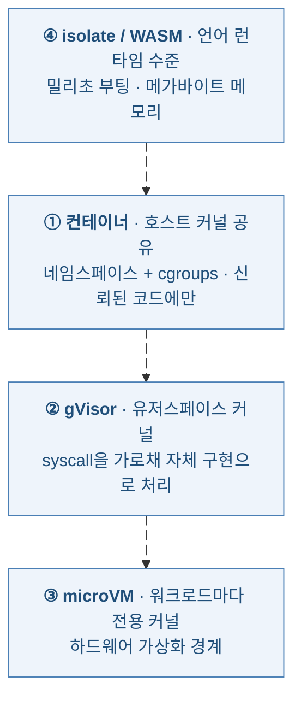
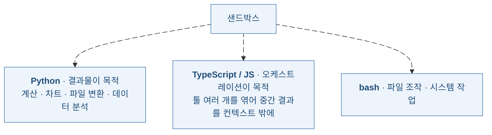
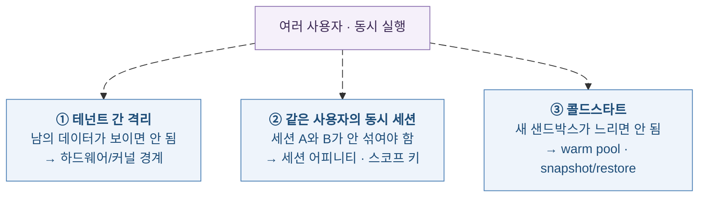

# 에이전트 샌드박스 내부 해부

**이 글이 답하려는 질문** — [앞 글](../2026-09-15-model-agent-api-session-memory/model-agent-api-session-memory-blog)에서 "L2부터는 세션이 곧 샌드박스"라고 정리했다. 그럼 그 샌드박스는 **실제로 무엇인가.** 무엇이 "하나"로 격리되고, 그 격리 장치는 어떤 언어로 만들어졌으며, 그 위에서 에이전트는 무슨 언어를 돌리고, 여러 사람이 동시에 들어오면 어떻게 버티는가. 이 글은 그 네 가지를 1차 자료로 파고든다.

**3줄 요약**
1. 샌드박스는 단일 기술이 아니라 **네 층의 스펙트럼**이다 — 컨테이너 → gVisor → microVM → isolate/WASM. 위로 갈수록 경계가 단단하고 아래로 갈수록 빠르다. "샌드박스 쓴다"는 말만으로는 아무것도 특정되지 않는다.
2. 격리 장치는 **메모리 안전 언어로 다시 쓰였다.** Firecracker는 Rust, gVisor는 Go다. 반대로 그 위에서 도는 코드는 압도적으로 **Python**이고, 툴 오케스트레이션 용도에서는 **TypeScript**가 부상했다. 둘의 이유가 다르다.
3. 동시성 문제는 셋으로 쪼개진다 — **테넌트 간 격리**(하드웨어 경계), **같은 사용자의 동시 세션**(세션 어피니티), **콜드스타트**(warm pool·snapshot). 마지막 것이 실제 아키텍처를 가장 많이 왜곡한다.

목차
1. [샌드박스 단위 — 무엇이 "하나"인가](#sec1)
2. [무엇으로 만들어졌나 — 구현 언어](#sec2)
3. [그 위에서 무슨 언어를 돌리나](#sec3)
4. [동시성과 멀티테넌시](#sec4)
5. [로컬 샌드박스 — 서버가 아닌 경우](#sec5)
6. [정리 — 고를 때의 기준](#sec6)
7. [참고문헌](#sec7)
8. [학습 퀴즈](#sec8)

---

## 1. 샌드박스 단위 — 무엇이 "하나"인가 {#sec1}

"샌드박스"는 두 개의 질문이 겹쳐 있는 단어다. **무엇으로 가두는가(기술적 경계)** 와 **무엇 하나당 하나를 주는가(논리적 단위)** 는 서로 다른 축이다.

### 1.1 기술적 경계 — 네 층의 스펙트럼

| 층 | 경계 | 대표 | 트레이드오프 |
| :--- | :--- | :--- | :--- |
| 컨테이너 | 네임스페이스·cgroups, **커널 공유** | 표준 OCI 런타임 | 가장 빠르고 가장 약하다. 신뢰된 코드에만 |
| gVisor | 유저스페이스에 Linux 유사 커널 | Modal, Daytona(옵션) | syscall 가로채기. VM 없이 강한 격리, I/O 많으면 비용 |
| microVM | 워크로드마다 **전용 커널** | Firecracker, Kata, AgentCore | 가장 단단함. 부팅·메모리 비용 |
| isolate / WASM | 언어 런타임 수준 격리 | Cloudflare Dynamic Workers | 밀리초 부팅, 하드웨어 경계는 포기 |

중요한 건 **"더 강한 게 항상 정답이 아니다"** 라는 점이다. 짧고 잦은 툴 호출에는 microVM의 부팅 비용이 배보다 배꼽이다. Cloudflare가 Dynamic Workers에서 microVM 대신 V8 isolate를 고른 이유가 이것이다 — 하드웨어 경계를 포기하는 대신 **부팅이 약 100배 빠르고 실행 컨텍스트당 메모리가 10~100배 적다**고 설명한다. [\[7\]](#ref7){:.cite}

반대로 GPU가 필요하면 선택지가 좁아진다. gVisor의 유저스페이스 커널은 GPU 호출을 가로채는 지점 때문에 PCIe 패스스루를 막는 반면, Firecracker의 하드웨어 가상화 경로는 VFIO 디바이스 패스스루를 지원해 샌드박스가 실제 GPU를 near-native로 쓸 수 있다. [\[9\]](#ref9){:.cite}

### 1.2 논리적 단위 — 무엇 하나당 하나인가

기술 경계를 정했다면 다음 질문은 "그 경계를 **무엇 단위로** 주느냐"다. 여기서 벤더별 성격이 갈린다.

| 단위 | 의미 | 사례 |
| :--- | :--- | :--- |
| **세션당** | 대화 하나 = 샌드박스 하나. 파일시스템이 대화 내내 유지 | AgentCore Runtime — 사용자 세션마다 **전용 microVM**(컴퓨트·메모리·파일시스템 격리) [\[3\]](#ref3){:.cite} |
| **툴 호출당** | 코드 실행 한 번 = 컨테이너 하나. 끝나면 버림 | 짧은 계산·변환 |
| **컨테이너 객체당** | 명시적으로 만든 컨테이너를 여러 호출이 공유 | OpenAI code interpreter — 20분 유휴 시 만료 [\[2\]](#ref2){:.cite} |
| **액터(사용자)당** | 사람 하나에 환경 하나. 장기 개인화 | 장기 실행 워크스페이스형 |

**단위를 정하는 건 보안이 아니라 "무엇이 살아남아야 하는가"다.**

툴 호출당 샌드박스는 상태가 안 남으니 가장 안전하고 가장 싸다. 그런데 에이전트가 1단계에서 만든 파일을 3단계에서 읽어야 하면 못 쓴다. 세션당 샌드박스는 그걸 해결하는 대신 **유휴 자원을 붙들고 있는 비용**을 만든다. AgentCore가 최대 8시간 실행에 **15분 무활동 시 컨테이너 회수**를 건 이유가 정확히 이 균형이다. [\[3\]](#ref3){:.cite}

---

## 2. 무엇으로 만들어졌나 — 구현 언어 {#sec2}

샌드박스의 구현 언어는 취향 문제가 아니다. **격리 장치 자체가 뚫리면 격리가 무의미**하므로, 이 계층은 메모리 안전성이 곧 보안 요구사항이다.

| 격리 기술 | 구현 언어 | 성격 |
| :--- | :--- | :--- |
| **Firecracker** | **Rust** [\[5\]](#ref5){:.cite} | microVM 모니터(VMM). 불필요한 디바이스를 빼 메모리 풋프린트와 부팅 시간을 줄인 최소 설계 |
| **gVisor** | **Go** [\[6\]](#ref6){:.cite} | 유저스페이스에서 도는 애플리케이션 커널. OCI 런타임 `runsc`로 Docker·Kubernetes와 연결 |
| **V8 isolate** | C++ | 언어 런타임 수준 격리. Cloudflare Workers 계열 |

gVisor 문서의 표현이 이 계층의 설계 철학을 압축한다 — **"메모리 안전 언어(Go)로 작성되어 유저스페이스에서 돈다."** [\[6\]](#ref6){:.cite} Firecracker도 같은 이유로 Rust다. C로 짠 하이퍼바이저의 메모리 버그 하나가 곧 게스트 탈출이기 때문이다.

Firecracker의 출신도 알아둘 만하다. AWS가 **Lambda와 Fargate를 돌리기 위해** 만든 물건이고, 문서는 "멀티테넌트 컨테이너·함수 기반 서비스를 위해 만들어졌다"고 명시한다. [\[5\]](#ref5){:.cite} 에이전트 샌드박스 벤더들이 이걸 가져다 쓰는 건 우연이 아니라, **"신뢰할 수 없는 코드를 남의 것과 섞어 돌린다"** 는 문제가 서버리스와 동일하기 때문이다.

### 2.1 벤더별 채택

| 플랫폼 | 격리 방식 |
| :--- | :--- |
| **E2B** | Firecracker microVM — 실행마다 전용 Linux 커널 [\[8\]](#ref8){:.cite} |
| **Modal** | gVisor [\[8\]](#ref8){:.cite} |
| **Daytona** | 기본은 공유 커널 Docker, gVisor·Kata는 옵트인 [\[8\]](#ref8){:.cite} |
| **Cloudflare** | Dynamic Workers는 V8 isolate, 컨테이너 옵션은 호스트 커널 공유 [\[7\]](#ref7){:.cite}[\[8\]](#ref8){:.cite} |
| **AWS AgentCore** | 세션당 microVM [\[3\]](#ref3){:.cite} |

**"샌드박스를 쓴다"는 문구는 아무것도 보장하지 않는다.** 기본값이 공유 커널 Docker인 플랫폼과 실행마다 전용 커널을 주는 플랫폼이 같은 단어를 쓴다. LLM이 생성한 코드는 정의상 신뢰할 수 없는 코드이므로, 도입 시 **기본 격리 수준이 무엇이고 강화하려면 무엇을 옵트인해야 하는지**를 반드시 확인해야 한다.

---

## 3. 그 위에서 무슨 언어를 돌리나 {#sec3}

구현 언어가 Rust·Go인 것과 달리, **샌드박스 안에서 실행되는 언어는 완전히 다른 논리로 결정된다.** 크게 두 갈래이고, 각각 이유가 다르다.

### 3.1 Python — 기본값

코드 실행 툴의 기본 언어는 예외 없이 Python이다.

| 제품 | 지원 언어 | 비고 |
| :--- | :--- | :--- |
| Anthropic code execution tool | **Python + bash** | pandas·numpy·matplotlib 등 데이터과학 라이브러리 사전 설치 [\[1\]](#ref1){:.cite} |
| OpenAI code interpreter | **Python** | 컨테이너 안에서 실행 [\[2\]](#ref2){:.cite} |
| AWS AgentCore Code Interpreter | **Python · JavaScript · TypeScript** | CSV·Excel·JSON 네이티브 처리 [\[4\]](#ref4){:.cite} |

이유는 단순하다. **목적이 코드가 아니라 결과물**이기 때문이다. 계산, 차트, 파일 변환, 데이터 분석 — 이 작업들의 생태계가 Python에 몰려 있고, 모델도 Python을 가장 잘 쓴다. bash가 함께 딸려오는 것도 같은 맥락이다. 파일 조작과 시스템 작업은 Python으로 감싸는 것보다 셸이 짧다.

### 3.2 TypeScript — 툴 오케스트레이션용

두 번째 갈래는 성격이 완전히 다르다. **코드가 산출물이 아니라 툴을 엮는 접착제**인 경우다.

모델이 툴을 하나씩 function calling으로 부르는 대신 짧은 프로그램을 작성하면, 여러 API 호출을 `Promise.all`로 묶고 `.reduce()`로 집계할 수 있다. 계산이 모델의 토큰 예측이 아니라 **JavaScript 런타임에서 일어난다.** [\[7\]](#ref7){:.cite} 중간 데이터는 컨텍스트에 들어오지 않고 최종 결과만 돌아온다.

효과는 크다. MCP 서버를 TypeScript API로 바꾸고 에이전트가 그에 대해 코드를 작성하게 하면 전통적 툴 호출 대비 **토큰 사용량이 81% 줄었다**고 보고된다. [\[7\]](#ref7){:.cite} Anthropic이 보고한 Google Drive → Salesforce 사례는 **150,000 → 2,000 토큰(약 98.7% 감소)** 이다. [\[10\]](#ref10){:.cite}

**왜 여기서는 TypeScript인가.** 두 가지가 겹친다.

1. **런타임이 그렇다.** Cloudflare Dynamic Workers와 Vercel Sandbox는 TypeScript 우선 플랫폼이다. [\[8\]](#ref8){:.cite} isolate 위에서 도는 코드는 자연히 JS/TS다.
2. **타입이 툴 스키마와 맞는다.** MCP 툴 정의를 TypeScript 인터페이스로 노출하면 모델이 시그니처를 보고 바로 호출 코드를 쓸 수 있다. TypeScript는 더 압축적이고 사람과 LLM 모두에게 읽기 쉬우며 API 호출당 토큰을 덜 쓴다는 게 Cloudflare의 논거다. [\[7\]](#ref7){:.cite}

정리하면 **Python은 "무엇을 계산할까", TypeScript는 "무엇을 호출할까"** 에 최적화돼 있다. 같은 샌드박스라도 용도가 언어를 정한다.

---

## 4. 동시성과 멀티테넌시 {#sec4}

"여러 사람이 동시에 쓰면 어떻게 하나"는 사실 **세 개의 다른 문제**가 뭉쳐 있는 질문이다. 섞으면 답이 안 나온다.

### 4.1 ① 테넌트 간 격리 — 경계의 문제

이건 1장의 답으로 해결된다. 신뢰할 수 없는 코드를 멀티테넌트로 돌리려면 컨테이너로는 부족하고 microVM이나 Kata급 경계가 필요하다. Kubernetes 생태계도 같은 결론에 도달해, **Agent Sandbox**라는 CRD 기반 프로젝트가 gVisor(커널 수준)와 Kata(VM급) 격리를 선택지로 제공한다. [\[11\]](#ref11){:.cite}

### 4.2 ② 같은 사용자의 동시 세션 — 라우팅과 스코프의 문제

여기가 실제로 버그가 많이 나는 지점이다. 두 가지 장치가 쓰인다.

**세션 어피니티.** AgentCore Runtime은 세션 헤더로 같은 microVM에 요청을 라우팅한다. 그래서 **클라이언트가 응답에서 받은 세션 ID를 이후 모든 요청에 넣어야** 한다. 이걸 빠뜨리면 같은 대화인데 다른 샌드박스로 가서 파일이 없어진 것처럼 보인다. [\[3\]](#ref3){:.cite}

**스코프 키.** 메모리 계층에서는 격리가 경로로 표현된다. AgentCore Memory는 `actorId`와 `sessionId`로 이벤트를 조직하고 [\[12\]](#ref12){:.cite}, Vertex Memory Bank는 `scope` 딕셔너리로 범위를 나누며 **같은 스코프의 기억끼리만 통합**된다. [\[13\]](#ref13){:.cite} 멀티테넌시 경계가 이 한 필드에 달려 있다.

**쓰기 충돌.** 같은 저장소를 두 세션이 동시에 건드리면 덮어쓰기가 난다. Anthropic memory store가 `content_sha256` precondition을 제공하는 이유다 — 읽은 내용이 그대로일 때만 쓰기가 적용된다. [\[14\]](#ref14){:.cite}

### 4.3 ③ 콜드스타트 — 실제로 아키텍처를 바꾸는 문제

가장 과소평가되는 축이다. 격리가 강할수록 부팅이 느리고, 에이전트는 사용자를 기다리게 한다.

| 기법 | 효과 |
| :--- | :--- |
| **snapshot / restore** | Firecracker 스냅샷으로 콜드 부팅 125~200ms → **5~30ms** [\[9\]](#ref9){:.cite} |
| **warm pool** | 사용자가 기다리기 전에 미리 띄워둠. Kubernetes Agent Sandbox의 `SandboxWarmPool`은 밀리초 단위 할당 [\[11\]](#ref11){:.cite} |
| **standby** | 유휴 상태를 컴퓨트 비용 없이 유지하다 재개 [\[15\]](#ref15){:.cite} |

규모 감각도 참고할 만하다. Modal은 10만 개 이상의 동시 샌드박스를 지원한다고 밝히고 있다. [\[15\]](#ref15){:.cite}

**snapshot/restore는 성능 기법이 아니라 신뢰성 기법이기도 하다.** 장기 실행 에이전트가 체크포인트를 떠두면, 실패했을 때 처음부터 다시 돌리는 대신 **알려진 정상 지점으로 복원**할 수 있다. [\[15\]](#ref15){:.cite} 앞 글에서 본 AgentCore의 managed session storage나 Managed Agents의 세션 재개도 같은 계열의 요구에서 나온 기능이다.

---

## 5. 로컬 샌드박스 — 서버가 아닌 경우 {#sec5}

지금까지는 전부 서버 이야기였다. 그런데 개발자 머신에서 도는 하네스는 microVM을 띄울 수 없다. 여기서는 **OS가 이미 가진 격리 원시 기능**을 쓴다.

Claude Code가 좋은 사례다. 플랫폼마다 다른 장치를 쓴다. [\[16\]](#ref16){:.cite}

| 플랫폼 | 격리 수단 |
| :--- | :--- |
| macOS | `sandbox-exec` + 동적 생성한 **Seatbelt 프로파일** |
| Linux | **bubblewrap** + 네트워크 네임스페이스 격리 |
| Windows | 전용 `srt-sandbox` 로컬 사용자 계정 + Windows Filtering Platform 이그레스 차단 |

설계 원칙은 두 축이다. **파일시스템 쓰기는 작업 디렉터리로 제한**하고, **네트워크는 프록시 allowlist로 거른다.** 문서는 둘 다 있어야 실효가 있다고 못 박는다 — 파일만 막고 네트워크를 열어두면 데이터가 나갈 수 있기 때문이다. [\[16\]](#ref16){:.cite} 읽기는 반대로 "기본 허용 후 특정 영역 거부, 그 안에서 다시 허용"이라는 deny-then-allow 패턴을 쓴다. [\[16\]](#ref16){:.cite}

Anthropic은 이 원시 기능들을 감싼 `@anthropic-ai/sandbox-runtime`도 공개했다. 컨테이너 없이 임의 프로세스에 OS 수준의 파일시스템·네트워크 제약을 거는 도구다. [\[17\]](#ref17){:.cite}

**로컬 샌드박스는 서버 샌드박스와 위협 모델이 다르다.** 서버는 "남의 테넌트로부터" 지키는 게 목적이라 하드웨어 경계가 필요하다. 로컬은 **"내 머신의 나머지 부분으로부터"** 지키는 게 목적이라 OS 권한 경계로 충분하다. 다만 같은 사용자 권한으로 도는 이상 커널 경계는 없으므로, 로컬 샌드박스를 서버급 격리로 착각하면 안 된다.

---

## 6. 정리 — 고를 때의 기준 {#sec6}

| 질문 | 답이 갈리는 지점 |
| :--- | :--- |
| 신뢰할 수 없는 코드를 돌리나 | 그렇다면 컨테이너는 부족하다. microVM 또는 gVisor 이상 |
| 상태가 단계를 넘어 살아남아야 하나 | 그렇다면 세션당 샌드박스. 아니면 호출당이 싸고 안전 |
| 호출이 짧고 잦은가 | 그렇다면 isolate 계열. microVM 부팅 비용이 배보다 배꼽 |
| GPU가 필요한가 | gVisor는 패스스루가 막힌다. Firecracker 계열로 |
| 목적이 결과물인가 오케스트레이션인가 | 결과물이면 Python, 툴 엮기면 TypeScript |
| 사용자를 기다리게 하면 안 되나 | warm pool·snapshot이 있는 플랫폼인지 확인 |
| 서버인가 개발자 머신인가 | 로컬이면 OS 원시 기능(Seatbelt·bubblewrap). 위협 모델이 다르다 |

세 문장으로 압축하면 이렇다.

1. **격리 강도와 부팅 속도는 맞바꾸는 관계다.** 무조건 강한 쪽이 정답이 아니라, 코드의 신뢰 수준과 호출 빈도가 층을 정한다.
2. **구현 언어는 보안 요구사항의 결과**(Rust·Go)이고, **실행 언어는 용도의 결과**(Python·TypeScript)다. 둘을 같은 논리로 설명하려 하면 안 맞는다.
3. **동시성은 세 문제다.** 테넌트 격리는 경계로, 세션 혼선은 어피니티와 스코프 키로, 콜드스타트는 warm pool과 snapshot으로 푼다. 하나의 답으로 셋을 다 막으려 하면 과설계가 된다.

---

## 7. 참고문헌 {#sec7}

> 본문의 `[N]`을 누르면 해당 항목으로 이동한다.

**벤더 공식 문서**

**[1]** Code execution tool — Anthropic 공식 문서 · [https://platform.claude.com/docs/en/agents-and-tools/tool-use/code-execution-tool](https://platform.claude.com/docs/en/agents-and-tools/tool-use/code-execution-tool)

**[2]** Code Interpreter — OpenAI 공식 문서 · [https://developers.openai.com/api/docs/guides/tools-code-interpreter](https://developers.openai.com/api/docs/guides/tools-code-interpreter)

**[3]** Use isolated sessions for agents (AgentCore Runtime) — AWS 공식 문서 · [https://docs.aws.amazon.com/bedrock-agentcore/latest/devguide/runtime-sessions.html](https://docs.aws.amazon.com/bedrock-agentcore/latest/devguide/runtime-sessions.html)

**[4]** Execute code and analyze data using AgentCore Code Interpreter — AWS 공식 문서 · [https://docs.aws.amazon.com/bedrock-agentcore/latest/devguide/code-interpreter-tool.html](https://docs.aws.amazon.com/bedrock-agentcore/latest/devguide/code-interpreter-tool.html)

**격리 기술 (1차 저장소)**

**[5]** Firecracker — 공식 저장소 (Rust, AWS Lambda·Fargate 기반) · [https://github.com/firecracker-microvm/firecracker](https://github.com/firecracker-microvm/firecracker)

**[6]** gVisor — 공식 저장소 (Go, 유저스페이스 애플리케이션 커널, `runsc`) · [https://github.com/google/gvisor](https://github.com/google/gvisor)

**[11]** Agent Sandbox — Kubernetes SIG 프로젝트 문서 · [https://agent-sandbox.sigs.k8s.io/docs/](https://agent-sandbox.sigs.k8s.io/docs/)

**코드 실행 패턴**

**[7]** Code Mode: the better way to use MCP — Cloudflare 블로그 · [https://blog.cloudflare.com/code-mode/](https://blog.cloudflare.com/code-mode/)

**[10]** Code execution with MCP — Anthropic 엔지니어링 · [https://www.anthropic.com/engineering/code-execution-with-mcp](https://www.anthropic.com/engineering/code-execution-with-mcp)

**세션 · 메모리 스코프**

**[12]** AgentCore Memory terminology (`actorId` · `sessionId` · namespace) — AWS 공식 문서 · [https://docs.aws.amazon.com/bedrock-agentcore/latest/devguide/memory-terminology.html](https://docs.aws.amazon.com/bedrock-agentcore/latest/devguide/memory-terminology.html)

**[13]** Generate memories (`scope`) — Google Cloud 문서 · [https://cloud.google.com/vertex-ai/generative-ai/docs/agent-engine/memory-bank/generate-memories](https://cloud.google.com/vertex-ai/generative-ai/docs/agent-engine/memory-bank/generate-memories)

**[14]** Using agent memory (`content_sha256` precondition) — Anthropic 공식 문서 · [https://platform.claude.com/docs/en/managed-agents/memory](https://platform.claude.com/docs/en/managed-agents/memory)

**로컬 샌드박스**

**[16]** Configure the sandboxed Bash tool — Claude Code 문서 · [https://code.claude.com/docs/en/sandboxing](https://code.claude.com/docs/en/sandboxing)

**[17]** `@anthropic-ai/sandbox-runtime` — Anthropic 공개 저장소 · [https://github.com/anthropic-experimental/sandbox-runtime](https://github.com/anthropic-experimental/sandbox-runtime)

**플랫폼 비교 (2차 출처 · 벤더 자료 포함)**

**[8]** 샌드박스 플랫폼 비교 (E2B · Modal · Daytona · Cloudflare · Vercel) — Northflank · LogRocket · Developers Digest 등 (2차 출처) · [https://northflank.com/blog/daytona-vs-e2b-ai-code-execution-sandboxes](https://northflank.com/blog/daytona-vs-e2b-ai-code-execution-sandboxes)

**[9]** How to sandbox AI agents in 2026: MicroVMs, gVisor & isolation strategies — Northflank 블로그 (벤더 자료) · [https://northflank.com/blog/how-to-sandbox-ai-agents](https://northflank.com/blog/how-to-sandbox-ai-agents)

**[15]** Best Stateful Sandboxes for Long-Running Agent Sessions (2026) — Modal 블로그 (벤더 자료) · [https://modal.com/resources/best-stateful-sandboxes-long-running-agent-sessions](https://modal.com/resources/best-stateful-sandboxes-long-running-agent-sessions)

> **소싱 노트**: 1차 자료(벤더 공식 문서·프로젝트 저장소)를 우선으로 삼았다. 다만 **[8][9][15]** 는 샌드박스 플랫폼 벤더가 경쟁 제품과 자사를 비교한 자료이므로 편향이 있을 수 있다. 특히 부팅 시간(125~200ms → 5~30ms), 동시 실행 규모(10만+), 토큰 절감률(81%, 98.7%) 같은 수치는 측정 조건이 공개되지 않은 경우가 많으므로, 도입 판단 전에 자체 벤치마크를 권한다. 각 플랫폼의 **기본 격리 수준**은 제품 변경이 잦으므로 반드시 현재 문서에서 재확인할 것.

---

## 8. 🧠 학습 퀴즈 {#sec8}

**Q1.** 신뢰할 수 없는 LLM 생성 코드를 멀티테넌트로 돌릴 때, 표준 컨테이너로 충분한가? (O/X)

정답

**X.** 표준 컨테이너는 네임스페이스와 cgroups로 나눌 뿐 **호스트 커널을 공유**한다. 커널 취약점 하나면 경계가 무너지므로 신뢰된 코드에만 적합하다. 신뢰할 수 없는 코드에는 워크로드마다 전용 커널을 주는 **microVM**(Firecracker·Kata)이나 유저스페이스 커널인 **gVisor**가 필요하다.

주의할 점은 일부 플랫폼이 **기본값으로 공유 커널 Docker를 주고** 강한 격리는 옵트인으로 둔다는 것이다. "샌드박스를 쓴다"는 문구만으로는 격리 수준이 특정되지 않는다.

**Q2.** Firecracker는 Rust로, gVisor는 Go로 작성됐다. 왜 이 계층에서 메모리 안전 언어를 쓰는가?

정답

**격리 장치 자체가 뚫리면 격리가 무의미해지기 때문이다.** 하이퍼바이저나 유저스페이스 커널의 메모리 버그 하나가 곧 게스트 탈출(sandbox escape)로 이어진다. gVisor 문서는 이를 "메모리 안전 언어(Go)로 작성되어 유저스페이스에서 돈다"고 직접 설명한다.

즉 이 계층의 언어 선택은 생산성 취향이 아니라 **보안 요구사항의 결과**다. 반대로 샌드박스 *위에서* 도는 언어(Python·TypeScript)는 용도가 결정한다 — 논리가 완전히 다르다.

**Q3.** 코드 실행 툴은 대부분 Python이 기본인데, Cloudflare의 code mode는 왜 TypeScript인가?

정답

**목적이 다르기 때문이다.** Python 계열은 **결과물**(계산·차트·파일 변환·데이터 분석)이 목적이고 그 생태계가 Python에 몰려 있다. code mode는 코드가 산출물이 아니라 **툴을 엮는 접착제**다.

TypeScript를 쓰는 이유는 두 가지가 겹친다. (1) 런타임이 그렇다 — Cloudflare Dynamic Workers·Vercel Sandbox는 TypeScript 우선 플랫폼이고 isolate 위에서 도는 코드는 자연히 JS/TS다. (2) 타입이 툴 스키마와 맞는다 — MCP 툴을 TypeScript 인터페이스로 노출하면 모델이 시그니처를 보고 바로 호출 코드를 쓸 수 있다.

효과는 `Promise.all`로 API 호출을 묶고 `.reduce()`로 집계해 **계산이 모델의 토큰 예측이 아니라 JS 런타임에서** 일어나는 것이다. 토큰 81% 감소가 보고됐다.

**Q4.** AgentCore Runtime에서 같은 대화를 이어가는데 아까 만든 파일이 없다. 가장 흔한 원인은?

정답

**세션 ID를 후속 요청에 넣지 않아 다른 microVM으로 라우팅된 것이다.** AgentCore는 세션 헤더로 같은 microVM에 요청을 보내므로, 클라이언트가 응답에서 받은 세션 ID를 **이후 모든 요청에 포함해야** 세션 어피니티가 유지된다.

두 번째 후보는 **15분 무활동으로 컨테이너가 회수된 것**이다(최대 실행 8시간, 유휴 15분).

**Q5.** "여러 사람이 동시에 쓰는 문제"를 하나의 대책으로 풀려 하면 왜 실패하는가?

정답

**서로 다른 세 문제가 뭉쳐 있기 때문이다.**

1. **테넌트 간 격리** — 남의 데이터가 보이면 안 됨 → 하드웨어/커널 경계(microVM·gVisor·Kata)
2. **같은 사용자의 동시 세션** — 세션끼리 안 섞여야 함 → 세션 어피니티, `actorId`/`sessionId`/`scope` 같은 스코프 키, 쓰기 충돌 방지(`content_sha256`)
3. **콜드스타트** — 새 샌드박스가 느리면 안 됨 → warm pool, snapshot/restore, standby

격리를 강화해도 콜드스타트는 안 풀리고, warm pool을 깔아도 스코프 키를 잘못 쓰면 데이터가 섞인다. 각각 다른 층의 대책이 필요하다.

**Q6.** Firecracker 스냅샷이 성능뿐 아니라 신뢰성 기법이기도 한 이유는?

정답

**실패 복구 지점을 만들기 때문이다.** 스냅샷/복원은 콜드 부팅 125~200ms를 5~30ms로 줄이는 성능 기법이지만, 장기 실행 에이전트가 체크포인트를 떠두면 실패했을 때 **처음부터 다시 돌리는 대신 알려진 정상 지점으로 복원**할 수 있다.

수 시간짜리 에이전트 작업에서는 이쪽이 더 중요할 수 있다. AgentCore의 managed session storage나 Managed Agents의 세션 재개도 같은 요구에서 나온 기능이다.

**Q7.** 개발자 머신에서 도는 로컬 하네스(Claude Code 등)의 샌드박스는 서버 샌드박스와 무엇이 다른가?

정답

**위협 모델이 다르다.** 서버는 "남의 테넌트로부터" 지키는 게 목적이라 하드웨어 경계가 필요하다. 로컬은 **"내 머신의 나머지 부분으로부터"** 지키는 게 목적이라 OS 권한 경계로 충분하다.

그래서 수단도 다르다 — macOS는 `sandbox-exec` + Seatbelt 프로파일, Linux는 bubblewrap + 네트워크 네임스페이스, Windows는 전용 로컬 사용자 계정 + Windows Filtering Platform 이그레스 차단을 쓴다. 원칙은 **파일시스템 쓰기는 작업 디렉터리로 제한 + 네트워크는 프록시 allowlist**이고, 공식 문서는 둘 다 있어야 실효가 있다고 못 박는다.

다만 같은 사용자 권한으로 도는 이상 커널 경계는 없으므로, 로컬 샌드박스를 서버급 격리로 착각하면 안 된다.

---

> 📚 이 글은 [누가 대화를 기억하는가](../2026-09-15-model-agent-api-session-memory/model-agent-api-session-memory-blog)의 6장(샌드박스와 실행 경계)에서 다루지 못한 구현 층위를 이어서 파고든 후속 리서치다. 수치와 기본 격리 수준은 2026년 9월 기준이며 제품 변경이 잦은 영역이다.
