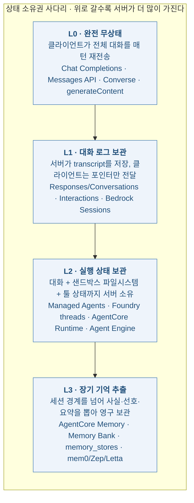
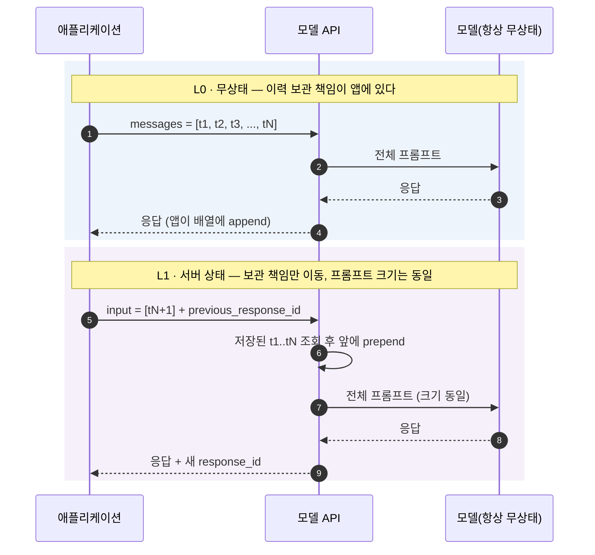
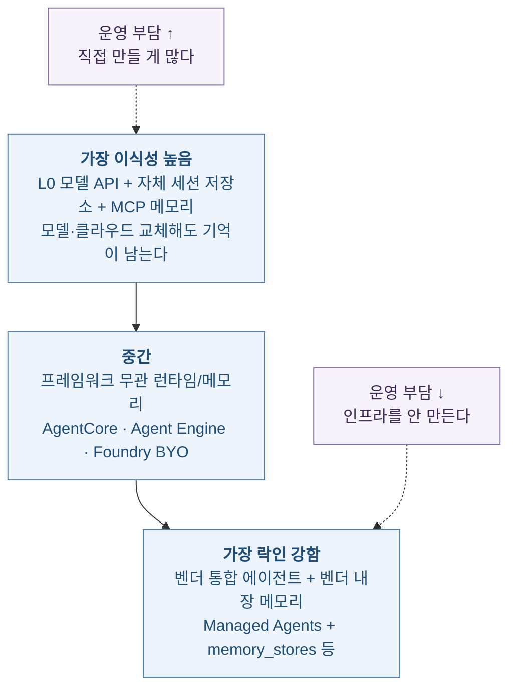
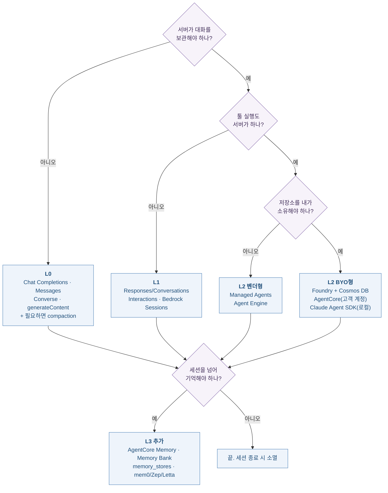

# 누가 대화를 기억하는가

> 📊 발표자료: [model-agent-api-session-memory-presentation.pptx](./model-agent-api-session-memory-presentation.pptx) · 📚 참고문헌: [model-agent-api-session-memory-references.xlsx](./model-agent-api-session-memory-references.xlsx)

**이 리포트가 답하려는 질문** — OpenAI Chat Completions는 세션을 서버에서 관리하지 않는다. 그런데 Responses API는 한다. Claude Messages API는 안 하는데, Claude Managed Agents는 한다. Bedrock Converse는 안 하는데, AgentCore는 한다. **같은 회사 안에서도 API마다 상태 소유권이 다르다.** 이 글은 (1) 상용 모델 API들의 세션 관리 주체, (2) 상용 에이전트 SDK·서버 API들의 세션·메모리 관리 주체, (3) 모델 API와 에이전트 API를 **같이 쓸 때 기억이 실제로 어디에 쌓이는지**를 1차 문서 기준으로 정리한다.

**3줄 요약**
1. 모델은 언제나 무상태다. "서버 세션"이란 모델이 기억한다는 뜻이 아니라, **누가 대화 로그를 보관하고 매 턴 재조립하느냐**의 문제다. 그래서 서버 세션을 써도 입력 토큰은 매 턴 다시 과금된다.
2. 2025~2026년 사이 전 벤더가 **무상태 모델 엔드포인트 → 상태 저장 모델 엔드포인트 → 상태 저장 에이전트 런타임 → 세션을 넘는 장기 메모리 서비스**라는 같은 사다리를 올랐다. 이름만 다르고 계층 구조는 동일하다.
3. 세션(단기)과 메모리(장기)는 **직교하는 별개 제품**이다. 그래서 "OpenAI 모델 + AWS 메모리", "Claude 모델 + 로컬 SQLite 세션" 같은 조합이 실제로 성립한다. 이때 지켜야 할 단 하나의 규칙은 **대화 이력의 source of truth를 딱 한 곳에만 두는 것**이다.

목차
1. [관통 프레임 — 상태 소유권 4단계](#sec1)
2. [대전제 — 모델은 언제나 무상태다](#sec2)
3. [모델 API 계층: 벤더별 해부](#sec3)
4. [에이전트 API 계층: 벤더별 해부](#sec4)
5. [모델 API와 에이전트 API는 무엇이 다른가](#sec5)
6. [같이 쓰는 경우 — 직교 매트릭스와 실제 조합](#sec6)
7. [실무 결정 기준 — 거버넌스·비용·락인](#sec7)
8. [요약 치트시트](#sec8)
9. [참고문헌](#sec9)
10. [학습 퀴즈](#sec10)

---

## 1. 관통 프레임 — 상태 소유권 4단계 {#sec1}

벤더 문서를 다 읽고 나면 용어가 서로 다를 뿐 구조는 같다는 게 보인다. 모든 API는 아래 네 단계 중 하나에 놓인다.

여기서 중요한 건 **L0~L2가 "이번 대화"의 축이고, L3는 "대화들 사이"의 축이라 서로 직교한다**는 점이다. L0(완전 무상태 모델 API)에 L3(장기 메모리 서비스)를 붙이는 조합이 가능하고, 실제로 가장 흔한 프로덕션 패턴이기도 하다. 5장·6장에서 다시 다룬다.

| 단계 | 서버가 가지는 것 | 클라이언트가 보내는 것 | 세션이 끊기면 |
| :--- | :--- | :--- | :--- |
| L0 | 없음 | 전체 메시지 배열 | 클라이언트가 이력을 갖고 있으면 무손실 |
| L1 | 대화 transcript | 새 턴 + 이전 응답/대화 ID | 서버 보존 기간 내라면 이어붙기 가능 |
| L2 | transcript + 실행 환경(파일, 프로세스) | 새 이벤트 + 세션 ID | 런타임 정책에 따라 재개 또는 폐기 |
| L3 | 추출된 사실·선호·요약 | 조회 쿼리 + 스코프 키 | 세션과 무관하게 영속 |

---

## 2. 대전제 — 모델은 언제나 무상태다 {#sec2}

이 글 전체를 오해 없이 읽으려면 먼저 못 박아야 할 사실이 있다. **어떤 벤더의 "stateful API"도 모델 가중치가 대화를 기억한다는 뜻이 아니다.** 트랜스포머 추론은 매 요청마다 프롬프트 전체를 다시 받아 처리한다. 서버 세션이 하는 일은 "클라이언트가 보내던 메시지 배열을 서버가 대신 보관했다가 추론 직전에 붙여주는 것"뿐이다.

이 그림이 함의하는 실무적 결과가 세 가지다.

- **비용은 줄지 않는다.** OpenAI 문서는 `previous_response_id`로 체인을 이으면 *"체인에 속한 모든 이전 입력 토큰이 입력 토큰으로 과금된다"* 고 명시한다. 서버 세션은 네트워크 페이로드를 줄여줄 뿐 컨텍스트 비용을 줄여주지 않는다. 비용을 실제로 줄이는 건 prompt caching과 compaction 쪽이다.
- **컨텍스트 윈도우 한계는 그대로다.** 서버가 보관해준다고 100만 토큰짜리 대화가 마법처럼 들어가지 않는다. 그래서 L1·L2 제품들은 거의 예외 없이 별도의 요약·compaction 레이어를 함께 내놓는다.
- **데이터는 벤더 쪽에 남는다.** L0에서는 요청이 끝나면 아무것도 남지 않지만, L1 이상에서는 대화가 벤더 인프라에 저장된다. 이 차이가 6·7장의 거버넌스 논의 전부를 만든다.

---

## 3. 모델 API 계층: 벤더별 해부 {#sec3}

### 3.1 OpenAI — 한 회사 안에 L0·L1이 공존

OpenAI는 상태 축에서 가장 여러 겹을 동시에 유지하는 벤더다.

- **Chat Completions (`/v1/chat/completions`)** — 완전 무상태. 매 요청에 전체 `messages` 배열을 다시 보내야 한다. 사용자가 지적한 그대로다. 마이그레이션 압박은 있지만 계속 지원된다.
- **Responses API (`/v1/responses`)** — 기본적으로 상태 저장이다. `store` 파라미터가 기본 `true`이고, 응답 객체는 기본 30일 보관된다. 다음 턴에 `previous_response_id`로 이전 응답 ID를 넘기면 서버가 그 ID로 전체 이력을 조회해 새 입력 앞에 붙인다. 앱은 새 질문만 보내지만 모델은 전체를 본다.
- **Conversations API (`/v1/conversations`)** — 대화를 *자체 식별자를 가진 장기 객체*로 만드는 전용 리소스다. `conversation` ID를 `/v1/responses` 요청에 넘기면 해당 대화에 턴이 누적된다. 대화 객체와 그 안의 아이템은 **응답 객체의 30일 TTL 적용 대상이 아니다.** 즉 Responses 단독 체인보다 수명이 길다.

정리하면 OpenAI 안에서만 세 가지 소유권 모델이 동시에 제공된다. 신규 프로젝트에서 "세션을 서버가 갖게 하고 싶다"면 Conversations, "이어붙이기만 되면 된다"면 `previous_response_id`, "데이터를 남기기 싫다"면 `store: false` 또는 Chat Completions다.

### 3.2 Anthropic — Messages API는 L0 고정, 대신 "서버가 편집한다"

Anthropic의 Messages API(`/v1/messages`)는 상태 저장 옵션 자체가 없다. 매 요청에 전체 `messages`를 보낸다. 그런데 Anthropic은 L1로 올라가는 대신 **독특한 중간 지점**을 만들었다. 저장은 클라이언트가 계속 하되, **컨텍스트 편집은 서버가 하는** 방식이다.

- **Context editing** (베타 헤더 `context-management-2025-06-27`) — `clear_tool_uses_20250919` 전략을 켜면, 대화가 임계치를 넘었을 때 API가 오래된 tool result를 시간순으로 비우고 자리표시 텍스트로 대체한다. 응답의 `context_management.applied_edits`에 몇 개를 지우고 몇 토큰을 회수했는지 돌아온다.
- **Compaction** (베타 헤더 `compact-2026-01-12`) — `context_management.edits`에 `compact_20260112`를 넣으면, 입력 토큰이 트리거 임계치(기본 150,000, 최소 50,000)에 도달할 때 모델이 이전 대화의 요약을 담은 `compaction` 블록을 생성한다. 이후 요청에서는 그 블록 **이전의 모든 콘텐츠가 드롭**된다. `pause_after_compaction`으로 요약 직후 멈춰 추가 내용을 끼워넣을 수도 있고, `instructions`로 요약 프롬프트를 통째로 교체할 수도 있다.

여기서 결정적인 포인트가 있다. 공식 문서는 **클라이언트가 여전히 전체 메시지 목록을 매 턴 보낸다**고 명시한다. compaction은 대화 이력을 서버에 저장하지 않는다. 앱은 응답 전체(`compaction` 블록 포함)를 로컬 배열에 append하고, 다음 요청에 그 배열을 통째로 보내면, API가 compaction 블록 이전을 알아서 버린다.

**Anthropic 모델 API의 포지션** — "클라이언트가 관리하는 목록 + 서버가 수행하는 컨텍스트 최적화". 저장 주체는 클라이언트(L0)에 남기면서 컨텍스트 엔지니어링의 어려운 부분만 서버로 옮긴 절충안이다. ZDR(Zero Data Retention)을 유지하면서도 장기 실행 에이전트를 돌릴 수 있다는 게 실무적 함의다.

### 3.3 Google Gemini — `generateContent`(L0)에서 Interactions API(L1)로 세대 교체

Gemini도 같은 길을 갔다. 기존 `generateContent`는 "요청 하나, 응답 하나"의 무상태 모델이고 클라이언트가 전체 이력을 배열로 들고 있어야 했다. 2026년 6월 GA된 **Interactions API**가 그 자리를 대체한다.

- `previous_interaction_id`를 넘기면 서버가 이력을 조회해 이어붙인다.
- `store`는 기본 `true`다. `store: false`로 무상태를 선택할 수 있지만, 그러면 `previous_interaction_id`와 백그라운드 실행을 못 쓴다.
- 보존 기간은 유료 티어 **55일**(7/14/28일로 조정 가능), 무료 티어 **1일**이다.
- 함정 하나: `tools`, `system_instruction`, `generation_config`는 **interaction 스코프**라서 `previous_interaction_id`로 이어져도 승계되지 않는다. 매 턴 다시 명시해야 한다.
- 캐싱: Gemini 2.5 이후 모델은 implicit caching이 기본 활성이고, 상태 모드(`previous_interaction_id`)와 무상태 모드 양쪽에서 동작한다.

Google 문서는 앞으로 모든 신규 모델·멀티모달 기능·에이전트 기능이 Interactions API에서 출시된다고 못 박았다. 즉 Gemini는 **상태 저장 쪽을 기본값으로 삼은 첫 주요 모델 API**다.

### 3.4 Azure OpenAI — 표면은 OpenAI, 저장 위치는 고객 테넌트

Azure OpenAI의 Responses API는 OpenAI와 같은 파라미터 표면(`previous_response_id`, `store`)을 제공하고 대화 상태는 30일간(또는 삭제할 때까지) 유지된다. 차별점은 **어디에 저장되느냐**다.

Responses API를 Foundry에서 쓰면 서비스가 메시지 이력을 저장할 데이터 스토어를 만드는데, 이 데이터는 **고객 Azure 테넌트의 Foundry 리소스 내부, 해당 리소스와 같은 지리적 위치에 저장**되고 기본적으로 AES-256으로 암호화된다. 규제 산업에서 Azure를 고르는 이유가 여기 압축돼 있다. 같은 API 모양, 다른 데이터 경계.

참고로 Azure 쪽 Conversations 엔드포인트는 Foundry REST 레퍼런스에 등재돼 있으나 배포·리전 구성에 따라 가용성이 갈린다는 사용자 보고가 있다. 도입 전에 실제 배포에서 확인하는 편이 안전하다.

### 3.5 AWS Bedrock — Converse는 L0, 세션은 "명시적 별도 API"

Bedrock의 통합 모델 인터페이스인 **Converse API**는 완전 무상태다. 호출자가 `messages` 배열을 직접 관리하고 매 요청에 전체 이력을 다시 보내야 하며, Bedrock은 그 이력을 보관하지 않는다.

AWS의 선택은 상태를 모델 API에 끼워넣는 대신 **별도 API 묶음으로 떼어낸 것**이다. Bedrock **Session Management API**가 그것이다.

| 오퍼레이션 | 역할 |
| :--- | :--- |
| `CreateSession` | 대화를 담을 세션 생성, 고유 session ID와 ARN 반환 |
| `CreateInvocation` | 세션 안에 관련된 상호작용들을 묶는 그룹 생성 |
| `PutInvocationStep` | 각 상호작용의 세밀한 상태 체크포인트(텍스트·이미지) 저장 |

AWS는 이 API를 LangGraph·LlamaIndex 같은 **오픈소스 프레임워크의 상태 저장소**로 쓰라는 용도로 내놨다. 즉 이건 "모델이 알아서 이어붙여주는 세션"이 아니라 **개발자가 명시적으로 쓰고 명시적으로 읽는 체크포인트 스토어**다. 이 구분이 중요하다. L1 중에서도 자동 주입형(OpenAI·Gemini)과 명시적 저장형(AWS)은 프로그래밍 모델이 완전히 다르다.

참고로 구형 **Bedrock Agents**의 `InvokeAgent`는 `sessionId`를 재사용하면 서버가 세션 상태를 유지하는 자동 주입형이다. 같은 AWS 안에서도 경로마다 다르다.

### 3.6 모델 API 종합 비교

| 벤더 · API | 단계 | 세션 저장 주체 | 이어붙이는 방식 | 기본 보존 | 무상태 선택 |
| :--- | :---: | :--- | :--- | :--- | :---: |
| OpenAI Chat Completions | L0 | 클라이언트 | 전체 `messages` 재전송 | 없음 | 항상 |
| OpenAI Responses | L1 | OpenAI 서버 | `previous_response_id` | 30일 | `store: false` |
| OpenAI Conversations | L1 | OpenAI 서버 | `conversation` ID | 30일 TTL 미적용 | X |
| Anthropic Messages | L0 | 클라이언트 | 전체 `messages` 재전송 | 없음 | 항상 |
| Anthropic + compaction | L0 | 클라이언트 | 전체 재전송, 서버가 앞부분 드롭 | 없음 | 항상 |
| Gemini `generateContent` | L0 | 클라이언트 | 전체 `contents` 재전송 | 없음 | 항상 |
| Gemini Interactions | L1 | Google 서버 | `previous_interaction_id` | 유료 55일 / 무료 1일 | `store: false` |
| Azure OpenAI Responses | L1 | **고객 Azure 테넌트** | `previous_response_id` | 30일 | `store: false` |
| Bedrock Converse | L0 | 클라이언트 | 전체 `messages` 재전송 | 없음 | 항상 |
| Bedrock Session Mgmt | L1 | AWS(고객 계정) | 개발자가 명시적으로 put/get | 설정 | 안 쓰면 됨 |
| Bedrock `InvokeAgent` | L1~L2 | AWS | `sessionId` 재사용 | 세션 정책 | X |

---

## 4. 에이전트 API 계층: 벤더별 해부 {#sec4}

모델 API가 "한 번의 추론"을 파는 것이라면, 에이전트 API는 **루프 전체**를 판다. 루프를 판다는 건 필연적으로 루프의 상태 — 툴 호출 이력, 중간 산출물, 파일시스템 — 까지 떠안는다는 뜻이다. 그래서 에이전트 API는 거의 자동으로 L2 이상이 된다.

### 4.1 Anthropic Claude Managed Agents — L2 + L3를 한 제품으로

2026년 4월 8일 출시된 Anthropic의 호스팅 에이전트 하네스다. **Anthropic이 하네스, 샌드박스, 세션 로그를 자기 인프라에서 돌린다.** 베타 헤더는 `managed-agents-2026-04-01`.

네 개 개념으로 구성된다.

| 개념 | 내용 |
| :--- | :--- |
| Agent | 모델, 시스템 프롬프트, 툴, MCP 서버, 스킬 — 버전 관리되는 리소스 |
| Environment | 세션이 돌아갈 곳: Anthropic 클라우드 샌드박스 또는 자체 인프라의 self-hosted 샌드박스 |
| Session | environment 안에서 도는 에이전트 인스턴스. **대화 이력을 세션이 보유** |
| Events | 앱과 에이전트가 주고받는 메시지(유저 턴, 툴 결과, 상태 업데이트) |

핵심 API 흐름은 `POST /v1/sessions`로 세션을 만들고(필수 필드는 `agent`와 `environment_id`), `POST /v1/sessions/{id}/events`로 이벤트를 보내고, SSE로 스트리밍받는 구조다. `initial_events`(최대 50개)를 create 요청에 넣으면 생성과 시작을 한 번에 할 수 있다. **이벤트 이력은 서버에 영속되며 전체 조회가 가능하다.**

세션 제어 파라미터가 꽤 촘촘하다.

- `agent`를 문자열로 주면 최신 버전, `{"type": "agent", "version": N}`으로 주면 버전 고정, `{"type": "agent_with_overrides", ...}`로 주면 이 세션에만 모델·프롬프트·툴을 덮어쓴다. 오버라이드는 병합이 아니라 **전체 치환**이다.
- `budget.max_list_cost`로 세션당 비용 상한을 건다. 금액은 부동소수점 반올림을 피하려고 **미국 센트 단위 문자열**(`"2500"` = $25.00)로 받는다. 상한에 닿으면 세션이 `budget_reached`로 일시정지된다.
- `vault_ids`로 MCP OAuth 자격증명 볼트를 연결하면 토큰 갱신을 Anthropic이 대행한다.

**장기 메모리는 별도 리소스인 memory store**가 담당한다(베타 헤더 `agent-memory-2026-07-22`, 세션 엔드포인트와 헤더를 **섞으면 400 에러**). 워크스페이스 스코프의 텍스트 문서 컬렉션이고, 세션 생성 시 `resources[]`에 붙이면 샌드박스 안 `/mnt/memory/<slug>/` 경로에 디렉터리로 마운트된다. 에이전트는 평소 쓰던 파일 툴로 읽고 쓴다.

| 제약 | 값 |
| :--- | ---: |
| 세션당 최대 memory store | 8개 |
| 메모리 1개당 최대 크기 | 100 kB (약 25k 토큰) |
| store당 최대 메모리 수 | 10,000개 |
| 메모리 버전 보존 | 30일 (라이브 메모리의 최신 버전은 무기한) |

모든 변경은 불변 **memory version**(`memver_...`)을 만들어 감사 추적이 남고, 규제 대응용 `redact` 엔드포인트가 따로 있다. 동시 쓰기 충돌은 `content_sha256` precondition으로 막는다.

**보안 경고 (공식 문서 명시)** — memory store는 기본 `read_write`로 붙는다. 에이전트가 신뢰할 수 없는 입력(유저 프롬프트, 웹에서 가져온 콘텐츠, 서드파티 툴 출력)을 처리한다면, 프롬프트 인젝션이 성공했을 때 악성 내용이 store에 **기록**될 수 있다. 이후 세션들은 그걸 신뢰된 기억으로 읽는다. 참조용 자료나 에이전트가 수정할 필요 없는 store는 `read_only`로 붙여야 한다.

이건 L3 장기 메모리 전반에 해당하는 구조적 위험이다. 메모리는 세션 경계를 넘는 쓰기 채널이고, 그래서 인젝션의 지속성(persistence)을 만들어낸다.

데이터 거버넌스 측면에서 중요한 단서가 하나 있다. Managed Agents는 설계상 상태 저장이라 대화 이력·샌드박스 상태·산출물을 서버에 보관하며, 그 결과 **Zero Data Retention과 HIPAA BAA 적용 대상이 아니다.** 세션과 업로드 파일은 API로 언제든 삭제할 수 있다.

### 4.2 Claude Agent SDK — 같은 회사, 정반대의 상태 소유권

Managed Agents와 대조적으로 Claude Agent SDK는 **로컬 우선**이다. 세션은 `~/.claude/projects/` 아래에 프로젝트 절대경로 해시로 나뉜 디렉터리에 `.jsonl`(한 줄 = 한 이벤트, append-only)로 저장된다. ID로 resume하면 같은 세션에 이어 붙고, fork하면 원본 이력을 복사한 **새 세션 ID**가 생겨 두 갈래가 독립적으로 진행된다.

즉 Anthropic은 같은 에이전트 개념을 두 가지 상태 소유권으로 동시에 판다. **"내 머신/내 서버에 이력을 두겠다"면 Agent SDK, "인프라를 아예 안 만들겠다"면 Managed Agents.**

### 4.3 OpenAI Agents SDK — 세션 백엔드를 고르는 구조

OpenAI Agents SDK는 클라이언트 라이브러리이므로 세션 저장소를 **선택**하게 한다. 이게 이 글의 3번 질문(크로스오버)에 가장 직접적인 답을 준다.

| 세션 구현 | 저장 위치 | 특징 |
| :--- | :--- | :--- |
| `MemorySession` | 프로세스 메모리 | 프로세스 종료 시 소실 |
| `SQLiteSession` | 로컬 SQLite | 기본은 인메모리 DB, 파일 경로를 주면 영속 |
| `OpenAIConversationsSession` | **OpenAI 서버** | Conversations API와 동기화 |
| `OpenAIResponsesCompactionSession` | 래핑한 하위 세션 | Responses API로 이력을 압축, 턴마다 자동 compaction 가능 |
| Redis / SQLAlchemy / MongoDB / Dapr | **자체 인프라** | 공유·저지연, 기존 DB 활용, 클라우드 네이티브 배포 |

같은 에이전트 코드에서 한 줄만 바꿔 **기억의 소유권을 로컬 ↔ 자체 DB ↔ OpenAI 서버로 이동**시킬 수 있다. 상태 소유권이 런타임 설정으로 내려온 첫 사례에 가깝다.

주변 제품 상황도 정리해두자. **AgentKit**은 Agents SDK · Responses API · ChatKit · Agent Builder를 묶은 번들 브랜딩인데, 이 중 시각적 워크플로 빌더인 **Agent Builder는 2026년 11월 30일 종료 예정**이다. OpenAI는 신규 작업에 대해 ChatKit SDK + Agents SDK 기반의 **자체 서버 구현**을 권장한다. ChatKit 자체는 독립 임베더블 채팅 UI로 남고, 자체 인프라에서 셀프호스팅할 수 있다.

### 4.4 AWS Bedrock AgentCore — 런타임(L2)과 메모리(L3)를 분리 판매

AWS는 이 계층을 가장 명시적으로 쪼개놓았다.

**AgentCore Runtime (L2)** — 사용자 세션마다 **전용 microVM**을 할당해 컴퓨트·메모리·파일시스템을 격리한다. 세션 헤더로 같은 microVM에 라우팅하므로, 클라이언트는 응답의 세션 ID를 받아 이후 모든 요청에 넣어야 세션 어피니티가 유지된다. ARM64 컨테이너, 최대 **8시간** 실행 윈도, **15분 무활동 시 컨테이너 회수**, HTTP와 A2A 프로토콜 네이티브 지원(A2A 구성 시 포트 9000의 무상태 streamable HTTP 서버 기대). 2026년 3월에는 에이전트 파일시스템 상태를 유지하는 **managed session storage**가 프리뷰로 추가됐다.

결정적으로 **AgentCore Runtime은 프레임워크 무관(framework agnostic)이며, Amazon Bedrock·Anthropic Claude·Google Gemini·OpenAI 등 서로 다른 LLM으로 에이전트를 돌릴 수 있다.** 이게 6장 크로스오버의 핵심 재료다.

**AgentCore Memory (L3)** — 단기/장기를 명확히 나눈 별도 서비스다.

| 용어 | 정의 |
| :--- | :--- |
| AgentCore Memory | 최상위 컨테이너. 에이전트의 모든 이벤트와 추출된 인사이트를 보유 |
| Event | 단기 기억의 기본 단위. **불변·타임스탬프**되며 `actorId`·`sessionId`로 조직됨 |
| Actor (`actorId`) | 상호작용 주체. 사람·다른 에이전트·시스템 |
| Session (`sessionId`) | 하나의 연속된 상호작용. 그 안의 모든 이벤트를 묶는 키 |
| Memory strategy | 단기 → 장기 변환 규칙. 무엇을 남길지 결정 |
| Namespace | 장기 기억을 논리적으로 묶는 구조화된 경로. 조회·필터·접근제어에 사용 |
| Memory record | 네임스페이스 안에 저장되는 구조화된 정보 단위 |

단기는 `CreateEvent` / `GetEvent` / `ListEvents` / `DeleteEvent`로, 장기는 전략 설정 후 `RetrieveMemoryRecords` / `ListMemoryRecords` / `DeleteMemoryRecords`로 다룬다. 2026년의 주요 업데이트는 세 가지다.

- **2026-03 스트리밍 알림** — 장기 메모리 레코드 생성·변경 시 푸시 알림. 폴링 제거.
- **2026-05~06 strictly consistent metadata** — 애플리케이션이 붙인 메타데이터 값이 LLM 추론 없이 추출·통합을 그대로 통과해 장기 레코드에 도달.
- **2026-09 `IngestData` API** — 콘텐츠를 받아 장기 메모리 전략들로 팬아웃하고, **단기 이벤트를 만들지 않고** 바로 장기 레코드를 만든다. 대화가 아닌 문서·기록물을 메모리에 넣는 경로가 열린 셈이다.

### 4.5 Azure Foundry Agent Service — thread/run 모델 + BYO 스토리지

Azure는 OpenAI Assistants에서 유래한 **thread / run / message** 모델을 유지한다.

- **Thread**는 명시적으로 삭제할 때까지 유지되고, 하나의 스레드에 최대 **100,000개 메시지**를 붙일 수 있다.
- **Run**은 스레드에 대해 에이전트를 기동하는 단위다. 에이전트가 자기 설정과 스레드 메시지를 읽어 모델·툴을 호출하고 새 메시지를 스레드에 덧붙인다.

차별점은 **BYO Thread Storage**다. Standard agent setup에서는 스레드가 **고객 소유의 Azure Cosmos DB 계정**에 저장된다. `enterprise_memory` 데이터베이스 안에 `thread-message-store`(최종 사용자 대화), `system-thread-message-store`(내부 시스템 메시지), `agent-entity-store`(모델 입출력) 등의 컨테이너가 생성되며, 사용할 Cosmos DB 계정은 총 처리량 한도가 최소 3,000 RU/s여야 한다. Foundry Agent Service는 **non-OpenAI 모델도 지원**한다.

즉 Azure는 L2 상태를 제공하면서도 **물리적 저장소 소유권은 고객에게 남기는** 유일한 메이저 옵션이다.

### 4.6 Google Vertex AI Agent Engine — Sessions(L2) + Memory Bank(L3), 프레임워크 무관

Google은 Agent Engine 안에 두 메커니즘을 둔다. **Sessions**는 단기 대화 컨텍스트를, **Memory Bank**는 세션을 넘는 장기 저장을 담당한다. 둘 다 2026년 현재 GA이며, 2026년 1월 28일부터 Sessions·Memory Bank·Code Execution에 과금이 시작됐다.

Memory Bank의 핵심 API는 두 개다.

- **`GenerateMemories`** — 세션 종료나 턴 종료 같은 특정 시점에 대화에서 사실을 자동 추출한다.
- **`RetrieveMemories`** — 저장된 기억을 조회한다. 전부 가져오는 단순 조회와, 현재 대화에 가장 관련 있는 것만 가져오는 유사도 검색 조회를 모두 지원한다.

**`scope`** 는 생성된 기억의 범위를 나타내는 딕셔너리다(예: `{"session_id": "MY_SESSION"}`). **같은 스코프의 기억끼리만 통합(consolidation) 대상이 된다.** 명시적으로 스코프를 주지 않으면 세션에서 생성된 기억은 자동으로 `{"user_id": USER_ID}`로 키가 매겨진다. 멀티테넌시 설계가 이 한 필드에 달려 있다.

가장 중요한 건 이거다. **Agent Engine SDK는 프레임워크 오케스트레이션 없이도, 또는 ADK가 아닌 다른 프레임워크와도 Sessions·Memory Bank를 쓸 수 있도록 설계됐다.** REST API로 직접 호출하는 경로도 문서화돼 있다. ADK·LangChain·LangGraph 등을 재작업 없이 배포할 수 있는 프레임워크 무관 배포도 지원한다.

### 4.7 서드파티 메모리 계층 — mem0 / Zep / Letta

벤더 종속을 피하려는 쪽에는 독립 메모리 제품군이 있다. 셋 다 지향점이 뚜렷이 다르다.

| 제품 | 메모리 모델 | 특징 |
| :--- | :--- | :--- |
| **mem0** | 범용 메모리 API (add/update/delete/retrieve) | 서비스 무관. 어떤 오케스트레이터 뒤에도 놓인다. 로컬 우선 MCP 서버(OpenMemory MCP) 보유 |
| **Zep** | 시간 인식 지식 그래프 (Graphiti 엔진) | 사실이 *언제* 학습됐고 서로 어떻게 연결되는지 보존. 공식 MCP 서버 제공 |
| **Letta** (구 MemGPT) | 상태 저장 에이전트 OS | OS 메모리 관리에서 착안한 계층 구조를 **에이전트 자신이 편집**. MCP 클라이언트로 동작 |

셋 다 Apache-2.0이고 MCP 생태계에 연결되지만 방식은 다르다. 메모리를 MCP 툴로 노출하면 **모델·프레임워크·클라우드를 전부 갈아치워도 기억은 그대로 남는다.** 락인 회피 관점에서 가장 강력한 선택지다.

### 4.8 에이전트 API 종합 비교

| 제품 | 단계 | 세션 소유 | 장기 메모리 | 모델 자유도 | 물리적 저장 위치 |
| :--- | :---: | :--- | :--- | :--- | :--- |
| Claude Managed Agents | L2+L3 | Anthropic 서버 | `memory_stores` 내장 | Claude 전용 | Anthropic (ZDR·BAA 불가) |
| Claude Agent SDK | L2 | **로컬 `.jsonl`** | 직접 구현 | Claude 전용 | 내 머신/서버 |
| OpenAI Agents SDK | L1~L2 | **선택 가능** | 서드파티 연동 | LiteLLM 등으로 확장 | 선택에 따라 |
| Bedrock AgentCore | L2+L3 | AWS microVM | AgentCore Memory | **Bedrock·Claude·Gemini·OpenAI** | AWS (고객 계정) |
| Azure Foundry Agents | L2 | Azure 스레드 | 스레드 누적 | non-OpenAI 포함 | **고객 Cosmos DB** |
| Vertex Agent Engine | L2+L3 | Google Sessions | Memory Bank | 프레임워크 무관 | Google Cloud |
| mem0 / Zep / Letta | L3 | 해당 없음 | 전문 제품 | 완전 무관 | 셀프호스팅 또는 SaaS |

---

## 5. 모델 API와 에이전트 API는 무엇이 다른가 {#sec5}

표면적으로는 "루프를 누가 도느냐"의 차이지만, 실제로 갈리는 축은 다섯 개다.

| 축 | 모델 API | 에이전트 API |
| :--- | :--- | :--- |
| **실행 단위** | 요청 1회 = 추론 1회 | 요청 1회 = 목표 달성까지의 루프 전체 |
| **상태의 범위** | 대화 메시지만 | 대화 + 툴 결과 + 파일시스템 + 프로세스 |
| **툴 실행 주체** | **클라이언트**가 실행하고 결과를 되돌려줌 | **서버(샌드박스)**가 직접 실행 |
| **시간 척도** | 초 단위 | 분~시간 단위 (AgentCore 최대 8시간, Managed Agents는 스케줄 실행까지) |
| **실패 모드** | 타임아웃·거절 | 세션 중단·예산 초과·샌드박스 회수·재개 필요 |

세 번째 줄이 결정적이다. **툴 실행이 서버로 넘어가는 순간 상태도 반드시 서버로 넘어간다.** 모델이 파일을 쓰고 명령을 돌리면 그 결과물을 어딘가 두어야 하고, 그 "어딘가"가 벤더 인프라이기 때문이다. 이것이 "에이전트 API는 자동으로 L2 이상"인 구조적 이유다.

그리고 여기서 파생되는 실무적 귀결이 하나 있다. **에이전트 API를 쓰는 순간 데이터 거버넌스 논의가 모델 API와 달라진다.** 앞서 본 Anthropic의 ZDR·HIPAA BAA 비적용 고지는 예외가 아니라 이 계층의 일반 법칙이다. Azure가 굳이 BYO Cosmos DB를 만든 이유도, AWS가 고객 계정 안에서 돌리는 이유도 같다.

---

## 6. 같이 쓰는 경우 — 직교 매트릭스와 실제 조합 {#sec6}

이제 사용자가 던진 세 번째 질문이다. **모델 API와 에이전트 API를 같이 쓸 수 있는가, 그러면 메모리는 어디에 쌓이는가.**

답은 "쓸 수 있고, 흔하며, **어디에 쌓일지는 당신이 고르는 것**"이다. 이 계층은 서로 직교한다.

```mermaid
flowchart LR
  subgraph A["① 추론 (모델 API)"]
    direction TB
    A1["OpenAI"]
    A2["Anthropic"]
    A3["Gemini"]
    A4["Bedrock<br/>모델들"]
  end
  subgraph B["② 루프 (에이전트 런타임)"]
    direction TB
    B1["OpenAI<br/>Agents SDK"]
    B2["Claude<br/>Agent SDK"]
    B3["AgentCore<br/>Runtime"]
    B4["Agent Engine<br/>/ Foundry"]
  end
  subgraph C["③ 기억 (세션·메모리 저장소)"]
    direction TB
    C1["로컬 SQLite<br/>Redis · Mongo"]
    C2["OpenAI<br/>Conversations"]
    C3["AgentCore<br/>Memory"]
    C4["Memory Bank<br/>memory_stores"]
    C5["mem0 · Zep<br/>Letta (MCP)"]
  end
  A --> B --> C
  classDef box fill:#eef4fb,stroke:#4a7fb5,stroke-width:1px,color:#1F4E79;
  class A1,A2,A3,A4,B1,B2,B3,B4,C1,C2,C3,C4,C5 box;
```

세 열에서 하나씩 자유롭게 고르면 된다. 실제로 성립하는 대표 조합들이다.

| # | 조합 | 추론 위치 | 세션 저장 | 장기 메모리 | 성립 근거 |
| :---: | :--- | :--- | :--- | :--- | :--- |
| 1 | OpenAI Agents SDK + `OpenAIConversationsSession` | OpenAI | OpenAI 서버 | 없음/서드파티 | SDK 공식 세션 구현 |
| 2 | OpenAI Agents SDK + Claude 모델(LiteLLM) + Redis 세션 | Anthropic | **내 Redis** | 서드파티 | SDK가 LiteLLM/Any-LLM 어댑터 제공 |
| 3 | AgentCore Runtime + OpenAI 모델 + AgentCore Memory | **OpenAI** | AWS microVM | **AWS** | Runtime이 OpenAI·Gemini·Claude 모델 지원 |
| 4 | 임의 프레임워크 + Vertex Memory Bank | 아무 데나 | 프레임워크 | **Google** | Agent Engine SDK는 ADK 없이도 사용 가능 |
| 5 | Azure Foundry Agents + non-OpenAI 모델 + BYO Cosmos | Azure 모델 카탈로그 | **내 Cosmos DB** | 스레드 누적 | Standard setup의 BYO Thread Storage |
| 6 | 아무 모델 + mem0/Zep MCP 서버 | 아무 데나 | 프레임워크 | **MCP 뒤 어디든** | 메모리를 MCP 툴로 노출 |
| 7 | LangGraph/LlamaIndex + Bedrock Session Mgmt API | Bedrock | **AWS(고객 계정)** | 직접 구현 | AWS가 명시한 설계 용도 |

### 6.1 그래서 메모리는 어디에 쌓이는가 — 판별 규칙

조합이 복잡해 보여도 판별은 세 가지 질문으로 끝난다.

1. **대화 이력(transcript)은 누가 보관하는가?** → 에이전트 런타임의 세션 백엔드 설정이 결정한다. 모델 API가 아니다. 조합 2에서 모델은 Anthropic이지만 이력은 내 Redis에 있다.
2. **툴 실행 산출물(파일 등)은 어디 남는가?** → 샌드박스 소유자가 결정한다. Managed Agents면 Anthropic, AgentCore면 AWS, Agent SDK 로컬이면 내 디스크다.
3. **세션을 넘는 사실·선호는 어디 쌓이는가?** → 명시적으로 붙인 L3 제품이 결정한다. 안 붙였으면 **어디에도 안 쌓인다.** 세션이 끝나면 사라진다.

이 세 개가 서로 다른 곳일 수 있다는 게 핵심이다. "메모리가 어디 있냐"는 질문에는 단일 답이 없고, **세 개의 답**이 있다.

### 6.2 안티패턴 — 이중 기록(double bookkeeping)

크로스오버에서 가장 자주 발생하는 사고는 **이력의 source of truth가 둘이 되는 것**이다.

에이전트 SDK의 세션 객체가 이력을 들고 있는데 동시에 모델 API의 서버 세션 체이닝(`previous_response_id` / `previous_interaction_id` / `conversation`)을 켜면, 양쪽이 각자 이력을 앞에 붙이려 한다. 그 결과는 중복 턴, 예상보다 큰 입력 토큰 청구, 툴 호출 순서 불일치다. Gemini Interactions API처럼 `tools`·`system_instruction`이 승계되지 않는 API에서는 여기에 설정 누락까지 겹친다.

**설계 원칙 — 대화 이력의 소유자는 정확히 하나여야 한다.**

- 에이전트 SDK의 세션을 쓴다 → 모델 API는 무상태 모드로 호출한다(`store: false` 또는 체이닝 파라미터 미사용).
- 모델 API의 서버 세션을 쓴다 → SDK 세션은 그 서버 세션을 래핑하는 구현(`OpenAIConversationsSession` 같은)만 쓰고, 별도 로컬 저장을 병행하지 않는다.
- 장기 메모리(L3)는 예외다. 이건 이력이 아니라 **추출된 사실**이므로 이중이 아니다. 오히려 L0~L2 어느 조합에도 독립적으로 얹는 게 정상이다.

### 6.3 마이그레이션 관점 — 어느 조합이 갈아타기 쉬운가

이건 좋고 나쁨의 축이 아니라 **교환의 축**이다. 락인이 강한 쪽은 그만큼 인프라를 안 만들어도 된다. 자체 구현 쪽은 자유롭지만 샌드박스·재개·감사 로그를 전부 직접 만들어야 한다.

---

## 7. 실무 결정 기준 — 거버넌스·비용·락인 {#sec7}

### 7.1 데이터 거버넌스로 먼저 자른다

가장 많은 선택지를 한 번에 제거하는 축이다.

| 요구사항 | 가능한 선택 | 불가능한 선택 |
| :--- | :--- | :--- |
| Zero Data Retention 필수 | L0 모델 API(+compaction), 자체 세션 저장 | Claude Managed Agents(공식 비적용), 서버 저장 모드 전반 |
| 데이터가 자사 테넌트에 있어야 함 | Azure Responses/Foundry BYO Cosmos, AgentCore(고객 계정), 셀프호스팅 메모리 | OpenAI Conversations, Gemini Interactions 기본값 |
| 특정 지리에 고정 | Azure(리소스와 동일 지리), Anthropic `inference_geo` 핀 | 지역 미지정 기본 라우팅 |
| 감사 추적·소급 삭제 필요 | Anthropic memory versions + `redact`, AgentCore 이벤트(불변·타임스탬프) | 단순 로컬 파일 저장 |

### 7.2 비용은 "저장"이 아니라 "재전송"에서 나온다

2장에서 봤듯 서버 세션은 토큰 비용을 줄이지 않는다. 실제로 비용을 움직이는 레버는 셋이다.

- **Prompt caching** — 긴 접두사를 재사용. Anthropic은 compaction 블록과 시스템 프롬프트에 `cache_control` 브레이크포인트를 두면 캐시 적중률이 극대화된다고 안내한다. Gemini는 2.5 이후 implicit caching이 기본이고 상태/무상태 모드 모두에서 동작한다.
- **Compaction / context editing** — 이력 자체를 줄인다. Anthropic의 `compact_20260112`가 가장 형식화된 형태고, OpenAI 쪽은 `OpenAIResponsesCompactionSession`이 대응된다.
- **장기 메모리로 옮기기** — 전체 대화를 컨텍스트에 유지하는 대신 추출된 사실만 조회한다. AgentCore Memory·Memory Bank의 존재 이유가 사실상 이것이다. Vertex는 유사도 검색 조회를 지원해 "관련된 기억만" 넣을 수 있다.

여기에 에이전트 계층 고유의 비용 통제 장치도 있다. Managed Agents의 `budget.max_list_cost`는 세션 단위 하드 상한이고, AgentCore Runtime의 15분 유휴 회수·8시간 상한은 컴퓨트 측 상한이다.

### 7.3 선택 가이드

| 상황 | 권장 | 이유 |
| :--- | :--- | :--- |
| 단순 챗봇, 이력이 짧다 | L0 모델 API + 앱 DB | 가장 단순하고 가장 이식성 높다 |
| 멀티 디바이스 동기화가 필요한 채팅 | OpenAI Conversations 또는 Gemini Interactions | 서버가 대화 객체를 들고 있어 기기 간 이어받기가 공짜 |
| 규제 산업, 데이터가 테넌트 밖으로 못 나감 | Azure Foundry BYO Cosmos / AgentCore(고객 계정) | 실행은 맡기고 저장은 소유 |
| ZDR 계약이 걸려 있음 | Anthropic Messages + compaction + 자체 저장 | 서버 컨텍스트 최적화를 쓰면서 무상태 유지 |
| 수 시간짜리 자율 작업, 인프라 만들기 싫음 | Claude Managed Agents | 하네스·샌드박스·재개·스케줄 실행까지 포함 |
| 모델을 자주 갈아탈 예정 | AgentCore Runtime 또는 자체 루프 + MCP 메모리 | 모델 교체가 설정 변경으로 끝난다 |
| 개인화가 제품의 핵심 | 전용 L3(AgentCore Memory / Memory Bank / Zep) | 세션 이력만으로는 사용자 모델이 안 쌓인다 |

---

## 8. 요약 치트시트 {#sec8}

기억할 문장 다섯 개로 압축하면 이렇다.

1. **모델은 무상태다.** 서버 세션은 보관 책임의 이동이지 기억의 획득이 아니다. 토큰은 매 턴 다시 낸다.
2. **한 벤더 안에도 여러 단계가 공존한다.** OpenAI는 L0·L1을 동시에, Anthropic은 L0(Messages)과 L2+L3(Managed Agents)를 동시에 판다.
3. **툴 실행이 서버로 가면 상태도 서버로 간다.** 그래서 에이전트 API는 자동으로 거버넌스 문제가 된다.
4. **세션(L0~L2)과 메모리(L3)는 직교한다.** 그래서 "OpenAI 모델 + AWS 메모리" 같은 조합이 실제로 돈다.
5. **이력의 소유자는 하나여야 한다.** SDK 세션과 모델 API 체이닝을 동시에 켜면 중복 과금과 순서 꼬임이 온다.

---

## 9. 참고문헌 {#sec9}

> 상세 목록은 [model-agent-api-session-memory-references.xlsx](./model-agent-api-session-memory-references.xlsx) 참고.

**OpenAI**
- Conversation state — https://developers.openai.com/api/docs/guides/conversation-state
- Migrate to the Responses API — https://developers.openai.com/api/docs/guides/migrate-to-responses
- Agents SDK Sessions (Python) — https://openai.github.io/openai-agents-python/sessions/
- Agents SDK Models (LiteLLM/Any-LLM) — https://openai.github.io/openai-agents-python/models/
- ChatKit / Agent Builder — https://developers.openai.com/api/docs/guides/chatkit · https://developers.openai.com/api/docs/guides/agent-builder
- Introducing AgentKit — https://openai.com/index/introducing-agentkit/

**Anthropic**
- Claude Managed Agents overview — https://platform.claude.com/docs/en/managed-agents/overview
- Start a session — https://platform.claude.com/docs/en/managed-agents/sessions
- Using agent memory (memory stores) — https://platform.claude.com/docs/en/managed-agents/memory
- Self-hosted sandboxes / MCP tunnels — https://platform.claude.com/docs/en/managed-agents/self-hosted-sandboxes · https://claude.com/blog/claude-managed-agents-updates
- Context editing — https://platform.claude.com/docs/en/build-with-claude/context-editing
- Compaction — https://platform.claude.com/docs/en/build-with-claude/compaction
- Memory tool — https://platform.claude.com/docs/en/agents-and-tools/tool-use/memory-tool
- Agent SDK sessions — https://code.claude.com/docs/en/agent-sdk/sessions

**Google**
- Gemini Interactions API overview — https://ai.google.dev/gemini-api/docs/interactions-overview
- Gemini generateContent — https://ai.google.dev/gemini-api/docs/interactions
- Context caching — https://ai.google.dev/gemini-api/docs/caching
- Vertex AI Agent Engine Memory Bank overview — https://cloud.google.com/agent-builder/agent-engine/memory-bank/overview
- Generate memories / Fetch memories — https://cloud.google.com/vertex-ai/generative-ai/docs/agent-engine/memory-bank/generate-memories · .../fetch-memories
- Memory Bank public preview 발표 — https://cloud.google.com/blog/products/ai-machine-learning/vertex-ai-memory-bank-in-public-preview

**AWS**
- AgentCore Memory 개요 / how it works / terminology — https://docs.aws.amazon.com/bedrock-agentcore/latest/devguide/memory.html
- 단기 메모리 / 장기 메모리 — https://docs.aws.amazon.com/bedrock-agentcore/latest/devguide/using-memory-short-term.html · .../long-term-memory-long-term.html
- `IngestData` API (2026-09) — https://aws.amazon.com/about-aws/whats-new/2026/09/agentcore-memory-direct-ingest/
- 스트리밍 알림 (2026-03) — https://aws.amazon.com/about-aws/whats-new/2026/03/agentcore-memory-streaming-ltm
- Runtime 세션 격리 — https://docs.aws.amazon.com/bedrock-agentcore/latest/devguide/runtime-sessions.html
- Managed session storage 프리뷰 — https://aws.amazon.com/about-aws/whats-new/2026/03/bedrock-agentcore-runtime-session-storage
- Bedrock Session Management APIs — https://docs.aws.amazon.com/bedrock/latest/userguide/sessions.html · https://aws.amazon.com/blogs/machine-learning/amazon-bedrock-launches-session-management-apis-for-generative-ai-applications-preview/

**Microsoft Azure**
- Threads, Runs, Messages — https://learn.microsoft.com/en-us/azure/ai-foundry/agents/concepts/threads-runs-messages
- Azure OpenAI Responses API — https://learn.microsoft.com/en-us/azure/foundry/openai/how-to/responses
- BYO Thread Storage (Cosmos DB) — https://devblogs.microsoft.com/cosmosdb/azure-ai-foundry-connection-for-azure-cosmos-db-and-byo-thread-storage-in-azure-ai-agent-service/
- Standard agent setup — https://learn.microsoft.com/en-us/azure/foundry/agents/concepts/standard-agent-setup

**서드파티 메모리**
- mem0 — https://mem0.ai/blog/mem0-vs-zep · Zep(Graphiti) · Letta(구 MemGPT)
- MemGPT 논문 — https://arxiv.org/abs/2310.08560

> **소싱 노트**: 본 리서치는 각 벤더의 공식 문서를 우선 출처로 삼았고(Anthropic·AWS·Google·Microsoft·OpenAI 공식 docs 직접 조회), 일부 항목은 검색 결과가 노출한 문서 발췌에 의존했다. 특히 (1) Azure의 Conversations 엔드포인트 가용성, (2) 서드파티 메모리 제품들의 2026년 기능 현황 — 이 둘은 벤더/리전별 편차가 커서 도입 전 실제 배포 환경에서 재확인을 권한다. 베타 헤더와 API 이름은 2026년 9월 기준이며 베타 단계 기능은 변경될 수 있다.

---

## 10. 🧠 학습 퀴즈 {#sec10}

**Q1.** OpenAI Responses API에서 `previous_response_id`로 대화를 이어붙이면, 앱이 새 질문만 보내므로 입력 토큰 비용이 절감된다. (O/X)

정답

**X.** 네트워크로 보내는 페이로드만 줄어들 뿐이다. 서버가 저장된 이력을 조회해 새 입력 앞에 붙인 뒤 모델에 넘기므로 모델이 보는 프롬프트 크기는 동일하다. OpenAI 문서는 체인에 속한 **모든 이전 입력 토큰이 입력 토큰으로 과금된다**고 명시한다. 비용을 실제로 줄이는 건 prompt caching과 compaction이다.

**Q2.** Anthropic의 server-side compaction(`compact_20260112`)을 켜면 대화 이력이 Anthropic 서버에 저장되므로, 클라이언트는 새 메시지만 보내면 된다. (O/X)

정답

**X.** compaction은 대화 이력을 서버에 저장하지 않는다. 클라이언트는 여전히 **전체 메시지 목록을 매 턴 전송**하고, API가 `compaction` 블록 이전의 콘텐츠를 알아서 드롭한다. 공식 문서 표현으로는 "클라이언트가 관리하는 목록 + 서버가 수행하는 컨텍스트 최적화"다. 이 설계 덕분에 ZDR을 유지하면서도 장기 실행 에이전트를 돌릴 수 있다.

**Q3.** AgentCore Runtime은 AWS 서비스이므로 Amazon Bedrock에서 제공하는 모델만 사용할 수 있다. (O/X)

정답

**X.** AgentCore Runtime은 프레임워크 무관이며 **Amazon Bedrock, Anthropic Claude, Google Gemini, OpenAI 등 서로 다른 LLM으로 에이전트를 실행할 수 있다.** 이것이 "OpenAI 모델로 추론하고 상태·메모리는 AWS에 두는" 크로스오버 조합이 성립하는 근거다.

**Q4.** 에이전트 SDK의 세션 객체(예: `SQLiteSession`)와 모델 API의 서버 세션 체이닝(`previous_response_id`)을 동시에 켜면 어떤 문제가 생기는가?

정답

**이력의 source of truth가 둘이 되어 중복 주입이 발생한다.** SDK 세션이 로컬 이력을 프롬프트에 붙이고, 모델 API도 저장된 이력을 앞에 붙이므로 같은 턴이 두 번 들어간다. 결과는 중복 턴, 예상보다 큰 입력 토큰 청구, 툴 호출 순서 불일치다.

원칙: SDK 세션을 쓰면 모델 API는 무상태 모드로 호출하고, 모델 API의 서버 세션을 쓰면 SDK 쪽은 그걸 래핑하는 구현(`OpenAIConversationsSession` 등)만 쓴다. 단 **장기 메모리(L3)는 이력이 아니라 추출된 사실이므로 예외**다 — 어느 조합에도 독립적으로 얹을 수 있다.

**Q5.** Claude Managed Agents의 memory store를 기본 설정으로 붙였을 때 발생하는 보안 위험은 무엇인가?

정답

**프롬프트 인젝션의 지속성(persistence).** memory store는 기본 `read_write`로 마운트되므로, 에이전트가 신뢰할 수 없는 입력(유저 프롬프트, 웹 콘텐츠, 서드파티 툴 출력)을 처리하다 인젝션에 당하면 악성 내용이 store에 **기록**된다. 이후 세션들은 그것을 신뢰된 기억으로 읽는다. 공식 문서는 참조용 자료나 에이전트가 수정할 필요 없는 store는 `read_only`로 붙이라고 권고한다.

이건 Managed Agents만의 문제가 아니라 **L3 장기 메모리 전반의 구조적 위험**이다. 메모리는 세션 경계를 넘는 쓰기 채널이기 때문이다.

**Q6.** Gemini Interactions API에서 `previous_interaction_id`로 대화를 이어붙였는데 툴이 갑자기 안 불린다. 원인은?

정답

**`tools`, `system_instruction`, `generation_config`는 interaction 스코프라서 `previous_interaction_id`로 승계되지 않는다.** 매 호출마다 다시 명시해야 한다. 대화 이력만 서버가 이어주고 설정은 이어주지 않는다는 점이 함정이다.

참고로 `store: false`를 주면 무상태로 쓸 수 있지만, 그러면 `previous_interaction_id`와 백그라운드 실행 자체를 못 쓴다.

**Q7.** Vertex AI Memory Bank에서 `scope`를 명시하지 않고 `GenerateMemories`를 호출하면 어떻게 되는가?

정답

**세션에서 생성된 기억이 자동으로 `{"user_id": USER_ID}` 스코프로 키가 매겨진다.** 그리고 **같은 스코프의 기억끼리만 통합(consolidation) 대상**이 된다. 즉 멀티테넌시 경계가 이 한 필드에 달려 있다. 세션 단위로 격리하고 싶다면 `{"session_id": "..."}`처럼 명시해야 한다.

**Q8.** 규제 때문에 "대화 데이터가 우리 회사 클라우드 테넌트를 벗어나면 안 된다"는 제약이 있다. L2 에이전트 런타임을 쓰면서 이 조건을 만족시키는 선택지 두 가지는?

정답

1. **Azure Foundry Agent Service의 Standard setup + BYO Thread Storage** — 스레드가 고객 소유 Azure Cosmos DB(`enterprise_memory` DB)에 저장된다. Azure OpenAI Responses API도 고객 테넌트의 Foundry 리소스 내부, 같은 지리에 저장된다.
2. **Bedrock AgentCore를 고객 AWS 계정에서 운영** — Runtime의 microVM과 Memory 리소스가 고객 계정 안에 있다.

보조적으로 **Claude Managed Agents의 self-hosted sandbox**도 있다. 다만 이 경우 툴 실행만 자체 인프라로 옮겨지고 **에이전트 루프·컨텍스트 관리는 Anthropic 인프라에 남으며**, Managed Agents 자체는 ZDR·HIPAA BAA 적용 대상이 아니다. 조건이 "모든 데이터"라면 1·2번이 정답이다.

---

> 📚 이 글은 OpenAI·Anthropic·Google·AWS·Microsoft의 공식 API 문서와 2026년 출시 공지를 1차 출처로 삼아 정리했다. 모든 베타 헤더·엔드포인트·수치는 2026년 9월 기준이며, 베타 기능은 변경될 수 있다.
